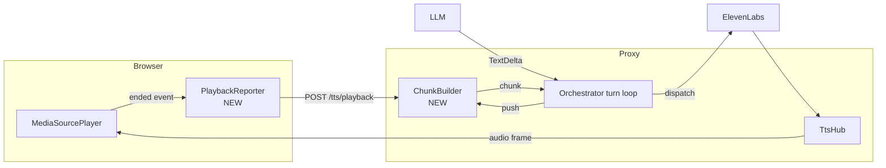

# Adaptive TTS Chunking with Playback Backpressure

**Status:** Draft
**Type:** Specification
**Audience:** Both
**Date:** 2026-04-22

## 1. Problem

Today the orchestrator dispatches a TTS synthesis request the moment [`SentenceChunker`](../parley-core/src/tts/sentence.rs) emits a chunk, which is on every sentence terminator (`.`, `?`, `!`, with the standard exceptions for `Dr.` etc.). This minimizes time-to-first-audio but produces three downstream problems:

1. **Choppy prosody.** ElevenLabs synthesizes each sentence in isolation. The voice cannot read ahead, modulate intonation across clauses, or pace the cadence of a paragraph. Every sentence sounds like the *first* sentence.
2. **Per-request overhead.** Each synthesis dispatch carries a fixed HTTP/SSE setup cost. Many small dispatches waste round-trips.
3. **No backpressure.** The proxy synthesizes faster than the browser plays back, accumulating buffered MP3 in the browser's `MediaSource` for no benefit. (This is hidden today by the fact that synthesis is also slow per chunk; with longer chunks the buffer would balloon.)

The desired behavior:

- The **first** chunk goes out as soon as possible — small, fast, pays the latency-to-first-word cost.
- Subsequent chunks **grow** as long as the LLM keeps producing tokens *and* the browser hasn't caught up to playback.
- Chunks have an **upper bound** so a long uninterrupted reply doesn't end up as a single multi-minute synthesis.
- The system is **playback-aware** rather than heuristic: the browser tells the proxy when each chunk's audio has *finished playing*, and the proxy uses that to decide when the next chunk must be released.

This is a behavioral change to the orchestrator's TTS dispatch loop plus a new browser→proxy feedback channel. No public LLM-side or session-storage changes.

## 2. Goals & Non-Goals

### Goals

- **G1.** Replace the per-sentence dispatch with size-bounded, playback-bounded chunking.
- **G2.** Time-to-first-audio is within 10% of today's behavior. (First chunk is still single-sentence.)
- **G3.** Subsequent chunks contain *up to N sentences* where N is bounded by both a hard ceiling and a deadline derived from playback feedback.
- **G4.** The browser reports per-chunk playback completion to the proxy; the proxy uses these reports as the cue to release the next buffered chunk.
- **G5.** When the LLM finishes streaming, any buffered text flushes immediately as the final chunk regardless of playback state.

### Non-Goals

- **NG1.** Reordering, retiming, or pitch-shifting audio in the browser. Playback timing remains whatever the `<audio>` element does natively.
- **NG2.** Per-paragraph synthesis based on the LLM's actual paragraph breaks. We bound by sentence count and character count, not by LLM-emitted markup.
- **NG3.** Synthesizer model changes. We continue to use the configured ElevenLabs model unchanged.
- **NG4.** Adaptive bitrate or container negotiation. MP3 stays.
- **NG5.** Persistence of playback timing in the session file. Backpressure is a runtime-only concept.

## 3. Architecture

### 3.1 Component Changes



`SentenceChunker` is preserved as a pure utility (it still answers "where do sentences end?"). A new `ChunkBuilder` sits above it, deciding when to *release* a chunk to dispatch.

### 3.2 ChunkBuilder State

Lives inside the orchestrator's turn loop, one per turn. Owned by the turn task.

- `pending: String` — accumulated text since the last released chunk.
- `pending_sentences: u32` — how many sentence boundaries `pending` contains.
- `chunks_dispatched: u32` — total chunks released this turn.
- `chunks_played_back: u32` — total chunks the browser has reported as fully played.
- `release_deadline_ms: Option<u64>` — wall-clock deadline by which the next chunk must release regardless of size, or `None` when there is no pending audio that we're waiting on. Set when we dispatch a chunk; cleared when the browser reports it played back.

### 3.3 Release Rules

A chunk is released (cut from `pending`, dispatched to TTS) when **any** of:

- **R1. First-chunk priority.** `chunks_dispatched == 0` and `pending` contains at least one complete sentence.
- **R2. Soft cap.** `pending_sentences >= soft_cap` and the most recent character is a sentence terminator (i.e., we don't cut mid-sentence).
- **R3. Hard cap.** `pending.len() >= hard_cap_chars`. We cut at the latest sentence boundary if any exist within `pending`; otherwise we cut at the latest whitespace; otherwise (degenerate) we cut at `hard_cap_chars` exactly. Only triggered for pathological input (no sentence terminators for thousands of characters).
- **R4. Backpressure release.** `chunks_played_back >= chunks_dispatched - lead_window` and `pending_sentences >= 1`. The browser is catching up; release whatever we have at the next sentence boundary so we stay `lead_window` chunks ahead of playback.
- **R5. Stream end.** The LLM finished. Flush `pending` as the final chunk (even if mid-sentence, matching today's `chunker.finish()` behavior).

### 3.4 Tunable Parameters

All configured at the orchestrator's turn-context construction time, with conservative defaults:

| Parameter | Default | Rationale |
|---|---|---|
| `first_chunk_max_sentences` | 1 | Match current latency-to-first-audio. |
| `soft_cap_sentences` | 8 | Roughly one short paragraph. Long enough for prosody coherence, short enough that one synthesis HTTP round-trip stays bounded. |
| `hard_cap_chars` | 1500 | Safety net. Equivalent to ~10–12 sentences of normal prose. |
| `lead_window_chunks` | 2 | Stay at most 2 chunks ahead of playback. With `soft_cap_sentences=8`, that's ~16 sentences of audio buffered in the worst case. |

These are constants in the orchestrator for v1. A future spec can lift them into persona settings if per-persona tuning matters.

### 3.5 Playback Feedback Channel

#### Browser Side

`MediaSourcePlayer` already exposes [`on_ended`](../src/ui/media_player.rs#L235) for the *whole stream*. We need per-chunk completion. Two options were considered:

- **A. Per-chunk MediaSourcePlayers.** Spin up one player per chunk, chain them. Rejected: doubles HTML audio elements, complicates the seek/pause UX, and the "ended" event from a `<audio src=blob>` doesn't actually mean "all bytes played" — it means "the source signaled end".
- **B. Server marks chunk boundaries; browser reports byte cursors back.** The proxy's audio sibling stream emits a `chunk_started` JSON frame before each chunk's audio bytes. The browser tracks the audio element's `currentTime` against the `MediaSource.duration` and posts a `chunk_played` notification when it crosses the boundary. **Chosen.**

#### Wire Protocol

The audio sibling SSE stream ([`/conversation/tts/{turn_id}`](../proxy/src/conversation_api.rs)) gains one new frame between the existing `audio` frames:

```jsonc
{ "type": "chunk_boundary", "chunk_index": 3, "byte_offset": 41280 }
```

`byte_offset` is the cumulative byte count of MP3 already emitted *before* this chunk's first audio frame. The browser uses it to compute the corresponding `MediaSource` time after `appendBuffer` lands.

A new browser→proxy endpoint:

```
POST /conversation/tts/{turn_id}/playback
Content-Type: application/json

{ "chunk_index": 3 }
```

Returns `204 No Content` on success, `404` if the turn id is unknown (the cache may have already been evicted; this is non-fatal — the orchestrator falls back to the soft cap rule). Idempotent: a duplicate report for the same `chunk_index` is silently accepted. The proxy passes the report into the orchestrator's `ChunkBuilder` via the existing `TtsHub` channel (a new `PlaybackReport` enum variant alongside the audio frames).

#### Browser Reporting Logic

In `MediaSourcePlayer`:

- Track `chunk_byte_boundaries: Vec<u64>` and `chunk_indices: Vec<u32>` populated as `chunk_boundary` SSE frames arrive.
- On the `<audio>` element's `timeupdate` event, walk the boundary list; for each boundary whose corresponding `MediaSource.appendBuffer` has placed it at a `currentTime <= audio.currentTime`, fire a one-shot `playback_report(chunk_index)` callback up to the conversation view, which posts to `/playback`.
- Fire each chunk's report exactly once. Use the `chunk_indices` list as a queue.

The exact `byte_offset → currentTime` translation is approximate (MP3 is VBR-tolerant but not exact). For backpressure that's fine — the goal is "browser is catching up", not sample-accurate reporting.

### 3.6 Failure Modes

| Failure | Behavior |
|---|---|
| Browser stops sending playback reports (tab closed, network) | Proxy never gets backpressure release. R2 (soft cap) keeps things moving — next chunk releases when 8 sentences accumulate. The buffer in front of the (now-departed) browser grows but is bounded by the LLM stream's natural end. |
| Browser pauses audio | `currentTime` stops advancing; reports stop. Same as above — soft cap keeps the synthesis pipeline moving but at a bounded rate. The cache still finalizes and replay still works. |
| LLM finishes before any backpressure release | R5 flushes `pending`. Normal end-of-turn behavior. |
| `/playback` POST fails | Browser logs and continues. The next playback report attempts again. |

## 4. Data Model

### 4.1 New Types

In `parley-core::tts`:

```rust
/// One released chunk ready for synthesis.
#[derive(Debug, Clone, PartialEq)]
pub struct ReleasedChunk {
    pub index: u32,
    pub text: String,
    pub final_for_turn: bool,
}

/// Configuration for `ChunkBuilder`. Defaults match the table in §3.4.
#[derive(Debug, Clone, Copy)]
pub struct ChunkPolicy {
    pub first_chunk_max_sentences: u32,
    pub soft_cap_sentences: u32,
    pub hard_cap_chars: usize,
    pub lead_window_chunks: u32,
}

/// Builder state machine. Wraps `SentenceChunker`.
pub struct ChunkBuilder { /* ... */ }

impl ChunkBuilder {
    pub fn new(policy: ChunkPolicy) -> Self;
    /// Push token text. Returns any chunks released *now*.
    pub fn push(&mut self, text: &str) -> Vec<ReleasedChunk>;
    /// Report that a previously-dispatched chunk has finished
    /// playback in the browser.
    pub fn report_played(&mut self, chunk_index: u32) -> Vec<ReleasedChunk>;
    /// LLM stream ended. Flush any pending text as the final chunk.
    pub fn finish(self) -> Option<ReleasedChunk>;
}
```

`push` and `report_played` both return `Vec<ReleasedChunk>` because a single push/report can theoretically release multiple chunks (e.g., if backpressure was queued behind a hard cap that just got hit).

### 4.2 Wire Extensions

Audio sibling SSE adds the `chunk_boundary` frame variant.
Browser→proxy adds `POST /conversation/tts/{turn_id}/playback`.

## 5. Test Plan

| Component | Tests |
|---|---|
| `ChunkBuilder` (pure) | (1) First push with one sentence → released immediately, index 0. (2) Two sentences in one push, no playback reports → first released, second held. (3) Reports arrive → held sentences released. (4) Soft cap: push 8 sentences without reports → released as one chunk. (5) Hard cap: push 1500 chars without a sentence terminator → released, cut at last whitespace. (6) Stream end via `finish()` → trailing partial flushed with `final_for_turn=true`. (7) Duplicate report ignored. (8) Report for unknown chunk_index ignored (proxy may forward late reports for a turn that already ended). |
| Orchestrator integration | Using a `MockTtsProvider` and a test `ChunkPolicy` with `lead_window=1`. (1) LLM emits 5 sentences before any playback report → 1 chunk dispatched (the first), 4 sentences buffered. After playback report for chunk 0 → 1 more chunk dispatched. After report for chunk 1 → final flush. (2) LLM errors mid-stream → buffered text *not* dispatched (matches today's behavior). (3) `tts: None` in context → no `ChunkBuilder` constructed; behavior identical to text-only path. |
| Playback wire | (1) `chunk_boundary` frame parsed. (2) `POST /playback` happy path returns 204. (3) `POST /playback` for unknown turn returns 404 silently. (4) `POST /playback` for unknown chunk_index within a known turn returns 204 (idempotent). |
| Browser `MediaSourcePlayer` | Manual: confirm that with 5-sentence reply, `chunks_dispatched` settles to ≤ `lead_window + 1`. No automated WASM tests in this slice (matches current convention). |

## 6. Migration & Compatibility

- Session files: unchanged. Playback timing is runtime-only.
- API: additive only. The `chunk_boundary` SSE frame is new and unknown frame types are already ignored by the existing browser consumer (it pattern-matches on `type` and skips unknown variants).
- TTS cache replay (`/conversation/tts/{turn_id}/replay`): unchanged. Replay continues to serve the raw concatenated MP3; playback reporting does not apply to historical replay.

## 7. Open Questions

1. **Chunk boundaries at sentence vs. paragraph.** The release rules cut at sentence boundaries. Should they prefer paragraph boundaries (double newline) when one exists within the soft cap window? Probably yes — paragraph-aligned chunks are the most prosodically natural — but adds a tiebreaker rule. **Proposal:** add as R2.5 — "if a paragraph boundary exists in `pending`, prefer it over a sentence boundary at or above `soft_cap / 2` sentences". Defer the decision until v1 ships and we can listen.
2. **Playback report granularity.** Reporting on every `timeupdate` (~250ms in most browsers) is fine for backpressure but produces small POST traffic. Acceptable for v1.
3. **Lost chunk index recovery.** If a `chunk_boundary` SSE frame is somehow missed (mid-stream reconnect?), the browser doesn't know where chunk N+1 starts. Today the audio sibling stream doesn't support resume, so this is a non-issue for v1. Document for v2.

## 8. Out-of-Scope Reminders

- Predictive prefetch ("the user usually clicks Send Turn within 2s of finishing speaking, so warm the LLM connection"). Not this slice.
- TTS engine streaming chunked input (some providers accept multi-chunk streams as one synthesis context). Out of scope; ElevenLabs' v1 endpoint is one-shot per request.
- Dynamic policy tuning per persona. Constants for v1.
