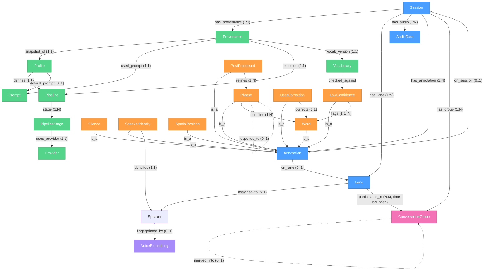

# Parley Architecture

> *From French parler, "to speak." A universal audio membrane that sits between you and the world of sound, selectively processing in both directions.*

## Core Data Model: The Annotated Stream

The fundamental abstraction in Parley is the **annotated stream** — a multi-track, time-indexed structure where audio is the primary axis and everything else is layered on top as annotations.

This is not a chat log. It's not a list of turns. It's closer to a multi-track DAW (digital audio workstation): time flows left to right, each speaker gets a lane, and annotations are spans pinned to time ranges on those lanes. When two people talk at once, their lanes simply have concurrent active spans. No information is lost.

```
Time:    0s -------- 5s -------- 10s -------- 15s -------- 20s
Lane 0:  [  Gavin: "So the idea is..."  ]      [ Gavin: "Right." ]
Lane 1:              [ Sarah: "Right, and—" ][ Sarah: "—the timeline shows..." ]
Lane 2:                                           [ Mike: "Can I jump in?" ]
Silence:                                                        [~~~~~ 3.2s ~~~~~]
```

### Why This Shape

Most transcription tools model speech as a serial list of segments, each with one speaker. When people overlap, the tool either drops one speaker, interleaves into unreadable fragments, or merges everything into one segment. All three are lossy. The data model itself is the bottleneck — if the container can't represent concurrent speech, it doesn't matter how good the model is.

Parley's model is designed so that as STT and diarization models improve (and they will — current models already detect overlap, they just have nowhere to put it), the architecture is ready to receive richer output without structural changes.

### Core Entities

#### Session

The top-level container. A single recording event or file-processing run.

- **Fields:** id, created, duration, source (mic, file, stream), channel count, sample rate per channel
- **Contains:** audio data, a set of lanes, a set of annotation layers, and provenance

#### Provenance

The complete record of *what produced this session's output*. Every session captures the settings that generated it, so you always know how you got here and can reproduce or improve on it.

- **Fields:** profile snapshot (full copy, not a reference — profiles evolve), prompt text used, pipeline stages executed, provider + model for each stage, vocabulary version, timestamp of each processing pass
- **Purpose:** If you re-process a session later with a better model, you can compare the old and new output. If a model produces surprising results, you can see exactly what configuration was in play.

#### Lane

A single speaker's track within a session. Each lane represents one voice source.

- **Fields:** lane id, speaker reference, time ranges of activity
- **Speaker assignment** can be: unknown (Lane 0, Lane 1), labeled (Speaker_0), identified ("Gavin"), or fingerprinted (matched to a voice embedding from a previous session)

#### Annotation

A span pinned to a time range, optionally on a specific lane. Annotations are the core extensibility mechanism — everything that isn't raw audio is an annotation.

**Annotation types (initial set, expected to grow):**

| Type | Scope | Realization | Description |
|------|-------|-------------|-------------|
| `Word` | Lane | Graph node (`NodeKind::Word`) | A single transcribed word with start/end time and confidence score |
| `Punctuation` | Lane | Graph node (`NodeKind::Punctuation`) | Inline punctuation (`.`, `,`, `—`, `?`) as a discrete node with independent confidence |
| `Silence` | Lane/Session | Graph node (`NodeKind::Silence`) | A timed gap in speech. Enables skip-to-next-speech in playback. |
| `Break` | Lane | Graph node (`NodeKind::Break`) | An explicit line or paragraph break — a structural boundary in the text |
| `Phrase` | Lane | **Derived** — contiguous span query | A group of words between Break nodes. Not stored; emergent from graph structure. |
| `SpeakerIdentity` | Lane | Side table (session metadata) | Who this lane's speaker is, with confidence and identification method |
| `LowConfidence` | Lane | **Derived** — `confidence < threshold` | Not a separate entity. Every node has a confidence field; low confidence is a projection-time predicate. |
| `SpatialPosition` | Lane | Future — per-node property or derived annotation | Estimated source position at a point in time, expressed in the spatial coordinate system (see below) |
| `PostProcessed` | Lane | `NodeOrigin::LlmFormatted` + `Correction` edges | LLM-cleaned version. Structural — original STT nodes are bypassed but preserved via Correction edges. |
| `UserCorrection` | Lane | `Correction` edge + bypassed nodes | Manual correction. Old and new nodes both live in the graph; edit history is structural. |

The annotation system is open — new types can be added without changing the core model. At the abstract level, an annotation is: `{ type, lane_id (optional), start_time, end_time, payload }`. At runtime, most annotation types are realized as nodes and edges in the word graph (see below).

#### Speaker

A known or unknown voice identity.

- **Fields:** id, label, name (if identified), kind (`human`, `ai_agent`, `unknown`), confidence, identification method, voice embedding ID (if fingerprinted)
- **Lifecycle:** Starts as an unlabeled lane assignment ("Speaker_0"). Gets promoted to a name via LLM contextual identification. Eventually gets a voice fingerprint that persists across sessions.
- **AI agents are speakers too.** In full-duplex mode or when an AI model is part of the conversation, it gets its own lane with its own annotations. The data model doesn't distinguish between human and AI speech structurally — only the `kind` field marks the difference.

#### ConversationGroup

A cluster of lanes that are engaged with each other over a time range. Models the fact that a session can contain multiple concurrent conversations.

- **Fields:** id, start time, end time (open-ended if ongoing)
- **Lane membership:** Lanes join and leave via `participates_in` edges, each with their own time range. A lane can briefly participate in two groups (someone leans over to another table, then comes back).
- **Group relationships:** Groups can `split_from` or `merge_into` other groups.
- **Detection:** Inferred from spatial clustering (beamforming shows three spatial clusters → three groups), semantic analysis (LLM detects topic divergence), or explicit user annotation.

**Example — prayer meeting lifecycle:**

```
Time:     0min ---- 10min ---- 20min ---- 30min ---- 40min
Group A:  [====== Lecture (all 12 lanes) ======]
Group B:                                        [== Table 1 (lanes 0,3,7) ==]
Group C:                                        [== Table 2 (lanes 1,4,5,8) ==]
Group D:                                        [== Table 3 (lanes 2,6,9,10,11) ==]

Edges:  Group B --split_from--> Group A
        Group C --split_from--> Group A
        Group D --split_from--> Group A
```

Annotations don't directly reference groups — the path is: Annotation → Lane → participates_in(time) → ConversationGroup. This keeps annotations simple while allowing group structure to form and dissolve independently.

#### Cross-Lane Relationships

Conversation is not just parallel monologues — utterances on one lane relate to utterances on other lanes. A new edge type captures this:

- **`responds_to`** — a Phrase on Lane B is a response to a Phrase on Lane A. This encodes conversational structure: who was talking to whom, what was an answer to what.
- **Detection:** LLM semantic analysis of the diarized transcript identifies response chains. Temporal proximity + semantic relevance = likely response.
- **Value:** Enables reconstructing the flow of a conversation even when multiple sub-conversations are interleaved. Also enables "show me just the thread between Gavin and Sarah" as a query.

#### Prompt

A reusable processing instruction that tells Parley how to think about incoming audio.

- **Examples:** "Clean transcription, preserve meaning," "Extract action items and summarize decisions," "Preserve code terminology exactly"
- **Stored as:** Markdown files — YAML frontmatter for metadata, body is the prompt text

#### Profile

A bundle of settings: STT provider, model, voice (TTS), audio format, encoding quality, pipeline stages, confidence mode.

- **Examples:** `default`, `meeting`, `dictation`, `conversation`
- **Stored as:** TOML files
- **Note:** When a session is created, the active profile is *snapshotted* into the session's provenance, not referenced by name. This decouples session history from profile evolution.

#### Pipeline

The ordered sequence of processing stages for a given mode. Pipelines are composable — file processing skips capture, full-duplex adds TTS output, etc.

**Stages:** capture → encode → STT → diarize → spatial-locate → speaker-identify → silence-detect → LLM post-process → save

#### Vocabulary

User-maintained word list for domain-specific terms, names, and acronyms. Feeds into confidence checking — STT output is compared against vocabulary, and low-confidence words not in the list get flagged.

#### Word Graph — Runtime Data Model

The abstract annotation model above describes *what* Parley stores. The **word graph** describes *how* it is stored and manipulated at runtime. It is the concrete realization of the annotated stream during a live session.

> Full specification: `docs/word-graph-spec.md`
>
> Implementation: `src/word_graph/` — currently the **minimal slice** (nodes, edges with `Next` only, arena+adjacency, `ingest_turn`, `walk_spine`, `edges_from`/`to`) per the Conversation Mode prerequisite (`docs/conversation-mode-spec.md` §1.5). The remaining graph features (`Alt`/`Correction`/`Temporal` edges, non-destructive editing, projection filters) will be added as the features that need them ship.

**Key insight from implementation:** The original architecture modeled annotations as separate entities layered over a timeline — a `LowConfidence` annotation points at a `Word` annotation; a `UserCorrection` annotation wraps another annotation. Building the real-time system revealed that **the word IS the annotation**. Separating the word from its metadata (confidence, origin, filler status) creates indirection that makes real-time ingest, editing, and projection harder. The word graph flattens this: metadata lives directly on each node.

**Structure:**

- **Nodes** — arena-allocated (`Vec<Node>`, `NodeId` = index). Each node has a `NodeKind` enum (`Word`, `Punctuation`, `Silence`, `Break`), a `NodeOrigin` enum (`Stt`, `LlmFormatted`, `AiGenerated`, `UserTyped`), a `confidence` score, timing (`start_ms`, `end_ms`), speaker lane index, and a `flags: u16` bitfield for cross-cutting boolean properties (e.g., filler detection).
- **Edges** — flat `Vec<Edge>`, each with `from: NodeId`, `to: NodeId`, `kind: EdgeKind`. Edge kinds: `Next` (primary sequence), `Alt` (alternative transcription), `Correction` (edit history), `Temporal` (cross-speaker timing, derived).
- **Per-speaker trees** — one root per speaker lane, each a spine of `Next`-linked nodes. Occasional `Alt` branches for alternatives. Forms a **forest**.
- **Temporal edges** make it a **DAG** — cross-speaker timing links computed by an analysis pass. These are derived artifacts: deletable and recomputable at any time.

**Non-destructive editing:** All edits are additive. When words are replaced (by the user or LLM), old nodes are bypassed on the spine but remain in the arena. `Correction` edges link old nodes to their replacements. This preserves full edit history, enables undo via graph traversal, and allows "revert to STT original" for any passage.

**Display is a projection:** The user never sees the graph directly. They see a filtered walk of the graph: verbatim mode (include fillers) vs. clean mode (skip fillers), single-speaker vs. interleaved, confidence-highlighted vs. plain. All are `ProjectionOpts` applied to the same graph.

**Filler handling:** Filler words (um, uh, er, etc.) are detected at ingest via a configurable word list and flagged with `FLAG_FILLER` in the node's bitfield. They remain in the graph — "strip fillers" is a projection filter, not data destruction. Toggle verbatim mode and the fillers reappear.

---

## Type Graph

How the core types relate to each other. Node types are the entities; edge types describe the relationship.



### Reading the Graph

**Node types (colors):**
- **Blue — core structure:** Session, Lane, AudioData, Annotation. The bones of the annotated stream.
- **Orange — annotation subtypes:** Word, Phrase, Silence, SpeakerIdentity, etc. Layers painted onto the timeline.
- **Green — configuration:** Profile, Prompt, Pipeline, Provider, Vocabulary, Provenance. Define *how* processing happens.
- **Pink — social structure:** ConversationGroup. Models which lanes are engaged with each other.
- **Purple — future:** VoiceEmbedding. Planned but not in the MVP.

**Edge types:**
- **Solid lines** = structural relationships that always exist (has_lane, has_annotation, contains, etc.)
- **Dotted lines** = optional, inferred, or future relationships (fingerprinted_by, responds_to, split_from)
- **Cardinality** is noted on each edge (1:1, 1:N, N:1, N:M, 0..1)

**Key relationships:**
- A **Session** is the root. It owns lanes, annotations, audio, provenance, and conversation groups.
- **Annotations** bind to a lane (lane-scoped, like Word or SpeakerIdentity) or to the session (session-scoped, like Silence).
- **Annotations relate to each other:** Phrase contains Words. UserCorrection corrects a Word. LowConfidence flags Words. PostProcessed refines Phrases. SpeakerIdentity identifies a Speaker.
- **Annotations relate across lanes:** Phrase `responds_to` Phrase (on a different lane). This captures conversational structure — who was answering whom — without forcing serial ordering.
- **Provenance** captures a *snapshot* of Profile, Prompt, Pipeline, and Vocabulary — not a live reference.
- **Speaker** exists at lane scope within a session, but can be linked to a **VoiceEmbedding** that spans sessions. Speaker has a `kind` field: human, ai_agent, unknown.
- **ConversationGroup** clusters lanes that are engaged with each other. Lanes `participate_in` groups with time-bounded membership (N:M — a lane can be in multiple groups briefly, a group has multiple lanes). Groups can `split_from` or `merge_into` other groups as conversations fragment or consolidate.

### Why a Graph

The arity is unconstrained by design. A lane can have zero annotations or thousands. A word can have zero corrections or several (from different processing passes). A phrase can overlap with other phrases. Silence spans can be nested within or adjacent to any other annotation. New annotation types can be added as new node types with new edge types to existing nodes — no schema migration, no breaking changes to existing data.

This graph structure also maps naturally to multiple persistence backends: serialize to JSON (nodes + edges), project to files (walk the graph and render), store in a graph database, or map to Gossamer's cell model.

At runtime, the word graph (arena + adjacency list) *is* this graph — not a projection of it. The session-level type graph describes inter-entity relationships (Session → Lane → Annotation, Provenance → Profile, etc.), while the word graph describes intra-lane structure (word → next word → punctuation → break → next word, with Correction and Temporal edges forming the DAG). Both are graphs; they operate at different granularities.

---

## Persistence

The in-memory annotated stream is the canonical representation. How it gets persisted is a projection — and Parley should not be coupled to a single projection.

### Storage Trait

Persistence is abstracted behind a trait:

```rust
trait SessionStore: Send + Sync {
    async fn save(&self, session: &Session) -> Result<SessionId>;
    async fn load(&self, id: &SessionId) -> Result<Session>;
    async fn list(&self, filter: &SessionFilter) -> Result<Vec<SessionMeta>>;
    async fn delete(&self, id: &SessionId) -> Result<()>;
}
```

Implementations:
- **File-based (default):** Markdown + timing JSON + audio files on disk. Human-readable, grep-able, portable.
- **Gossamer cells (future):** When Parley folds into Gossamer, sessions project into the cell model.
- **Database (future):** SQLite, Postgres, or any structured store for applications that need query capabilities.

### File-Based Projection (Default)

```
~/.parley/
├── config.toml                       # Global settings, default profile, API keys
├── profiles/
│   ├── default.toml
│   ├── meeting.toml
│   └── conversation.toml
├── prompts/
│   ├── general.md
│   ├── meeting-notes.md
│   └── code-dictation.md
├── vocabulary/
│   └── custom-words.toml
└── sessions/
    └── 2026-03-15/
        ├── 1430-standup.md           # Human-readable transcript (frontmatter + lanes)
        ├── 1430-standup.session.json # Full annotated stream (lanes, annotations, provenance)
        └── 1430-standup.flac         # Audio (or .opus)
```

The `.session.json` replaces the old `.timing.json` — it's the complete serialized annotated stream with all lanes, all annotation layers, spatial data, provenance, and word-level timing. The `.md` file is a *rendering* of this data into human-readable form, not the source of truth.

### Session Frontmatter (in .md)

```yaml
---
session_id: "20260315-143022"
created: 2026-03-15T14:30:22Z
duration_secs: 847.3
audio: "1430-standup.flac"
channels: 4
sample_rate: 48000
provenance:
  profile: "meeting"
  prompt: "meeting-notes"
  stt_provider: "deepgram"
  stt_model: "nova-3"
  pipeline: ["capture", "encode", "stt", "diarize", "spatial-locate", "speaker-identify", "silence-detect", "llm-postprocess"]
  confidence_mode: "defer"
speakers:
  - { lane: 0, name: "Gavin", confidence: 0.95, method: "addressed_by_name" }
  - { lane: 1, name: "Sarah", confidence: 0.85, method: "self_introduction" }
  - { lane: 2, name: "unknown", confidence: 0.0 }
silence_ranges:
  - { start: 15.2, end: 18.4 }
  - { start: 42.0, end: 43.1 }
---
```

---

## Audio Strategy

### Storage Formats

| Format | Use Case | Notes |
|--------|----------|-------|
| **FLAC** | Lossless archival. Meetings, anything you might re-process later. | ~50-60% of WAV size. Multi-channel native. |
| **Opus** | Lossy, configurable quality. Solo dictation, voice memos. | 16-96 kbps range. VBR default. `voip` and `audio` application modes. |

WAV is used only as an in-memory intermediate during processing — never stored to disk.

### Import Formats

Accept everything: MP3, M4A/AAC, WAV, FLAC, OGG, Opus, WMA. Decode via `symphonia` (pure Rust, no C dependencies) to PCM for processing.

### Opus Quality Tiers

| Bitrate | Quality | Use Case |
|---------|---------|----------|
| 16-24 kbps | Good voice memo | Long solo dictation you won't re-listen to |
| 32-48 kbps | High-quality speech | Default for most sessions. Near-indistinguishable from lossless for voice. |
| 64-96 kbps | Overkill for speech | Preserve background audio, ambient, music |

### Profile Audio Config

```toml
[audio]
format = "opus"           # "opus" | "flac"
opus_bitrate_kbps = 32    # 16-128, only when format = "opus"
opus_mode = "voip"        # "voip" | "audio"
sample_rate = 48000       # 48kHz (Opus native), 44100, 16000
channels = "mono"         # "mono" | "stereo" | "multi"
```

---

## Multi-Channel & Diarization Pipeline

### Capture & Storage

Capture at the highest channel count the device offers. Don't discard spatial information at capture time. Store all channels.

### Processing Flow

```
Mic (N channels) → Encode (N-ch, FLAC/Opus) → Store
                  ↘ Mix to mono → STT API
                  ↘ Keep channels → Beamforming / Spatial analysis → Diarization engine
```

### Beamforming & Spatial Audio

When multi-channel audio is available (microphone array, stereo conference mic, multi-track recording), phase relationships between channels encode spatial information — where each voice is coming from.

**Phase steering (beamforming):** Use inter-channel phase differences to localize sound sources, steer attention toward a specific direction, and suppress noise from other directions. This is the same principle the human brain uses with two ears (interaural time difference). With a mic array, it enables:

- **Source localization:** Estimate the direction/position of each speaker
- **Spatial filtering:** Isolate a single speaker by focusing the beam on their position
- **Noise suppression:** Attenuate signals arriving from directions without a known speaker
- **Diarization assist:** Speaker separation informed by physical location, not just voice characteristics

### Spatial Coordinate System

Source positions are expressed as **time-based delay vectors** — one delay value per channel, measured in time (not samples). Using time as the unit keeps coordinates consistent regardless of per-channel sample rates (e.g., one channel at 16kHz and another at 48kHz produce the same time-domain coordinates).

A source position at a given moment is: `{ time: f64, delays: Vec<f64> }` — where `delays[i]` is the time-of-arrival offset at channel `i` relative to a reference channel. This N-dimensional coordinate (where N = channel count) uniquely identifies a direction/position in the mic array's geometry.

**Source tracking:** Over a time range, a speaker's position is a trajectory — a sequence of delay vectors. This becomes a `SpatialPosition` annotation on their lane, updated at regular intervals. Enables:

- **Visualization:** Plot source positions and movement over time. Show where each speaker is relative to the mic array.
- **Playback focus:** During audio playback, the UI can steer the beam toward a selected speaker's tracked position, isolating their voice from the mix. Manual override possible — click a position to focus there.
- **Adaptive beamforming:** Instead of fixed beam directions, track the source trajectory and steer continuously.

**Real-time vs post-processing:** Real-time spatial tracking is achievable for static or slow-moving sources — conference table scenarios. Post-processing of recorded multi-channel audio is more tractable because it can do multi-pass analysis, tracking sources as they move. Both are goals.

**Challenge — moving sources:** Speakers shift position, turn their heads, stand up. Adaptive beamforming (continuously updating steering vectors) handles this, at the cost of complexity. Start with fixed-position assumptions for the MVP, evolve to adaptive tracking.

**Crate candidates:** `ndarray` for signal processing math, custom DSP for delay-and-sum beamforming, potentially `rustfft` for frequency-domain approaches.

### Diarization Tiers

**Tier 1 — Provider diarization (MVP):**
Use STT provider's built-in diarization (Deepgram `diarize=true`, AssemblyAI equivalent). Returns unlabeled Speaker_0, Speaker_1, etc. Ships first.

**Tier 2 — LLM contextual identification:**
Post-process the diarized transcript through an LLM to identify speakers by name. Looks for self-introductions, people addressing each other, role references, meeting context from the prompt. Produces a speaker mapping with confidence levels:

```yaml
speakers:
  Speaker_0: { name: "Gavin", confidence: 0.95, method: "addressed_by_name" }
  Speaker_1: { name: "Sarah", confidence: 0.85, method: "self_introduction" }
  Speaker_2: { name: "unknown", confidence: 0.0 }
```

**Tier 3 — Voice fingerprinting (future):**
Local voice embedding database. Identified speakers get voice embedding vectors stored across sessions. Parley recognizes voices across recordings without needing introductions. Requires speaker embedding model (ECAPA-TDNN or similar via ONNX Runtime).

Voice fingerprints are handed to STT/diarization providers as hints when the provider supports it — "here are the voice embeddings for people you're likely to encounter." This lets the model do better separation up front instead of relying entirely on post-processing.

### Silence Detection

Silence is an annotation, not an absence. When no speech is detected on any lane for a configurable threshold (e.g., 1.5 seconds), a `Silence` annotation is placed on the session timeline. This enables:

- **Skip-to-next-speech:** During playback, jump over silence to the next moment someone talks
- **Session summarization:** Know how much of a recording was active speech vs. dead air
- **Segmentation:** Natural break points for splitting long sessions into logical sections

The audio data in silent ranges is preserved — silence detection is purely an annotation, never a destructive operation.

---

## Provider Abstraction

Model-agnostic by design. All providers implement a trait:

```rust
trait SttProvider: Send + Sync {
    async fn stream(&self, audio: AudioStream, config: &SttConfig) -> TranscriptStream;
    async fn process_file(&self, path: &Path, config: &SttConfig) -> Transcript;
}

trait TtsProvider: Send + Sync {
    async fn synthesize(&self, text: &str, config: &TtsConfig) -> AudioStream;
}

trait LlmProvider: Send + Sync {
    async fn process(&self, prompt: &str, transcript: &str) -> String;
}
```

Initial providers: Deepgram (STT), local Whisper (STT fallback), OpenAI/Claude (LLM post-processing). Architecture supports adding any provider by implementing the trait.

---

## Project Structure

```
parley/
├── Cargo.toml
├── Dioxus.toml
├── docs/
├── src/
│   ├── main.rs                       # Entry point
│   ├── app.rs                        # Root Dioxus component, routing
│   │
│   ├── models/                       # Core data types (UI-independent)
│   │   ├── mod.rs
│   │   ├── session.rs                # Session, Provenance
│   │   ├── lane.rs                   # Lane (speaker track)
│   │   ├── annotation.rs            # Annotation types (Word, Phrase, Silence, etc.)
│   │   ├── speaker.rs
│   │   ├── spatial.rs                # SpatialPosition, delay vectors, source tracking
│   │   ├── prompt.rs
│   │   ├── profile.rs
│   │   ├── pipeline.rs
│   │   └── vocabulary.rs
│   │
│   ├── providers/                    # STT/TTS/LLM provider abstractions
│   │   ├── mod.rs
│   │   ├── stt.rs                    # SttProvider trait
│   │   ├── tts.rs                    # TtsProvider trait
│   │   ├── llm.rs                    # LlmProvider trait
│   │   ├── deepgram.rs
│   │   └── whisper_local.rs
│   │
│   ├── audio/                        # Audio I/O (platform-specific)
│   │   ├── mod.rs
│   │   ├── capture.rs               # Mic input via cpal
│   │   ├── playback.rs              # Playback with spatial focus support
│   │   ├── encoder.rs               # Opus/FLAC encoding
│   │   ├── mixer.rs                 # Multi-channel → mono mixdown
│   │   └── spatial.rs               # Beamforming, source localization, delay analysis
│   │
│   ├── engine/                       # Core processing pipeline
│   │   ├── mod.rs
│   │   ├── stream.rs                # Real-time streaming orchestration
│   │   ├── batch.rs                 # File-based processing
│   │   ├── diarize.rs               # Diarization + speaker identification
│   │   ├── silence.rs               # Silence detection + annotation
│   │   └── postprocess.rs           # LLM cleanup pass
│   │
│   ├── persistence/                  # Storage abstraction + implementations
│   │   ├── mod.rs
│   │   ├── store.rs                  # SessionStore trait
│   │   ├── file_store.rs            # File-based implementation (default)
│   │   ├── config.rs                # TOML config loading
│   │   ├── prompt_store.rs
│   │   └── markdown.rs              # Markdown rendering of sessions
│   │
│   └── ui/                           # Dioxus components
│       ├── mod.rs
│       ├── transcript_view.rs
│       ├── controls.rs
│       ├── session_list.rs
│       ├── settings.rs
│       └── prompt_editor.rs
│
├── assets/
│   └── styles.css
└── tests/
```

**Key architectural constraint:** `models/`, `providers/`, `audio/`, `engine/`, and `persistence/` are UI-independent. They can be extracted into a `parley-core` library crate when folding into Gossamer. Only `ui/` depends on Dioxus.

---

## Key Crates

| Crate | Purpose |
|-------|---------|
| `dioxus` | UI framework (desktop, web, mobile) |
| `cpal` | Cross-platform audio capture |
| `symphonia` | Universal audio decoding (MP3, M4A, FLAC, WAV, OGG, etc.) |
| `opus` / `audiopus` | Opus encoding |
| `flac-bound` or `claxon` | FLAC encoding/decoding |
| `tokio-tungstenite` | WebSocket client for streaming STT |
| `serde` + `toml` + `serde_yaml` | Serialization |
| `pulldown-cmark` | Markdown parsing (document reading feature) |
| `ort` (ONNX Runtime) | Local model inference (Whisper, speaker embeddings) |

---

## Implemented Today (Phase 4b checkpoint)

The structure above is the long-term target. The repository today contains a Cargo workspace with three members; the directory layout has not yet been migrated to the `models/ providers/ engine/ persistence/` shape above.

```
parley/                  # WASM-targeted Dioxus frontend (root crate `parley`)
parley-core/             # WASM-clean shared data types + invariants
proxy/                   # Native sidecar binary `parley-proxy`
```

### `parley-core`

WASM-clean. No `tokio`, no I/O, no audio. Holds the data model the frontend, proxy, and (eventually) the file format share.

- `chat` — `ChatMessage`, `ChatRole`, `ChatToken`, `TokenUsage`, `Cost`
- `model_config` — `ModelConfig`, `ModelConfigId`, `LlmProviderTag`, `TokenRates`
- `persona` — `Persona`, `PersonaId`, `SystemPrompt::{Inline, File}`, tier/voice/TTS settings
- `speaker` — `Speaker`, `SpeakerId`, kind enum (human / ai_agent / unknown)
- `word_graph` — node/edge types for the annotated stream
- **`conversation`** *(new)* — `ConversationSession`, `Turn`, `TurnProvenance`, `PersonaActivation`, `TurnId`. The persistable state of one Conversation Mode session: ordered turns, registered speakers, and the history of (persona, model) activations so we can answer "who said what with which model" from the file alone.

### `proxy`

Native, async, owns I/O and credentials. Will eventually expose an HTTP endpoint to the WASM frontend.

- `llm` — `LlmProvider` trait + `AnthropicLlm` streaming implementation, plus an SSE decoder hardened for chunk-boundary cases (Phase 4a)
- `registry` — loads `ModelConfig` and `Persona` files from `~/.parley/{models,personas}/` with per-file diagnostics; shared validation enforces persona → model / system-prompt-file references (Phase 3)
- **`orchestrator`** *(Phase 4b)* — `ConversationOrchestrator`, `OrchestratorState`, `OrchestratorEvent`, `OrchestratorContext`. Drives the per-turn state machine and dispatches user input to the active persona's `LlmProvider`.
- **`conversation_api`** *(new)* — HTTP routes that expose a single in-process `ConversationOrchestrator` to any client (the WASM frontend, integration tests, `curl`).

### Conversation orchestrator (Phase 4b)

The orchestrator is the runtime "harness" around a `ConversationSession`. It is **not** part of the audio pipeline — it consumes that pipeline's outputs and (in a later slice) drives a TTS provider with its outputs.

- **State machine subset:** `Idle → Routing → Streaming → Idle`, plus `Failed → Idle`. The audio-bound states from spec §5 (`Capturing`, `FinalizingStt`, `Speaking`, `Paused`, `Stopped`) land with the audio integration slice.
- **Turn flow:** `submit_user_turn(speaker_id, text)` resolves the active persona / model / provider *before* mutating the session, resolves the system prompt (inline or read from `prompts_dir`), appends the user turn, then returns a `BoxStream<OrchestratorEvent>` that the caller drives. Tokens stream through as `OrchestratorEvent::Token { delta }`; on completion the assistant turn is appended with full `TurnProvenance` (persona, model, usage, cost) and `OrchestratorEvent::AiTurnAppended` is emitted.
- **Failure surfacing (spec §10.1, partial):** Pre-dispatch errors return `OrchestratorError` synchronously without touching the session. Mid-stream provider errors emit `OrchestratorEvent::Failed { message }` then transition `Failed → Idle` without appending a partial assistant turn. Retry/skip UI is deferred.
- **Persona switching (spec §6.3):** `switch_persona(persona_id, model_config_id)` delegates to the session and takes effect on the next submitted turn. `PersonaActivation` history is recorded so a session file always shows when the active agent changed.
- **Cost (spec §11):** Per-turn cost is computed at append time from the active model's `TokenRates` and pinned into `TurnProvenance`. Session totals are derived later by summing turns.
- **Determinism for tests:** Time enters through a `Clock` trait so tests pin timestamps. Provider behavior enters through `LlmProvider` so tests use a `MockProvider` that yields a canned token script — no HTTP in unit tests.

### Conversation HTTP API (Phase 4c)

The proxy now exposes the orchestrator over HTTP so the WASM frontend (and any other client) can drive a session without speaking to LLM providers directly. All routes share one in-process orchestrator handle — multi-session multiplexing is a later concern.

| Route | Method | Purpose |
|-------|--------|---------|
| `/conversation/init` | POST | Create the session. Resolves persona → model → provider; for `LlmProviderTag::Anthropic` builds an `AnthropicLlm` from the supplied `anthropic_key`. Returns the initial `ConversationSession` JSON. |
| `/conversation/turn` | POST | Submit a user turn. Body: `{ speaker_id, content }`. Response is a `text/event-stream` of [`OrchestratorEvent`]s (one JSON object per `data:` line, with the SSE `event:` field mirroring the variant tag). |
| `/conversation/switch` | POST | Switch the active `(persona, model)` for the next turn. Validates ids against the loaded registries. Returns `204`. |
| `/conversation/snapshot` | GET | Full `ConversationSession` as JSON. |
| `/conversation/save` | POST | Persist the live session to disk via the configured `SessionStore`. Returns `{ "session_id": "..." }`. |
| `/conversation/load` | POST | Body: `{ session_id, anthropic_key? }`. Reads the session from disk, re-resolves its active persona/model against the current registries, builds a fresh provider (credentials are not persisted), and installs a new orchestrator. Returns the loaded `ConversationSession`. |
| `/conversation/sessions` | GET | List all session ids on disk, sorted. |
| `/personas` | GET | List the loaded personas as compact summaries: `{ personas: [{ id, name, description }, ...] }`, sorted by id. Used by the frontend's persona picker; does not expose `system_prompt` or other internals (the picker doesn't need them). *(Phase 4e)* |
| `/models` | GET | List the loaded model configs as compact summaries: `{ models: [{ id, provider, model_name, context_window }, ...] }`, sorted by id. Used by the frontend's model picker; does not expose provider options. *(Phase 4e)* |

**Failure mapping (spec §10.1, partial):**

- Pre-dispatch errors come back synchronously: unknown persona / model → `400`; missing provider / unreadable prompt file → `500`. The user turn is *not* appended on these.
- Mid-stream provider errors arrive on the SSE channel as a `failed` event followed by `state_changed` → `failed` → `idle`. The HTTP response itself is still `200` and the stream ends cleanly.
- "No active session" requests against `/turn`, `/switch`, `/snapshot` return `409 Conflict` so the client knows to call `/init` first.

**Provider construction:** Only `LlmProviderTag::Anthropic` is wired in this slice. Other tags surface as `501 Not Implemented` from `/init`. The supplied `anthropic_key` lives only inside the constructed `AnthropicLlm`; it is never logged.

**Determinism for tests:** A `#[cfg(test)]`-only `ConversationApiState::install_for_test` lets integration tests bypass the provider-construction path and inject an orchestrator built around a `MockProvider` (extracted to `proxy::llm::test_support` so the orchestrator and HTTP tests share one mock implementation). HTTP tests drive the router via `tower::ServiceExt::oneshot`, so they exercise the real routing, JSON deserialization, and SSE encoding without binding a port.

### Session persistence (Phase 4d)

Sessions are persisted as one JSON file per session under `~/.parley/sessions/{id}.json` (configured via `Registries::sessions_dir`). The store is abstracted behind a small async trait so tests inject a `tempfile::TempDir`-rooted store and the eventual move to a different backend (sqlite, etc.) does not ripple into the HTTP layer.

```rust
#[async_trait]
pub trait SessionStore: Send + Sync {
    async fn save(&self, session: &ConversationSession) -> Result<(), SessionStoreError>;
    async fn load(&self, id: &str) -> Result<ConversationSession, SessionStoreError>;
    async fn list(&self) -> Result<Vec<SessionId>, SessionStoreError>;
}
```

The default implementation, `FsSessionStore`, applies a strict ASCII allowlist to session ids before touching the filesystem: alphanumerics plus `_`, `-`, and `.`, with no leading/trailing dot, no `..`, no path separators, no controls, and no unicode. Invalid ids are rejected before any directory is created so a malicious id cannot have side effects on disk. The root directory is created lazily on first `save`.

**Credential policy:** `anthropic_key` is *never* written to disk. `/load` requires the caller to re-supply credentials in the same shape `/init` does. This keeps session files safe to commit, sync, or share, and forces a single chokepoint for credential handling.

**Drift handling:** When `/load` reads a file whose active persona or model id is no longer present in the live registries, the load returns `422 Unprocessable Entity` rather than silently substituting. The file is fine; the runtime config simply cannot drive it as-is.

**Failure mapping:** `InvalidId` → `400`; `NotFound` → `404`; I/O and JSON-decode failures → `500`. Save without an active session → `409` (same shape as the other write routes).


- Audio capture / STT / TTS integration (and the `Capturing`, `Speaking`, `Paused` states that come with them)
- Multi-party / WordGraph AI lane writes (`NodeOrigin::AiGenerated`)
- Pause / Stop / Play / barge-in
- Context compaction
- Session persistence: file-per-session JSON store landed in Phase 4d. **Deferred:** auto-save after each turn (clients call `/save` explicitly), session deletion endpoint, richer listing (metadata snapshot per id), encryption at rest.
- Frontend wiring: ✅ landed in **Phase 4f**. `src/ui/conversation.rs` (`ConversationView`) talks to the proxy via hand-rolled `web_sys::Request` + `wasm_bindgen_futures::JsFuture`. On mount it fetches `/personas` and `/models` to populate two `<select>` dropdowns; on send it lazily POSTs `/conversation/init`, then POSTs `/conversation/turn` and consumes the SSE response by reading `Response::body()` as a `ReadableStreamDefaultReader`, decoding chunks with `TextDecoder`, splitting on `\n\n` event boundaries, and parsing each frame's `data:` line into a `WireEvent` (mirror of `OrchestratorEvent`). `Token { delta }` accumulates into a streaming "in-progress" assistant bubble; `AiTurnAppended` finalizes the bubble; `Failed` surfaces as a status banner. `src/ui/root.rs` (`Root`) is a thin shell with a two-button toggle that picks between the existing transcription view (`App`) and `ConversationView` — no router, no shared state. The `parley_anthropic_key` cookie is read on mount and written back on edit, reusing the same key the transcription view uses for Haiku formatting.
  - **Deferred frontend pieces:** save/load/list/delete UI for sessions (proxy endpoints exist; no UI yet), `/conversation/switch` mid-conversation, auto-save after each turn, transcription→conversation handoff, multi-speaker turn metadata, audio integration, OpenAI provider, encryption at rest.
- Multi-session multiplexing (one process, many concurrent sessions keyed by id)
- Expression-annotation auto-prepend
- Retry-on-failure logic
- Cost aggregation across turns (per-turn cost is recorded; session totals are a render concern)

