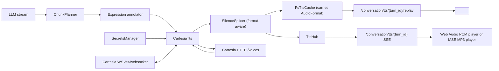

# Cartesia Sonic-3 TTS Integration

**Status:** Draft (revised after first integration smoke test)
**Type:** Specification
**Audience:** Both
**Date:** 2026-04-26

## 1. Overview

This spec adds Cartesia Sonic-3 as an optional text-to-speech provider in Parley's existing conversation voice pipeline.

Cartesia is not the default TTS provider in this spec. It is added as a privacy-aligned, highly expressive voice candidate that can be compared against ElevenLabs, xAI, and Hume Octave 2 using the same orchestrator, cache, and playback path. **The implementation uses Cartesia's WebSocket endpoint (`wss://api.cartesia.ai/tts/websocket`) — not the HTTP byte-streaming endpoint.** Existing TTS providers in Parley have shown audible prosody breaks at chunk boundaries, and Cartesia's WebSocket protocol exposes a `context_id` + `continue` mechanism that is the canonical fix for that exact problem. Since we are already paying the integration cost, we should plumb the path that solves the prosody problem on day one rather than land HTTP and migrate later.

**The Cartesia WebSocket only emits raw PCM** (per Cartesia error: `only 'raw' container is supported for this endpoint`). MP3 is a `POST /tts/bytes`-only output. To preserve the WebSocket benefit, this spec propagates raw PCM end-to-end: the cache, replay, live SSE pipeline, and browser playback all become **format-aware** so that providers can declare different `AudioFormat` outputs and the rest of the pipeline adapts. The existing MP3 paths (xAI, ElevenLabs) keep working unchanged.

**Wire payload shape inside the WebSocket is JSON, not raw binary.** Cartesia sends `{"type":"chunk","data":"<base64>"}` text frames carrying base64-encoded raw PCM samples; binary WS frames are not used. The provider parses and base64-decodes those into the same `TtsChunk::Audio(Vec<u8>)` shape the rest of the pipeline already consumes — bytes are bytes, only the container/codec interpretation downstream changes.

Research background: [research/cartesia-sonic-3.md](research/cartesia-sonic-3.md) (to be created alongside this spec).

Related specs:

- [conversation-voice-slice-spec.md](conversation-voice-slice-spec.md)
- [paragraph-tts-chunking-spec.md](paragraph-tts-chunking-spec.md)
- [expressive-annotation-spec.md](expressive-annotation-spec.md)
- [secrets-storage-spec.md](secrets-storage-spec.md)
- [xai-speech-integration-spec.md](xai-speech-integration-spec.md)
- [hume-octave-2-tts-integration-spec.md](hume-octave-2-tts-integration-spec.md)

## 2. Position

Cartesia's best fit is **expressive, privacy-aligned, low-latency conversation with prosody continuity across chunks**. Sonic-3 ships sub-100 ms time-to-first-audio at P50, supports inline `[laughter]` tags plus volume / speed / emotion controls, exposes a documented opt-out from training-data use, and — critically for this project — exposes a per-turn `context_id` over WebSocket so paragraph-leading chunks no longer get read with the exaggerated sentence-opener intonation we currently hear with ElevenLabs `previous_text` and xAI's per-request HTTP path.

The integration should preserve Parley's provider philosophy: the orchestrator talks to a provider-neutral `TtsProvider`; Cartesia-specific fields stay inside `CartesiaTts` until the shared trait needs a real new capability. Cartesia should earn default-provider status through measured listening tests, not by virtue of being the newest entrant.

## 3. Goals

- Add `ProviderId::Cartesia` as a TTS provider with `PARLEY_CARTESIA_API_KEY` secret resolution.
- Add `proxy::tts::CartesiaTts` implementing the existing `TtsProvider` trait, talking to Cartesia over WebSocket.
- Synthesize Sonic-3 speech through Cartesia's proxy-side WebSocket API without exposing the API key to the WASM frontend.
- **Forward `SynthesisContext::previous_text` as a Cartesia `context_id` + `continue: true` follow-up message** when the orchestrator marks chunks as part of the same turn, so cross-chunk prosody continuity is preserved by the model rather than reconstructed by Parley.
- Reuse the existing conversation pipeline (`ChunkPlanner`, annotator pass, `TtsProvider`, `SilenceSplicer`, `FsTtsCache`, `TtsHub`, `/conversation/tts/{turn_id}` SSE), and **make those stages format-aware** so a provider can declare a non-MP3 `AudioFormat` without breaking MP3 callers.
- Surface Cartesia's voice catalog through `TtsProvider::voices` with the same 24-hour cache contract used by xAI.
- Keep Cartesia disabled until a Cartesia credential is configured.
- Provide unit tests for registry wiring, WebSocket handshake, request construction, JSON-chunk parsing + base64 decoding, streaming audio success, empty-text rejection, default-voice fallback, voices-catalog caching (including the documented `{data:[…],has_more,next_page}` envelope), error handling, header / query-param round-tripping, and cost calculation; plus updated tests for the format-aware silence splicer, cache, replay endpoint, and browser SSE consumer.

## 4. Non-Goals

- Making Cartesia the default TTS provider.
- Using Cartesia's "Line" voice agent platform or any unified speech-to-speech agent API. Parley keeps STT, LLM, and TTS as independently swappable stages.
- Voice cloning, voice conversion, or voice-design workflows. Those require explicit consent/provenance UX and are deferred.
- Browser-direct Cartesia WebSocket calls or short-lived Cartesia access-token issuance. The proxy owns the API key in this spec.
- A long-lived, multiplexed WebSocket shared across turns. v1 opens **one WebSocket per `synthesize()` call** so the existing per-request `TtsProvider::synthesize(req, ctx) -> TtsStream` trait shape stays unchanged. Within a single call, we send all chunks for the turn back-to-back with `continue: true` and a shared `context_id`, then close. Persistent multiplexing across turns is a future-work item only if reconnect cost shows up in measured benchmarks.
- **Exposing word / phoneme timestamps through the `TtsProvider` trait.** Cartesia's WebSocket protocol interleaves binary audio frames with JSON status messages, and some of those messages carry per-word timing data (`{"type":"timestamps","word_timestamps":[{"word":"Hello","start":0.0,"end":0.42}, ...]}`). These are valuable for the reader-style word-level highlighting work in `todo.md` Phase 11. However, Parley's current `TtsChunk` enum only carries `Audio(Vec<u8>)` and `Done { characters }`. Adding a `TtsChunk::Metadata { ... }` variant is a cross-cutting trait change that would touch ElevenLabs, xAI, and Hume in the same PR, expanding the blast radius well beyond a Cartesia integration. v1 therefore parses timestamp messages off the wire, logs them at trace level so we know the ingestion path works, and discards them. When the metadata channel ships in its own slice, exposing the data is a one-line change in `CartesiaTts` rather than a re-implementation.
- Provider-native acting instructions beyond inline `[laughter]` tags and SSML volume/speed/emotion attributes. The full controllability surface (`docs.cartesia.ai/build-with-cartesia/sonic-3/volume-speed-emotion`) is in scope behind a feature flag in v1.5.

## 5. Requirements

| ID | Requirement | Verification |
| --- | --- | --- |
| CART-01 | Cartesia appears in the provider registry as a TTS provider with env var `PARLEY_CARTESIA_API_KEY`. | `providers` unit tests cover enum order, serialization, and registry metadata. |
| CART-02 | The frontend never receives the Cartesia API key. | Code review plus existing secrets API tests; Cartesia calls originate only in the proxy. |
| CART-03 | `CartesiaTts` rejects empty text before opening a WebSocket. | Provider unit test with a mock server that would fail if connected. |
| CART-04 | `CartesiaTts` opens a WebSocket to `wss://api.cartesia.ai/tts/websocket?api_key=…&cartesia_version=2026-03-01`, sends a JSON synthesis frame containing `model_id: "sonic-3"`, `transcript`, `voice: { mode: "id", id }`, `language: "en"`, `output_format`, `context_id`, `continue`, and `add_timestamps: true`, then reads binary audio frames + JSON status frames until `done`. | Provider unit test against a mock WS endpoint records the handshake URL and the first JSON frame. |
| CART-05 | `CartesiaTts` forwards `SynthesisContext::previous_text` (when present and non-empty) by reusing the `context_id` from the previous chunk and setting `continue: true` on the new request, so Sonic-3 produces prosody-continuous audio across chunks. | Provider unit test sends two `synthesize()` calls in sequence, asserts the second frame's `context_id` equals the first frame's `context_id` and that `continue: true` is set. |
| CART-06 | An empty `voice_id` from the caller falls back to a documented stable voice (Katie, `f786b574-daa5-4673-aa0c-cbe3e8534c02`). | Provider unit test verifies the substituted voice id in the JSON frame. |
| CART-07 | A successful synthesis emits one or more `TtsChunk::Audio` frames followed by exactly one `TtsChunk::Done { characters }`. | Provider unit test using a mock WS that emits binary chunks then a `{"type":"done"}` JSON message. |
| CART-08 | A non-2xx WS upgrade response or a `{"type":"error", "message":...}` JSON frame becomes `TtsError::Http { status, body }` or `TtsError::Protocol(..)` respectively. | Provider unit test for both failure modes. |
| CART-09 | Word-timestamp JSON frames are parsed and discarded (logged at trace level). The audio output is unaffected. | Provider unit test sends a stream containing audio + a timestamp frame, asserts only audio + Done are emitted by `synthesize()`. |
| CART-10 | `voices()` returns the catalog mapped into `VoiceDescriptor` and serves repeated calls within 24 hours from the in-memory cache. | Provider unit test calls `voices()` twice; only the first hits the mock HTTP `/voices` endpoint. |
| CART-11 | `supports_expressive_tags()` is `true` because Sonic-3 honours inline `[laughter]` and SSML volume/speed/emotion tags. | Unit test asserts the trait method returns `true`. |
| CART-12 | Cost calculation uses the pinned per-character rate. | Pure unit test for 1,000 characters. |
| CART-13 | Cartesia integration has no orchestrator behavior changes beyond provider selection. | Orchestrator regression tests continue to pass with a mock provider. |

## 6. Architecture



The Cartesia slice has two layers: a **provider module** (analogous to xAI / ElevenLabs) and a **format-aware audio pipeline** that lets a non-MP3 provider participate without breaking the MP3 providers. Cartesia's advanced capabilities (long-lived multiplexed WebSocket, exposed word-level timestamps, voice cloning, full SSML expression controls) stay behind follow-up work until the shared TTS contract can represent them honestly.

### 6.1 Provider Registry

`proxy/src/providers.rs` gains one provider:

```rust
ProviderId::Cartesia

ProviderDescriptor {
    id: "cartesia",
    display_name: "Cartesia",
    categories: &[ProviderCategory::Tts],
    env_var: "PARLEY_CARTESIA_API_KEY",
}
```

`ProviderId::all()` order must be extended with `Cartesia` at the end so the existing `registry_index_matches_variants` test remains a one-line update.

### 6.2 Module Layout

```text
proxy/
  src/
    tts/
      cartesia.rs    # Cartesia Sonic-3 TtsProvider implementation (WebSocket)
      mod.rs         # pub mod cartesia; re-export CartesiaTts
    providers.rs     # ProviderId::Cartesia + REGISTRY row
```

No `parley-core` changes are required for v1. The shared `VoiceDescriptor` type already covers everything we need to surface in the voice picker, and `SynthesisContext` already exposes `previous_text` plus a `ProviderContinuationState` enum we extend with a Cartesia variant.

### 6.3 Startup Wiring

Conversation setup currently resolves the active TTS provider from configured secrets and constructs an `Arc<dyn TtsProvider>`. Cartesia follows the xAI / ElevenLabs pattern:

1. Resolve `ProviderId::Cartesia` credential through `SecretsManager`.
2. If configured, construct `CartesiaTts::new(api_key, reqwest::Client)` (the same `reqwest::Client` is used for the `/voices` HTTP fetch; the WebSocket uses `tokio-tungstenite`, which is already a workspace dependency).
3. Use the active persona/model voice id as the Cartesia voice reference. If unset, the provider substitutes the documented stable default (Katie).
4. If no Cartesia credential exists, return the existing provider-not-configured path.

### 6.4 Format-aware audio pipeline

Today, every TTS provider in Parley emits MPEG-1 Layer III audio at 44.1 kHz / 128 kbps stereo. The silence splicer concatenates a pre-baked silence MP3 frame; the cache writes `.mp3` files; the replay endpoint sets `Content-Type: audio/mpeg`; the browser uses Media Source Extensions with `audio/mpeg` MIME. Cartesia's WS forces us to break that single-format assumption.

The minimal, focused changes:

1. **`AudioFormat` enum** (`proxy/src/tts/mod.rs`). Add a new variant:

   ```rust
   pub enum AudioFormat {
       Mp3_44100_128,
       Pcm_S16LE_44100_Mono,   // new
   }

   impl AudioFormat {
       pub fn mime(&self) -> &'static str { /* "audio/mpeg" | "audio/wav" via WAV wrap */ }
       pub fn cache_extension(&self) -> &'static str { /* "mp3" | "pcm" */ }
       pub fn sample_rate(&self) -> u32 { /* 44100 | 44100 */ }
       pub fn channels(&self) -> u16 { /* 2 | 1 */ }
       pub fn bytes_per_sample(&self) -> u16 { /* depends on codec; PCM is 2 */ }
   }
   ```

2. **`SilenceSplicer` becomes an enum.** Variants:

   ```rust
   pub enum SilenceSplicer {
       Mp3 { frame: &'static [u8], frame_duration_ms: u32 },
       Pcm { sample_rate: u32, channels: u16, bytes_per_sample: u16 },
   }

   impl SilenceSplicer {
       pub fn for_format(fmt: AudioFormat) -> Self { /* maps cleanly */ }
       pub fn silence(&self, duration_ms: u32) -> Vec<u8> {
           match self {
               Self::Mp3 { ... } => /* existing repeat-frame logic */,
               Self::Pcm { sample_rate, channels, bytes_per_sample } => {
                   let bytes = (duration_ms as u64 * (*sample_rate) as u64
                       * (*channels) as u64 * (*bytes_per_sample) as u64) / 1000;
                   vec![0u8; bytes as usize]
               }
           }
       }
       pub fn splice_with_silence(&self, ms: u32, audio: &[u8]) -> Vec<u8> { /* prepend */ }
   }
   ```

3. **`FsTtsCache` carries the audio format.** The current cache writes `{turn_id}.mp3`; we change the on-disk layout to `{turn_id}.{ext}` with a sidecar `{turn_id}.fmt` file that stores the format identifier (single line, e.g. `mp3_44100_128` or `pcm_s16le_44100_mono`). The `TtsCacheReader` returns `(bytes, AudioFormat)` so the replay endpoint can pick the right MIME. Existing MP3 cache files without a sidecar are treated as `Mp3_44100_128` (back-compat for unmigrated sessions).

4. **Replay endpoint** (`/conversation/tts/{turn_id}/replay`). Maps `AudioFormat` to a `Content-Type`. For `Pcm_S16LE_44100_Mono`, the endpoint **prepends a streaming WAV header** (RIFF / WAVE / fmt / data with `data_size = 0xFFFFFFFF` to indicate "unknown / streaming"; browsers and audio libs accept this) so a plain `<audio src="...">` element can play the cached audio directly.

5. **Live SSE pipeline** (`/conversation/tts/{turn_id}`). The first SSE event becomes:

   ```
   event: format
   data: {"mime":"audio/pcm-s16le-44100-mono","sample_rate":44100,"channels":1,"bytes_per_sample":2}
   ```

   followed by the existing `event: audio` frames. MP3 callers get `{"mime":"audio/mpeg"}`. The format event lets the browser decide which player to attach without doing MIME sniffing on the first audio chunk.

6. **Browser playback** (`src/ui/media_player.rs` → split). Rename the existing `MediaSourcePlayer` to `Mp3Player` (or move into a `media::mp3` module) and add a sibling `PcmPlayer` backed by `web_sys::AudioContext` and an `AudioBufferSourceNode` queue. PCM samples are converted from `i16` little-endian into the `f32`-normalized format Web Audio expects on append. A small trait — `TtsAudioSink` with `append(bytes)`, `end()`, `play()`, `pause()`, `stop()` — lets `consume_tts_stream` call the right sink based on the leading format event.

This is a one-time pipeline change. Once landed, future providers (Hume, Whisper-TTS, …) can declare any `AudioFormat` we model and the rest of the pipeline picks it up automatically.

## 7. API Contract

### 7.1 WebSocket synthesis

```text
URL:   wss://api.cartesia.ai/tts/websocket?api_key=<key>&cartesia_version=2026-03-01
Open:  no extra headers required. Auth + version travel on the query string
       because browsers can't set headers on WebSocket handshakes; the proxy
       mirrors that convention.

Send (single JSON text frame per chunk in a turn):
{
  "model_id": "sonic-3",
  "transcript": "<text>",
  "voice": { "mode": "id", "id": "<voice_uuid>" },
  "language": "en",
  "context_id": "<uuid>",
  "continue": <bool>,                   // false on first chunk in turn, true on subsequent
  "add_timestamps": false,              // not requested in v1 (no metadata channel yet)
  "output_format": {
    "container": "raw",                 // WS only supports raw container
    "encoding":  "pcm_s16le",           // 16-bit signed PCM, little-endian
    "sample_rate": 44100                // mono is implicit
  }
}

Receive (text frames only — no binary frames are emitted):
{
  "type": "chunk",
  "data": "<base64 pcm_s16le bytes>",   // decode and emit as TtsChunk::Audio
  "done": false,
  "status_code": 206,
  "context_id": "..."
}
{ "type": "timestamps",  ... }          // discarded in v1
{ "type": "flush_done",  ... }          // discarded in v1
{ "type": "done",        ... }          // emit TtsChunk::Done { characters } and close
{ "type": "error",
  "title": "...", "message": "...",
  "error_code": "...", "status_code": 400,
  "context_id": "..." }                 // -> TtsError::Protocol(format!("...: ..."))
```

`context_id` is generated by `CartesiaTts` per turn. The first chunk of a turn allocates a fresh UUID; subsequent chunks reuse it and set `continue: true`. The provider stashes the active `context_id` in the `ProviderContinuationState::Cartesia(ContextId)` variant returned through `SynthesisContext` so the orchestrator can thread it across calls without touching the trait API surface.

> **Audio format note.** Sonic-3's WS endpoint only accepts `container: "raw"`. Inside that container, `encoding: "pcm_s16le"` gives us 16-bit signed-little-endian mono PCM at 44.1 kHz — 88 200 bytes/second per active stream. Each `chunk` text frame's `data` field is the base64 of a slice of those PCM samples. Browsers can't natively `<audio>`-play raw PCM, so the rest of the pipeline (cache, replay endpoint, browser playback) is updated to be format-aware (see §6.4).

### 7.2 Voices catalog (HTTP)

```text
GET https://api.cartesia.ai/voices?limit=100
Headers:
  Authorization: Bearer <key>
  Cartesia-Version: 2026-03-01
  Accept: application/json
```

Response shape (per Cartesia OpenAPI):

```json
{
  "data": [
    { "id": "<uuid>", "name": "Katie", "language": "en",
      "is_owner": false, "is_public": true, "description": "..." },
    ...
  ],
  "has_more": true,
  "next_page": "<deprecated cursor>"
}
```

We project each `data[]` entry into `VoiceDescriptor { id, display_name, language_tags }`. The 24-hour TTL matches `XAI_TTS_VOICES_TTL`. v1 fetches the first page only (`?limit=100`); paginating across `has_more` is a follow-up.

### 7.3 Pinned constants

```rust
pub const CARTESIA_TTS_WS_URL:       &str = "wss://api.cartesia.ai/tts/websocket";
pub const CARTESIA_TTS_VOICES_URL:   &str = "https://api.cartesia.ai/voices";
pub const CARTESIA_VERSION:          &str = "2026-03-01";
pub const CARTESIA_MODEL_ID:         &str = "sonic-3";
pub const CARTESIA_DEFAULT_VOICE:    &str = "f786b574-daa5-4673-aa0c-cbe3e8534c02"; // Katie
pub const CARTESIA_DEFAULT_LANGUAGE: &str = "en";
pub const CARTESIA_VOICES_TTL: Duration = Duration::from_secs(24 * 60 * 60);
pub const CARTESIA_SAMPLE_RATE:    u32 = 44_100;
pub const CARTESIA_CHANNELS:       u16 = 1;
pub const CARTESIA_BYTES_PER_SAMPLE: u16 = 2;       // pcm_s16le
pub const CARTESIA_COST_PER_CHAR_USD: f64 = 30.0 / 1_000_000.0;
```

The version is pinned per spec convention. When Cartesia ships a new dated version, bump the constant and snapshot the old behaviour into an explicit follow-up issue — same pattern used for `sonic-3-2026-01-12`.

## 8. Provider Implementation Sketch

```rust
pub struct CartesiaTts {
    api_key: Arc<str>,
    ws_url: Arc<str>,
    voices_endpoint: Arc<str>,
    client: reqwest::Client,
    voices_cache: Arc<Mutex<Option<VoicesCacheEntry>>>,
}

#[async_trait]
impl TtsProvider for CartesiaTts {
    fn id(&self) -> &'static str { "cartesia" }

    fn output_format(&self) -> AudioFormat { AudioFormat::Pcm_S16LE_44100_Mono }

    fn supports_expressive_tags(&self) -> bool { true }

    async fn synthesize(
        &self,
        request: TtsRequest,
        ctx: SynthesisContext,
    ) -> Result<TtsStream, TtsError> {
        if request.text.is_empty() {
            return Err(TtsError::Other("empty text".into()));
        }
        let characters = request.text.chars().count() as u32;

        let voice = if request.voice_id.is_empty() {
            CARTESIA_DEFAULT_VOICE.to_string()
        } else {
            request.voice_id
        };

        // Reuse the prior chunk's context_id when the orchestrator
        // marks this as a continuation. Otherwise, start a new turn.
        let (context_id, continue_) = match ctx.provider_state {
            Some(ProviderContinuationState::Cartesia(ref id))
                if ctx.previous_text.as_deref().is_some_and(|t| !t.is_empty()) =>
                (id.clone(), true),
            _ => (Uuid::new_v4().to_string(), false),
        };

        // Build the synthesis frame.
        let frame = json!({
            "model_id": CARTESIA_MODEL_ID,
            "transcript": request.text,
            "voice": { "mode": "id", "id": voice },
            "language": CARTESIA_DEFAULT_LANGUAGE,
            "context_id": context_id,
            "continue": continue_,
            "add_timestamps": false,
            "output_format": {
                "container": "raw",
                "encoding":  "pcm_s16le",
                "sample_rate": CARTESIA_SAMPLE_RATE,
            },
        });

        // Open the WebSocket and stream until `done`.
        let url = format!(
            "{}?api_key={}&cartesia_version={}",
            self.ws_url,
            urlencoding::encode(&self.api_key),
            CARTESIA_VERSION,
        );
        let (mut ws, _) = tokio_tungstenite::connect_async(&url)
            .await
            .map_err(|e| TtsError::Transport(e.to_string()))?;
        ws.send(Message::Text(frame.to_string()))
            .await
            .map_err(|e| TtsError::Transport(e.to_string()))?;

        let stream = try_stream! {
            while let Some(msg) = ws.next().await {
                match msg.map_err(|e| TtsError::Transport(e.to_string()))? {
                    // Cartesia sends audio inside JSON text frames as
                    // base64. Binary WS frames are not used.
                    Message::Text(json_str) => {
                        let v: serde_json::Value = serde_json::from_str(&json_str)
                            .map_err(|e| TtsError::Protocol(e.to_string()))?;
                        match v.get("type").and_then(|t| t.as_str()) {
                            Some("chunk") => {
                                if let Some(b64) = v.get("data").and_then(|d| d.as_str()) {
                                    let bytes = base64::engine::general_purpose::STANDARD
                                        .decode(b64)
                                        .map_err(|e| TtsError::Protocol(format!("base64: {e}")))?;
                                    if !bytes.is_empty() {
                                        yield TtsChunk::Audio(bytes);
                                    }
                                }
                            }
                            Some("done") => {
                                yield TtsChunk::Done { characters };
                                break;
                            }
                            Some("timestamps") | Some("flush_done") => { /* discard */ }
                            Some("error") => {
                                let msg = v.get("message").and_then(|m| m.as_str()).unwrap_or("unknown");
                                Err(TtsError::Protocol(format!("cartesia error: {msg}")))?;
                            }
                            _ => { /* unknown control frame; ignore */ }
                        }
                    }
                    Message::Close(_) => break,
                    _ => continue,
                }
            }
        };
        Ok(Box::pin(stream))
    }

    async fn voices(&self) -> Result<Vec<VoiceDescriptor>, TtsError> {
        // 24h cache; on miss, GET /voices and map each entry into VoiceDescriptor.
    }

    fn cost(&self, characters: u32) -> Cost {
        Cost::from_usd(characters as f64 * CARTESIA_COST_PER_CHAR_USD)
    }
}
```

### 8.1 SynthesisContext handling

- `previous_text` is **forwarded as a continuation signal**: if the field is `Some(non-empty)` *and* `provider_state` carries a Cartesia `context_id` from the previous chunk, the new synthesis frame reuses that `context_id` and sets `continue: true`. This is what gives us cross-chunk prosody continuity. If either field is missing, we fall back to a fresh `context_id` and `continue: false` (turn boundary).
- `provider_state` gains a new variant: `ProviderContinuationState::Cartesia(String)` carrying the active `context_id`. The orchestrator threads this back into the next `SynthesisContext` exactly the way it threads ElevenLabs' `request-id`.
- `chunk_index`, `final_for_turn`, and `next_text_hint` remain advisory and unused in v1.

### 8.2 Expressive tag policy

Sonic-3 honours `[laughter]` plus SSML `<emotion>`, `<prosody>`, `<break>`, etc. We set `supports_expressive_tags() = true`, which lets the existing annotator pass inject tags into prompts where appropriate (per `docs/expressive-annotation-spec.md`). The annotator's tag vocabulary is a strict subset of what Cartesia accepts, so no per-provider tag translation is required in v1.

If the annotator emits a tag Cartesia ignores, Sonic-3's documented behaviour is to read the tag silently or pass-through with no warning. We accept that for v1 and add a Cartesia-specific tag whitelist in v1.5 if listening tests show drift.

### 8.3 WebSocket lifecycle

- One WS per `synthesize()` call. Open on entry, close on `done` / error / drop.
- No reconnect logic in v1. A WS drop mid-turn surfaces as `TtsError::Transport(..)` and the orchestrator's existing failure handling (`docs/conversation-mode-spec.md` §failure-handling) takes over with the meta-turn Retry/Skip prompt.
- No keepalive pings. Cartesia sends server pings; `tokio-tungstenite` handles pong replies internally. We can add an explicit timeout (e.g. 30 s without any frame) in v1.5 if observation shows hangs.

## 9. Tests

All tests live in `proxy/src/tts/cartesia.rs` using a mock WebSocket server (recommend `tokio-tungstenite-mock` or a small hand-rolled `axum::ws` test server reused from `proxy::stt`'s test layout, whichever is already in the workspace), mirroring the structure of the xAI tests.

| Test | Asserts |
| --- | --- |
| `synthesize_emits_audio_then_done` | Happy path; mock WS emits binary frames + `{"type":"done"}` → stream yields N audio frames then one `Done { characters }`. |
| `error_frame_surfaces_protocol_error` | Mock WS sends `{"type":"error","message":"bad voice"}` → `TtsError::Protocol("cartesia error: bad voice")`. |
| `ws_handshake_failure_is_transport_error` | Mock WS rejects upgrade → `TtsError::Transport(..)`. |
| `empty_text_is_rejected_locally` | Empty `request.text` returns `TtsError::Other` without opening the WS. |
| `synthesize_uses_default_voice_when_id_empty` | Empty `voice_id` falls back to the documented Katie UUID. |
| `synthesis_frame_includes_required_fields` | Captured first WS frame has `model_id`, `transcript`, `voice.mode == "id"`, `voice.id`, `language`, `context_id`, `continue`, `add_timestamps`, and the full `output_format` block. |
| `auth_and_version_travel_on_query_string` | Captured WS handshake URL contains `api_key=…` and `cartesia_version=2026-03-01`. |
| `continuation_reuses_context_id_and_sets_continue_true` | Two sequential `synthesize()` calls with `previous_text` set on the second; assert second frame's `context_id` equals first frame's and `continue == true`. |
| `fresh_context_when_previous_text_absent` | `synthesize()` with no `previous_text` produces a new `context_id` and `continue: false`. |
| `timestamps_frames_are_parsed_and_discarded` | Mock WS interleaves a `{"type":"timestamps", ...}` frame with audio; only audio + Done are surfaced. |
| `voices_returns_catalog_and_caches` | First call hits server, second call within TTL serves from cache. |
| `cost_uses_pinned_per_char_rate` | 1000 chars → `0.030` USD, asserted within float epsilon. |
| `id_returns_stable_string` | `provider.id() == "cartesia"`. |
| `output_format_is_mp3_44100_128` | Trait method returns the variant the silence splicer expects. |
| `supports_expressive_tags_is_true` | Trait method returns `true`. |

Plus in `proxy/src/providers.rs`:

- The existing `registry_index_matches_variants`, `provider_ids_round_trip_through_string`, `every_provider_has_distinct_id_and_env_var`, `every_provider_belongs_to_a_known_category`, and `descriptor_lookup_matches_explicit_metadata` tests already enforce most of the registry invariants — they need a one-line update to include the new Cartesia variant.
- Add explicit `provider_ids_serialize_to_lowercase_string` and `provider_ids_deserialize_from_lowercase_string` assertions for `Cartesia <-> "cartesia"`.

In `proxy/src/tts/mod.rs`:

- Extend the `ProviderContinuationState` enum with a `Cartesia(String)` variant and a unit test that verifies it round-trips through `Debug`/`Clone`.

## 10. Privacy & Compliance

Cartesia's privacy policy (Section 3, retrieved 2026-04-26) states that user content may be used to train and enhance Cartesia models, with an explicit opt-out via a Google Form linked from the privacy page. Cartesia's enterprise tier additionally offers HIPAA, SOC 2 Type II, PCI Level 1, and custom DPAs.

The operator (the Parley user) is responsible for handling the training opt-out form for their account out-of-band. This spec does not encode any pre-launch checklist or storage mechanic for that decision. The transparency UI (§10.1 below) is informational only.

### 10.1 UI surface

The `docs/training-transparency-spec.md` per-provider transparency block should be updated to include a Cartesia row noting:

- Default behaviour: training-eligible.
- Opt-out mechanism: form-based (linked).
- Retention windows: not published for self-serve tiers (treat as unknown).
- Compliance posture: GDPR (all tiers), SOC 2 / HIPAA / PCI (Enterprise).

This is a documentation change, not a code change, but is in scope for the same PR so the user-visible "your data" copy stays accurate.

## 11. Risks & Open Questions

| Risk | Mitigation |
| --- | --- |
| Cartesia request frame shape evolves with the `cartesia_version` query param. | Pin `2026-03-01` and bump explicitly; same pattern as xAI snapshot pins. |
| ~~`output_format.container = "mp3"` over WebSocket may not be accepted on all server builds.~~ **Realized 2026-04-26.** Cartesia's WS endpoint hard-rejects anything other than `container: "raw"`. We are taking the planned mitigation: PCM end-to-end with a new `AudioFormat::Pcm_S16LE_44100_Mono` variant and a format-aware silence splicer, cache, replay endpoint, and browser playback (§6.4). |
| Cross-connection prosody continuity. v1 opens a fresh WebSocket per `synthesize()` call, so even though we reuse the `context_id` across chunks, Cartesia's server-side context state may not survive the reconnect. The benefit of `continue: true` may therefore be smaller than originally hoped until we hold one WebSocket open per turn. | Acceptable for v1 — Sonic-3's voice quality alone is a worthwhile listening test. Long-lived per-turn WebSocket is tracked in §14 Future Work; revisit after listening tests. |
| Streaming WAV header for the replay endpoint uses `data_size = 0xFFFFFFFF` (sentinel for "unknown size"). Some strict WAV decoders may reject this. | Browsers (Chromium, Firefox, WebKit) accept the sentinel; we surface the issue if a non-browser consumer of `/replay` complains. The cache file itself stays raw PCM; the WAV header is added on the fly at replay time, so the on-disk format is recoverable. |
| Mock WebSocket testing is heavier than wiremock-style HTTP testing. | Reuse the existing test scaffolding from `proxy/src/stt/` if a WS mock harness is already there; otherwise hand-roll a small `axum::ws` mock that lives in `cartesia.rs` `mod tests`. |
| Self-serve retention windows are not published. | Note as "unknown — contact sales for written commitment" in the transparency UI. |
| Voice IDs are UUIDs, not English names; users won't recognize them. | The voices catalog provides display names; the existing `VoiceDescriptor` and voice picker render those. |
| Cartesia's documented expressive tag set is a superset of the annotator's vocabulary. Tags the annotator emits but Cartesia doesn't recognize may be passed through silently or read literally. | Accept for v1; add a Cartesia-specific whitelist in v1.5 if listening tests show drift. |
| Cost calculation is tier-dependent; we pin Startup-tier effective rate. | Document the assumption; revisit if the user moves to Enterprise. |

## 12. Implementation Plan

Steps 1–10 are complete (provider + UI wiring) but exercise the wrong wire format; steps 11–18 implement the format-aware audio pipeline that was deferred and is now load-bearing.

1. ✅ **Trait extension** — `ProviderContinuationState::Cartesia(String)` in `proxy/src/tts/mod.rs`.
2. ✅ **Registry** — `ProviderId::Cartesia` + REGISTRY row + tests.
3. ✅ **Provider skeleton** — `proxy/src/tts/cartesia.rs` (will be rewritten in step 12).
4. ✅ **Module re-exports** — `pub mod cartesia` + `pub use CartesiaTts`.
5. ✅ **Conversation API wiring** — `resolve_tts` arm + tts_api wiring.
6. ✅ **Env example** — `CARTESIA_API_KEY=` placeholder.
7. ✅ **Settings UI** — `cartesia_configured` memo + `SecretsKeyRow`.
8. ✅ **Pipeline dropdown** — `option { value: "cartesia", "Cartesia (Sonic-3)" }`.
9. ✅ **Transparency copy** — Cartesia row in `docs/training-transparency-spec.md`.
10. ✅ **First-pass tests + initial workspace pass** — 30 cartesia tests, 312 proxy tests green (tested against an inaccurate mock).
11. ✅ **`AudioFormat` enum extension** (`proxy/src/tts/mod.rs`) — added `Pcm_S16LE_44100_Mono` plus helper methods (`replay_mime`, `sse_mime`, `tag`, `cache_extension`, `sample_rate`, `channels`, `bytes_per_sample`, `from_tag`, `wav_header`); `STREAMING_WAV_DATA_SIZE` constant.
12. ✅ **Provider rewrite** (`proxy/src/tts/cartesia.rs`) — Bearer auth on `/voices`, `?limit=100`, `{data:[…]}` envelope (with `{voices:[…]}` and top-level array fallbacks); WS request `output_format = raw / pcm_s16le / 44100`, `add_timestamps: false`, no `bit_rate`; WS response parses `{type:"chunk",data:b64}` JSON text frames and base64-decodes; declares `Pcm_S16LE_44100_Mono`; no `Message::Binary` path. 38 tests green.
13. ✅ **Format-aware `SilenceSplicer`** (`proxy/src/tts/silence.rs`) — refactored to enum (`Mp3 { frame, frame_duration_ms } | Pcm { sample_rate, channels, bytes_per_sample }`); `for_format(AudioFormat)` constructor; PCM `silence(ms)` returns frame-aligned `vec![0u8; …]`. Conversation API uses `resolve_silence_splicer` per provider.
14. ✅ **Cache format awareness** (`proxy/src/tts/cache.rs`) — `writer(session, turn, format)` writes both `{turn_id}.{ext}` and a sidecar `{turn_id}.fmt` carrying `AudioFormat::tag()`. `reader` returns `TtsCacheReader` with `format()` / `into_parts()` accessors; missing sidecar falls back to `Mp3_44100_128` for back-compat.
15. ✅ **Replay endpoint** (`proxy/src/conversation_api.rs::replay_tts`) — pulls format from cache reader, prepends a real-length RIFF/WAVE header for PCM (via `AudioFormat::wav_header(data_size)`), advertises `format.replay_mime()` (`audio/mpeg` or `audio/wav`).
16. ✅ **Live SSE endpoint** (`proxy/src/conversation_api.rs::stream_tts`) — emits leading `format` SSE frame (`format_event`) with `mime`, `tag`, `sample_rate`, `channels`, `bytes_per_sample`. `TtsHub::open(turn_id, format)` records the active provider's format; subscribers prefer the live format over the cache sidecar when both are present.
17. ✅ **Browser playback** — added `src/ui/pcm_player.rs` (Web Audio: lazy `AudioContext`, `AudioBufferSourceNode` queue, `i16le → f32` conversion, scheduled append). Added `src/ui/tts_audio_sink.rs` enum (`Mp3` | `Pcm`) with the unified `append`/`end`/`play`/`pause`/`stop`/`on_ended` shape. `consume_tts_stream` parses the leading `format` SSE frame, calls `TtsAudioSink::from_mime`, publishes the sink to `live_player`, and pumps audio.
18. ✅ **Verification** — `cargo test --workspace` (493 pass: 19 + 136 + 338). Manual smoke (proxy live + Cartesia key) is the next user-facing step in §13.

## 13. Verification

After code lands:

1. `cargo test -p parley-proxy tts::cartesia` — fast unit pass.
2. `cargo test --workspace` — catch registry, secrets, and UI regressions.
3. Manual smoke test:
   - `dev.ps1` to launch proxy + UI.
   - In the secrets pane, paste the Cartesia API key.
   - In the voice picker, switch provider → Cartesia, pick "Tessa" (Emotive) or "Kyle" (Emotive) for expressive tests, "Katie" or "Kiefer" for stable agent tests.
   - In Conversation Mode, enter prompts that exercise:
     - **Cross-chunk prosody**: a multi-paragraph response so chunks 2, 3, … hit the `continue: true` path. Listen specifically for whether paragraph-leading short words like "So", "But", "In" sound natural rather than getting the exaggerated sentence-opener intonation we hear from ElevenLabs/xAI today. This is the single most important listening test for this integration.
     - Inline laughter: `Oh wow, that's amazing! [laughter]`
     - SSML emotion: `<emotion value="excited">Let's go!</emotion>`
     - Sad prosody: `<emotion value="sad">I'm sorry to hear that.</emotion>`
   - Sweep the four voices above and screen-record the audio so the operator can A/B against ElevenLabs and the previously captured Hume Octave-2 sample.

## 14. Future Work

- **Long-lived multiplexed WebSocket** — share a single connection across turns and multiplex via per-turn `context_id`s, eliminating handshake cost. Requires extending the `TtsProvider` trait to express connection lifecycle, which is why v1 stays per-call.
- **Word-level timestamps through the trait** — add a `TtsChunk::Metadata { ... }` variant carrying word/phoneme timings, implement on all providers that support it (Cartesia, Hume), and wire into the reader-style word-level highlighting work in `todo.md` Phase 11. Cartesia's WS already emits the data in v1; this is purely a trait-level surfacing exercise.
- **Full SSML controllability** — expose `<break>`, `<prosody>`, `<say-as>`, etc. in the annotator pass. Cartesia accepts a richer surface than the current annotator emits.
- **Voice cloning** — Cartesia offers Instant (10 s sample) and Pro (fine-tuned) voice cloning. Out of scope for this spec; revisit with explicit consent/provenance UX.
- **Enterprise privacy** — once the project requires HIPAA or formal data residency, move to Cartesia Enterprise and execute the DPA. Update `secrets-storage-spec.md` to reflect the new contract.
- **Latency benchmarking** — add a workspace-level `cargo bench` or scripted benchmark that compares TTFB across ElevenLabs / xAI / Cartesia on the same prompt set, so default-provider decisions can be data-driven.
