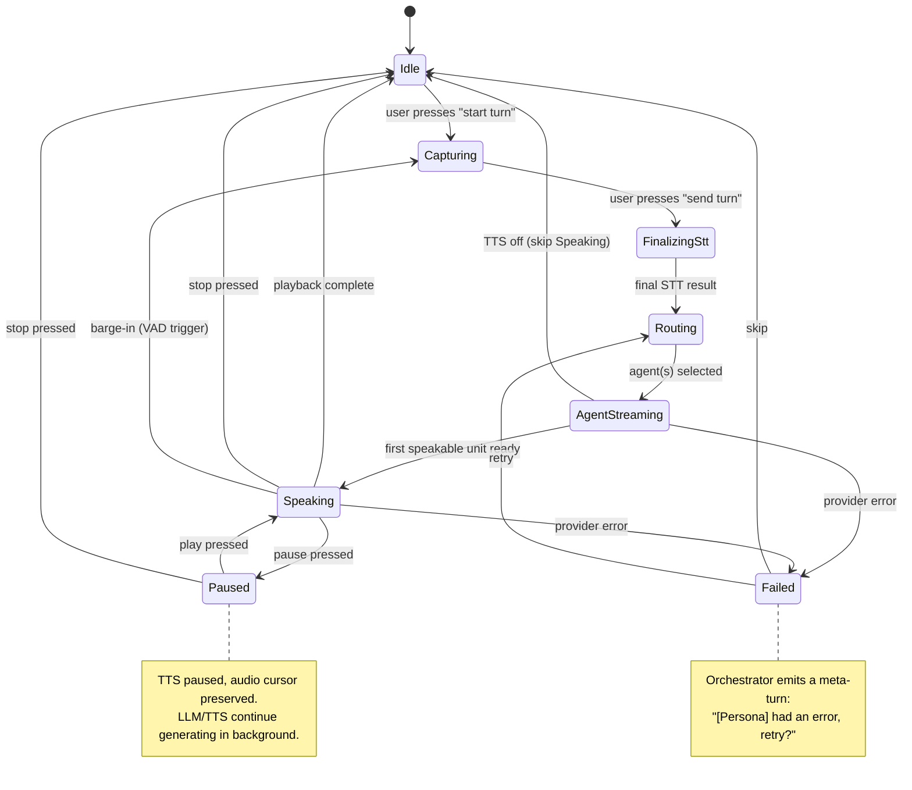

# Conversation Mode — Specification

> Status: **Draft**
> Author: Gavin + BigDog
> Date: 2026-04-20

---

## 1. Overview

Conversation Mode turns Parley from a transcription tool into a tool for *having conversations with AI agents* — while keeping the audio-pipeline core unchanged.

In Conversation Mode, Parley orchestrates a turn-based exchange between one or more humans and one or more AI agents. The user's voice is captured and transcribed (existing pipeline), routed to one or more LLM providers, and the response is optionally synthesized to speech and played back. The architecture is designed for **multi-tier agent orchestration** (a fast "host" model plus a heavy "expert" model with handoffs) and **mid-session persona/model switching**, but v1 ships with a single agent per turn for simplicity.

The driving use case: natural multi-party conversations (Gavin + parents + AI) where the AI can address each person by name, where the user's parents can listen to high-quality TTS without manual copy-paste into ElevenLabs Reader, and where the entire conversation is captured as a Parley session with full provenance.

---

## 1.5 Dependencies — Word-Graph Slice (Must Land First)

> Reference: [docs/word-graph-spec.md](word-graph-spec.md)

Conversation Mode reads and writes to the annotated stream. The current flat in-memory representation cannot host AI lanes, per-word TTS timing, or multi-lane diarization output. Before Conversation Mode can be implemented, a **minimal slice of the word-graph spec** must be built and the existing STT pipeline migrated onto it.

This is *not* the full word-graph implementation. The remaining graph features (`Alt` branches, `Correction` edges, `Temporal` edges, non-destructive editing, projection filters, undo) are deferred until they are needed by features outside Conversation Mode v1.

### 1.5.1 In Scope (Required Before Conversation Mode v1)

| Word-graph spec section | What to implement | Why Conversation Mode needs it |
|---|---|---|
| §1.1 `NodeKind` | `Word`, `Punctuation`, `Break`, `Silence` | Both human and AI lanes use the same node vocabulary. |
| §1.2 `NodeOrigin` | `Stt`, `UserTyped`, **and add `AiGenerated`** (new variant beyond current spec) | AI lane nodes need to be distinguishable from STT and user-typed origins. |
| §1.3 `NodeFlags` | `FLAG_TURN_LOCKED` only (`FLAG_FILLER` optional) | Live-turn rendering for in-progress AI streaming. |
| §1.4 `Node` struct | Full struct including `speaker: u8` lane index, `start_ms`, `end_ms`, `confidence` | Per-word TTS timing lives in `start_ms`/`end_ms` on AI nodes; lane index disambiguates speakers. |
| §2.1 `EdgeKind` | **`Next` only** | The per-lane spine. `Alt`, `Correction`, `Temporal` are not needed for v1. |
| §2.3 `Edge` struct | Full struct | Trivial. |
| §3.1 `WordGraph` storage | Arena (`Vec<Node>`), flat `Vec<Edge>`, `roots: Vec<NodeId>` (one per lane), adjacency `HashMap`s | Multi-lane forest is the structural prerequisite for AI lanes. |
| §3.2 core ops | `new`, `ingest_turn`, `walk_spine`, `edges_from`, `edges_to`, plus a new `ingest_ai_chunk` (or equivalent) for AI lane writes | Read/write surface the orchestrator needs. |
| §3.3 `SttWord` | Existing input shape | Migration target for the current STT pipeline. |
| Lane → Speaker binding | A `Lane` table where each lane references a `Speaker` (existing `Speaker` entity in [docs/architecture.md](architecture.md)) | Speaker-labeled transcripts for the LLM (§7 of this spec) and named addressing in AI replies. |

### 1.5.2 Out of Scope (Deferred — Not Needed for Conversation Mode v1)

| Word-graph spec section | Why deferred |
|---|---|
| §2.1 `EdgeKind::Alt` | No alternative-transcription UI in v1. |
| §2.1 `EdgeKind::Correction` | No editing of past turns in v1. |
| §2.1 `EdgeKind::Temporal` | Cross-speaker temporal DAG is an analysis pass; not on the v1 conversation path. |
| §2.2 derived-vs-intrinsic distinction | Trivially true when only `Next` edges exist; revisit when `Temporal` lands. |
| §3.2 `replace_span`, `delete_span`, `insert_after`, `analyze_temporal`, `reanalyze_range`, `to_llm_exchange`, `apply_llm_exchange` | All editing- and analysis-related. |
| §3.4 `ProjectionOpts` | Conversation history renders directly from the per-lane spine; no projection filters needed. |
| §4 Non-destructive editing (entire section) | No editing in v1. |

### 1.5.3 Migration Plan

1. Build the in-scope slice in a new module (e.g., `src/word_graph/`).
2. Migrate the existing STT ingest path off the current flat `Vec<Word>` (or equivalent) onto `ingest_turn` against the graph.
3. Verify Capture Mode still produces identical transcripts and persisted output.
4. *Then* begin Conversation Mode v1 implementation.

### 1.5.4 Word-Graph Spec Update Required

The current [word-graph spec §1.2 `NodeOrigin`](word-graph-spec.md#L96) defines three variants: `Stt`, `LlmFormatted`, `UserTyped`. Conversation Mode requires a fourth: **`AiGenerated`** — for words produced by an LLM as a conversational response (distinct from `LlmFormatted`, which is post-processing of existing STT output). This addition should be made to the word-graph spec as part of the slice work.

---

## 2. Goals & Non-Goals

### Goals (v1)

1. **Conversation Mode** as an opt-in top-level mode alongside Capture Mode.
2. **Single-agent turns** with high-quality TTS playback.
3. **Persona system** — switchable, mix-and-match bundles of (system prompt + voice + model config).
4. **Multi-party with self-introductions** — multiple humans in one room, each identified by voice, addressed by name in AI replies.
5. **Pause/Stop/Play controls** with per-turn audio caching.
6. **Crude barge-in** — VAD-triggered TTS pause that captures the interruption.
7. **Context window management** — token-based compaction, full transcript preserved.
8. **Cost visibility** — running total + per-turn breakdown.
9. **Architectural support** for multi-tier agents, mid-session persona switching, expensive narration, word-level TTS timing, and re-hydration of compacted content. None of these *ship* in v1, but v1 must not preclude them.

### Non-Goals (v1)

- Tools / function calling
- True full-duplex (audio-native, model-hears-while-speaking)
- Live narration of heavy-model reasoning streams
- Re-hydration of compacted content into live context
- Cross-session memory
- Word-level TTS highlighting and click-to-play in the UI
- Hosted realtime SDKs (OpenAI Realtime, Anthropic Agent API, ElevenLabs Conversational AI, Gradium, etc.)
- Mid-session persona switching (UI affordance — architectural support is in scope)
- Multi-tier orchestration with handoffs (deferred to v2)

### Explicit Philosophy Note

Parley remains an **audio-processing module**. Conversation Mode is a *feature that uses the core* — it is not a redefinition of what Parley is. The audio pipeline (capture, STT, diarization, persistence, TTS) is the core. The conversation orchestrator is a separate subsystem that consumes the core. This boundary must be respected: the audio core knows nothing about agents, personas, or turns.

---

## 3. Conceptual Model

### 3.1 The Two Top-Level Modes

| Mode | Description |
|---|---|
| **Capture Mode** | Today's behavior. Record audio → STT → annotated stream → save. No agent involvement. |
| **Conversation Mode** | User and AI agents exchange turns. Each turn is captured, transcribed, routed to agent(s), and the response is optionally spoken via TTS. |

Conversation Mode has a sub-toggle: **responses spoken** (TTS on) or **responses text-only** (TTS off). User input is independently typed or spoken.

### 3.2 New Entities

| Entity | Purpose |
|---|---|
| **Persona** | A reusable agent character: system prompt, voice (TTS), default model config, narration style. |
| **ModelConfig** | Provider + model + provider-specific settings (e.g., temperature, reasoning effort). Independent from Persona — mix-and-match. |
| **ConversationSession** | A Parley `Session` whose lanes include AI agent lanes. The data model is unchanged; this is just a `Session` with `Speaker.kind = ai_agent` lanes. |
| **Turn** | One exchange contribution — a contiguous span on a single lane bounded by speaker change or explicit "end-of-turn." Derived from the annotated stream, not stored separately. |
| **ConversationOrchestrator** | The runtime "harness" that owns conversation state, manages turn order, drives provider calls, handles pause/stop/barge-in. |

### 3.3 Persona ⊥ ModelConfig

Personas and model configs are orthogonal. A persona "Theological Scholar" can be paired with `claude-opus-4.7` for deep study or `gpt-5-mini` for quick lookups, without changing the persona definition. This is the mechanism for "switching models for consensus or perspective."

### 3.4 AI Agents Are Speakers

The annotated stream already supports `Speaker.kind = ai_agent`. Each active agent gets a lane. AI lanes hold:

- `Word` nodes (the spoken text), with `NodeOrigin::AiGenerated`
- Word-level timing from the TTS provider (start/end in ms)
- `Punctuation`, `Break`, and other standard node types
- Provenance pointing to the persona + model + provider that generated the turn

Multi-tier orchestration in v2 will add additional AI lanes per persona (one for the fast model, one for the heavy model) without any data-model changes.

---

## 4. The Conversation Orchestrator (a.k.a. The Harness)

The orchestrator is the central new component. It is *not* part of the core audio pipeline; it is a consumer of it.

### 4.1 Responsibilities

- Hold the current conversation history (the active `ConversationSession`)
- Hold the active persona(s) and their resolved model configs
- Hold provider client handles (LLM clients, TTS clients)
- Drive the **turn state machine** (see §5)
- Manage the **context window** and trigger compaction (§9)
- Manage **pause/stop/play** controls
- Detect **barge-in** via VAD and route the interruption (§8)
- Track **cost** per turn and in aggregate
- Handle provider failures and surface them gracefully (§10)

### 4.2 Architectural Constraints

- **Multi-tier-ready from day one.** The orchestrator's internal agent abstraction is `Vec<AgentSlot>`, not a hardcoded "fast" + "heavy" pair. v1 populates the vec with one slot.
- **Mid-session-switch-ready from day one.** Personas and model configs are looked up per-turn from the active session state, not captured at session start. Swapping the active persona between turns is supported in v1; only the UI to *trigger* the swap is deferred.
- **Decoupled from the UI.** The orchestrator exposes a state stream (e.g., `tokio::sync::watch` or a channel of `OrchestratorEvent`). The UI subscribes. No UI types leak into the orchestrator.

---

## 5. Turn State Machine

A single turn flows through the following states. Transitions are driven by events from the audio pipeline, the LLM provider, the TTS provider, and user controls.



### 5.1 State Definitions

| State | Description |
|---|---|
| **Idle** | No active turn. UI shows "Start Turn" affordance. |
| **Capturing** | Mic open, STT streaming. UI shows live interim transcript. |
| **Finalizing STT** | User has ended their turn; orchestrator awaits the final STT result. |
| **Routing** | Orchestrator selects which agent(s) to dispatch to. v1: always the active persona's heavy model. |
| **Agent Streaming** | LLM provider streaming tokens. UI shows tokens appearing in the AI lane. Sentence boundaries detected for speakable units. |
| **Speaking** | First speakable unit handed to TTS; audio playback begins. Subsequent sentences flow through TTS as they complete. |
| **Paused** | TTS playback paused; audio cursor preserved. LLM/TTS continue generating in background. |
| **Stopped** | TTS playback halted; remaining synthesized audio cached on the turn. Full LLM response still recorded in history. |
| **Failed** | Provider error. Orchestrator emits a meta-turn announcing the failure (spoken via fast/host voice in v2; in v1, spoken via the same persona voice). |

### 5.2 TTS Streaming Strategy

The orchestrator chunks the LLM token stream into **speakable units**. A speakable unit is:

- A complete sentence (terminated by `.`, `!`, or `?` followed by whitespace), OR
- An end-of-stream completion regardless of punctuation.

A small **lookahead buffer** (~1 token after the punctuation mark) avoids false sentence endings on abbreviations like "Dr." When the next token starts with a lowercase letter, the previous "sentence" is not yet complete; merge and continue.

Speakable units are dispatched to the TTS provider as they form. First-sentence latency is the dominant UX factor; the orchestrator must dispatch the first speakable unit the instant it completes.

### 5.3 Pause / Stop / Play Semantics

| Control | Effect on Playback | Effect on LLM | Effect on History | Effect on Audio Cache |
|---|---|---|---|---|
| **Pause** | Halts; cursor preserved. | Continues to completion. | Unchanged. | Continues to grow as TTS produces audio. |
| **Stop** | Halts; cursor reset for this turn. | Continues to completion. | Full response recorded; turn marked "stopped at cursor=N." | Frozen with whatever was synthesized so far; **never re-synthesized** if Play is pressed later. |
| **Play (per-turn button)** | Starts (or resumes) playback of a specific turn from its cached audio. | N/A | Unchanged. | Reused, not regenerated. |

Every AI response gets a Play button in the UI. If audio for that turn was never synthesized (TTS was off when it was generated), Play triggers synthesis on demand, then caches.

---

## 6. Personas

### 6.1 Schema

Personas live in `~/.parley/personas/*.toml`:

```toml
# ~/.parley/personas/theology-scholar.toml
[persona]
id = "theology-scholar"
name = "Theological Scholar"
description = "Bible study assistant following literal grammatical-historical hermeneutics."

[persona.system_prompt]
# Either inline text or a reference to a prompt file in ~/.parley/prompts/
file = "theology-scholar.md"
# OR
# text = """You are a..."""

[persona.tiers.heavy]
# v1 only uses the "heavy" tier. v2 will add "fast".
model_config = "claude-opus-latest"   # references a model config by id
voice = "elevenlabs:rachel"           # provider:voice_id
tts_model = "eleven_v3"               # v1 supports "eleven_v3" only; field exists for future flexibility
narration_style = "concise"           # how this tier introduces itself, hands off, etc. v2.

[persona.tiers.fast]
# Optional in v1. If present and v1 is single-agent, ignored.
# In v2, this becomes the host/anchor.
model_config = "claude-haiku-latest"
voice = "elevenlabs:adam"
tts_model = "eleven_v3"
narration_style = "anchor"

[persona.tts]
default_speak_responses = true        # whether responses are spoken by default
use_expression_annotations = true     # auto-prepend the expression-tag instruction to the system prompt (see §6.4)

[persona.context]
compact_at_token_pct = 70             # trigger compaction at 70% of model's context window
preserve_recent_turns = 6             # always keep the last N turns uncompacted
```

### 6.4 Expression Annotation Layer (Provider-Specific Surface)

For TTS to deliver emotionally appropriate speech, the LLM must annotate its responses with expression cues. Different TTS providers use different syntaxes and different scoping rules: xAI uses inline events plus XML-like wrappers, Cartesia Sonic-3 accepts point events and break tags, and ElevenLabs model families differ by version. Therefore the active `TtsProvider` owns both the expression instruction shown to the LLM and the translation into provider-native text.

The orchestrator does not maintain one universal prompt. At dispatch time, if `persona.tts.use_expression_annotations = true`, it asks the active provider for `TtsProvider::expression_tag_instruction()`. Providers return only the tags/spans they can render safely. The orchestrator then calls `TtsProvider::translate_expression_tags()` on each chunk before synthesis.

The brace-tag shape remains the cross-provider wire format in the assistant response, but the advertised vocabulary is provider-specific. Personas stay portable because they describe character and tone; the provider trait decides the legal expression surface for the current TTS model.

#### Neutral Expression Vocabulary (v1)

| Tag | Meaning |
|---|---|
| `{warm}` | Kind, gentle delivery. Default for empathetic personas. |
| `{empathetic}` | Feeling-with the listener. |
| `{concerned}` | Worried, careful tone. |
| `{questioning}` | Rising intonation, genuine inquiry. |
| `{thoughtful}` | Slower, considered, "thinking out loud." |
| `{excited}` | Energized, animated. |
| `{amused}` | Light, mildly playful. |
| `{laugh}` | Actual short laugh sound. |
| `{sarcastic}` | Dry, knowing inflection. |
| `{confused}` | Uncertain, puzzled. |
| `{sad}` | Somber, low energy. |
| `{soft}` | Quieter, intimate (conversational range, not stage-whisper). |
| `{emphasis}` | Stress on a word or short phrase. |
| `{sigh}` | Short audible exhale. Use sparingly. |
| `{pause:short}` | Deliberate beat, ~250ms. |
| `{pause:medium}` | Deliberate beat, ~700ms. |
| `{pause:long}` | Deliberate beat, ~1.5s. |

The vocabulary intentionally targets **conversational range**, not theatrical extremes. Whisper/shout-style tags are excluded because they are wrong-register for the parents-at-the-table use case. The vocabulary is expected to grow based on empirical use.

#### How the LLM Knows About Tags

The orchestrator **auto-prepends** the active provider's instruction to each persona's system prompt at dispatch time (gated by `persona.tts.use_expression_annotations`). The instruction lists only the tags that provider can currently render, with one-line descriptions and a short example.

For example, Cartesia may advertise `{laugh}`, `{sigh}`, and pause tags because those map cleanly to point events. xAI may additionally advertise `{soft}`, `{thoughtful}`, `{emphasis}`, and `{excited}` because its provider implementation can turn those into scoped wrappers over the following sentence or clause.

Personas describe their *character*. Plumbing (the tag instruction) is added uniformly by the orchestrator. Personas that need different behavior can opt out via `use_expression_annotations = false` and write whatever instruction they want directly into their system prompt.

#### Per-Provider Translation

Each `TtsProvider` implementation is responsible for translating the tags it advertised into its native expression syntax.

| Provider/model | Advertised expression surface |
|---|---|
| xAI grok-tts | `{laugh}`, `{sigh}`, pause tags, plus scoped style cues `{soft}`, `{thoughtful}`, `{emphasis}`, `{excited}` rendered through xAI wrappers. |
| Cartesia Sonic-3 | `{laugh}`, `{sigh}`, and pause tags rendered as `[laughter]`, `[sigh]`, and SSML break tags. |
| ElevenLabs multilingual v2 | No expression instruction; tags are not requested because this model family would read v3-style tags literally. |

Some translations are still lossy or approximate, but the loss is explicit and provider-local. A provider must not advertise a tag until its translator can render that tag safely.

### 6.2 Model Configs

Model configs live in `~/.parley/models/*.toml`:

```toml
# ~/.parley/models/claude-opus-latest.toml
[model]
id = "claude-opus-latest"
provider = "anthropic"
model_name = "claude-opus-4-7"
context_window = 200000

[model.options]
# Provider-specific options pass through opaquely.
temperature = 0.7
extended_thinking = { enabled = true, budget_tokens = 8000 }
```

Personas reference models by id. Any persona can be paired with any model config — that's the "mix-and-match for consensus and perspective" requirement.

### 6.3 Active Persona

The orchestrator holds an `active_persona: PersonaId` field. The currently active persona resolves on every turn (so a future UI affordance can swap it between turns without orchestrator restart).

A `ConversationSession` records the **sequence of active personas** used over its lifetime in provenance. If only one persona was used, provenance shows that one. If switching occurred, all switches are recorded with timestamps.

---

## 7. Multi-Party

### 7.1 The Architectural Bet

Multi-party with named addressing requires that the LLM receives a **speaker-labeled transcript** — every user turn tagged with the speaker's name. With proper labels, modern frontier models (validated experientially with Claude Opus 4.7) handle multi-party conversation well: addressing individuals by name, referring back to who said what, etc.

The hard part is *getting accurate labels in real-time.* Two paths feed the labels:

1. **Real-time diarization** from the STT provider (AssemblyAI streaming diarization or similar). Untested in production for Parley's use case. **This is the v1 risk.**
2. **Manual/explicit speaker tagging** as a fallback (button per speaker, or trigger phrases like "Gavin speaking" parsed by the orchestrator).

### 7.2 Self-Introduction Protocol

At session start (or on-demand later), the orchestrator can enter an **Introductions** sub-state:

1. Orchestrator displays a phonetically-rich sentence on screen, e.g.:
   > "My name is **___**, and I like long walks on the beach near the quiet pier under bright sunny skies."
2. Each speaker presses a "I'm next" button, then reads the sentence aloud (with their name substituted).
3. The orchestrator captures the audio, runs STT + voice fingerprinting (future) or speaker-embedding extraction, and creates a `SpeakerIdentity` annotation linking that voice profile to a name.
4. The user advances with a "Next speaker" button.
5. The user closes the introductions phase with a "We're ready" button. (No automatic timeout in v1.)
6. After introductions, late joiners can still self-introduce — the orchestrator always listens for self-intro phrases ("I'm Margie," "Hi, I'm Eric") and creates `SpeakerIdentity` annotations on the fly.

The default introduction sentence is configurable per-persona (some personas might want a domain-specific phrase). The user can edit it per session.

### 7.3 Fallback to Manual Tagging

If real-time diarization quality is unacceptable in v1 (TBD during implementation), the orchestrator falls back to **explicit per-speaker buttons**: one button per registered speaker, pressed before that person talks. Crude but reliable. The data model is unchanged — the buttons just produce the same `SpeakerIdentity` annotation a diarizer would have produced.

This decision (diarization vs. manual tagging) is left to implementation-time evaluation. Both code paths exist; a config flag chooses. **Open question.**

### 7.4 Addressing in AI Replies

Approach **(c)**: give the LLM the full speaker-labeled transcript and let it decide how to address people. No heuristic routing, no "directed turn" tagging in v1. Validated with Claude Opus 4.7.

### 7.5 TTS for Multi-Party

A single TTS voice speaks the entire AI response — there is no per-listener private channel. The voice is the active persona's heavy-tier voice. The AI's response text refers to people by name within the speech, which the TTS naturally pronounces.

---

## 8. Barge-In (v1 Crude Version)

Pure full-duplex is out of scope. v1 ships a minimal VAD-driven barge-in that pauses TTS and captures the interruption.

### 8.1 Trigger

During the **Speaking** state, a VAD monitor on the mic input watches for sustained speech. When two thresholds are met simultaneously, barge-in fires:

| Parameter | Default | Configurable |
|---|---|---|
| Volume threshold | -40 dBFS | Per-persona |
| Sustained duration | 500 ms | Per-persona |

Both must be met to avoid triggering on coughs, paper rustle, distant voices, etc.

### 8.2 Behavior on Trigger

1. Orchestrator transitions Speaking → Paused (same effect as the Pause button).
2. STT begins capturing the interrupting speech as the user's *next pending input.*
3. The pending input appears in a visible **"Pending Input"** area in the UI. The user can edit, append (by typing or by speaking again), discard, or send.
4. The AI's paused response remains in history with no special marker (the user may resume it).
5. User options:
   - **Send Turn** — pending input is committed as the next user turn. The AI's paused turn is finalized as "paused at this point" in history (cursor preserved). New turn proceeds.
   - **Play** — TTS resumes the paused AI response. Pending input remains in the buffer; the user can continue editing it for later sending.
   - **Discard** — pending input cleared.

This gives natural interruption without committing to true full-duplex, and makes "I started to interrupt but didn't mean to" recoverable.

---

## 9. Context Window Management

### 9.1 The Problem

Long conversations exceed the model's context window. The orchestrator must compact older content while preserving the full transcript for the user.

### 9.2 Compaction Trigger

Per-persona config: `compact_at_token_pct` (default 70%). When the projected token count of the next request would exceed this threshold, compaction runs **before** dispatching the next turn.

**Token counting:** Use the provider's official tokenizer where available (Anthropic's `count_tokens` API, OpenAI's `tiktoken`). When unavailable, fall back to a **word-count proxy** (~0.75 tokens per word for English; configurable per model). Token-based compaction is the architectural target; word-count is the v1 fallback when tokenizers aren't readily available.

### 9.3 Compaction Unit

Compaction operates by **token count**, not turn count and not time window:

1. Identify the oldest contiguous span of turns whose combined token count meets a target reduction (e.g., reduce context by 30% on each compaction).
2. Always preserve the most recent `preserve_recent_turns` turns uncompacted (default 6).
3. Send the identified span to the LLM with a "summarize this conversation segment, preserving speaker attribution and key facts" prompt.
4. Replace the span in the *live context* with a single **summary turn**.

### 9.4 The Summary Turn

A summary turn is a structural element in the conversation history:

- `Speaker.kind = system`
- Body: the LLM-generated summary
- Metadata: `was_compacted_from = [turn_ids]` — references to the original turns in the persistent transcript
- Visually marked in the UI (different background, "Summary of N earlier turns" header)

The original turns **remain in the persistent transcript** (the annotated stream / session file). They are simply no longer in the live LLM context.

### 9.5 Re-Hydration (Deferred to v2)

Bringing original turns back into live context when they become relevant again is a v2 feature. Requires:

- UI to mark "I need this back" (or automatic relevance detection)
- Heuristics for when re-hydration would help
- Token budget checks

**v1 preserves the data; v2 builds the interaction.**

### 9.6 Context Visibility

The UI exposes a context-utilization indicator (similar to VS Code Copilot's hollow pie chart): shows current token usage as a percentage of the active model's context window. Compaction events appear as visible markers in the conversation.

---

## 10. Failure Handling

### 10.1 LLM Provider Failures

When the LLM provider returns an error mid-response:

1. Orchestrator captures the partial response (whatever streamed before the error).
2. Orchestrator emits a **system meta-turn**:
   > "[Persona name] had an error: `{error message}`. Shall I retry?"
3. The meta-turn is spoken via TTS (using the active persona's voice in v1; in v2 with multi-tier, this becomes the fast/host model's voice).
4. UI shows **Retry** and **Skip** buttons.
5. Retry: re-dispatches the same turn to the same provider. (Fallback to a different provider is a v2 feature.)
6. Skip: marks the turn as failed in history, returns to Idle.

### 10.2 TTS Provider Failures

If TTS fails after the LLM response is generated:

1. Response stays in history as text-only.
2. UI shows the response with a "TTS unavailable — retry" affordance on the Play button.
3. User can retry synthesis at will, or read the text.

### 10.3 STT Provider Failures

Falls under existing core-pipeline error handling. Conversation Mode surfaces the error as a notification but does not modify the audio core's behavior.

---

## 11. Cost Tracking

### 11.1 What's Tracked

Per-turn:
- STT cost (existing meter)
- LLM cost: input tokens × input rate + output tokens × output rate
- TTS cost: characters synthesized × per-character rate

### 11.2 UI Surface

- **Running total** in the conversation panel header (extends the existing cost meter — same widget, just keeps tallying across turns within a session).
- **Per-turn breakdown** available on hover or expansion of the turn (`STT: $0.001, LLM: $0.034, TTS: $0.012, Total: $0.047`).
- **Model config** drives the rate table — each model config TOML carries its `input_rate_per_1m` and `output_rate_per_1m`.

---

## 12. Provider Traits

### 12.1 Design Philosophy

LLM providers diverge significantly (extended thinking, reasoning effort, tool calling formats, response shapes). Forcing a single uniform trait either dumbs everything down to the lowest common denominator or accumulates `Option<T>` cruft.

**Approach: thin shared trait + provider-specific extension traits.**

### 12.2 Shared Trait

```rust
/// The minimum surface every LLM provider must implement so the orchestrator
/// can drive a basic streaming chat exchange without provider-specific knowledge.
#[async_trait]
pub trait LlmProvider: Send + Sync {
    fn id(&self) -> &str;
    fn context_window(&self) -> usize;

    /// Streaming chat completion. Yields tokens as they arrive.
    async fn stream_chat(
        &self,
        messages: &[ChatMessage],
        opts: &ChatOptions,
    ) -> Result<BoxStream<'_, Result<ChatToken>>>;

    /// Token counting. Implementations should use the provider's native
    /// tokenizer when available; fall back to word-count approximation.
    fn count_tokens(&self, text: &str) -> usize;

    /// Cost calculation for a completed exchange.
    fn cost(&self, input_tokens: usize, output_tokens: usize) -> Cost;
}
```

`ChatOptions` carries universal options (temperature, max tokens, stop sequences) plus a `provider_extensions: serde_json::Value` escape hatch for things the shared trait can't model.

### 12.3 Provider-Specific Extension Traits

Each provider also exposes its own trait for features unique to that provider:

```rust
/// Anthropic-specific surface beyond the shared LlmProvider.
pub trait AnthropicLlm: LlmProvider {
    fn enable_extended_thinking(&self, budget: usize) -> Self;
    // ... other Anthropic-specific affordances
}

pub trait OpenAiLlm: LlmProvider {
    fn set_reasoning_effort(&self, effort: ReasoningEffort) -> Self;
    // ... other OpenAI-specific affordances
}
```

The orchestrator interacts via the shared `LlmProvider` trait for routing and dispatch. Per-persona configuration code (which knows which provider it's targeting) can use the extension traits to opt into provider-specific behavior.

### 12.4 TTS Provider Trait

```rust
#[async_trait]
pub trait TtsProvider: Send + Sync {
    fn id(&self) -> &str;
    fn list_voices(&self) -> Vec<VoiceInfo>;

    /// Synthesize a speakable unit. The input carries the rendered text
    /// plus Parley's neutral expression annotations (see §6.4); the
    /// provider implementation translates those annotations into its
    /// native expression syntax. Returns audio bytes plus per-word timing.
    /// Word timings populate the AI lane in the annotated stream even if
    /// v1's UI doesn't render word-level highlighting.
    async fn synthesize(
        &self,
        input: &TtsInput,
        voice_id: &str,
        opts: &TtsOptions,
    ) -> Result<TtsResult>;

    /// Streaming variant for low-latency playback. Yields audio chunks
    /// as they arrive from the provider.
    async fn synthesize_stream(
        &self,
        input: &TtsInput,
        voice_id: &str,
        opts: &TtsOptions,
    ) -> Result<BoxStream<'_, Result<TtsChunk>>>;

    fn cost(&self, characters: usize, voice_id: &str) -> Cost;
}

/// A speakable unit handed to TTS. Carries the rendered text along with
/// Parley's neutral expression annotations (see §6.4). The provider
/// implementation translates annotations into its native syntax.
pub struct TtsInput {
    pub text: String,
    pub annotations: Vec<ExpressionSpan>,
    /// Optional raw passthrough for power users — bypasses translation.
    pub raw_provider_text: Option<String>,
}

pub struct ExpressionSpan {
    pub tag: ExpressionTag,            // Warm, Empathetic, Laugh, PauseShort, ...
    pub start_char: usize,             // byte offset into TtsInput.text
    pub end_char: usize,
}

pub struct TtsResult {
    pub audio: Vec<u8>,
    pub format: AudioFormat,
    pub word_timings: Vec<WordTiming>,
}

pub struct WordTiming {
    pub word: String,
    pub start_ms: u32,
    pub end_ms: u32,
}
```

Word timings flow into the AI lane's nodes from day one. The UI doesn't render them in v1, but the data is captured.

### 12.5 v1 Provider Targets

| Trait | v1 Implementations |
|---|---|
| `LlmProvider` | `AnthropicLlm` (Haiku, Sonnet, Opus), `OpenAiLlm` (mini and frontier) |
| `TtsProvider` | `ElevenLabsTts` (eleven_v3 model only in v1) |

Future: Gradium (audio-native), local Whisper, local Piper TTS, additional ElevenLabs models (Flash v2.5 for low-latency cases), etc.

---

## 13. Persistence

### 13.1 Reuse the Existing Session Format

A `ConversationSession` is a `Session` with AI lanes. No new top-level format. The existing `.session.json` (full annotated stream) and `.md` (human-readable rendering) cover everything.

### 13.2 AI Lane Captures Expression Annotations

AI lane nodes in the annotated stream carry the original expression annotations alongside the rendered text. This means a turn can be re-synthesized later in a different voice or with a different TTS provider while preserving the LLM's emotional intent. The translation to provider-native syntax happens at synthesis time, not ingest time, so the canonical record stays neutral.

### 13.3 Session Frontmatter Additions

```yaml
---
session_id: "20260420-143022"
mode: "conversation"                  # NEW: "capture" | "conversation"
provenance:
  # ... existing fields ...
  conversation:
    personas_used:
      - { persona_id: "theology-scholar", from_turn: 0, to_turn: 12 }
      - { persona_id: "theology-scholar", from_turn: 13, to_turn: 25, model_config: "gpt-5-frontier" }
    compaction_events:
      - { at_turn: 18, compacted_turns: [0, 1, 2, 3, 4, 5], summary_turn_id: "summary-1" }
    tts_used: true
    total_cost_usd: 0.247
---
```

### 13.4 Per-Turn TTS Audio Cache

Synthesized audio for each AI turn is cached in the session directory:

```
~/.parley/sessions/2026-04-20/
├── 1430-conversation.md
├── 1430-conversation.session.json
├── 1430-conversation.flac           # User-side captured audio
└── tts-cache/
    ├── turn-001.opus                # AI lane audio per turn
    ├── turn-003.opus
    └── turn-007.opus
```

This is the audio the per-turn Play button replays. Surviving across app restarts means historical sessions remain replayable without re-synthesis.

---

## 14. UI Surface (v1 Sketch)

Not a full UI design — just the affordances Conversation Mode requires:

| Affordance | Description |
|---|---|
| Mode toggle | Capture Mode ↔ Conversation Mode. Top-level. |
| Persona selector | Dropdown of available personas. Active persona shown. |
| Model config selector | Dropdown of available model configs for the active persona. (Per the mix-and-match design.) |
| TTS toggle | "Speak responses" on/off (per-session, defaults to persona's preference). |
| Speaker registry | Visible list of registered speakers in the current session. "Add speaker" / "Run introductions" affordances. |
| Pending input area | Shows captured user speech (during a turn) and barge-in captures. Editable. |
| Conversation history | Scrolling list of turns with speaker labels, timestamps, per-turn cost on hover, Play button on every AI turn. |
| Context indicator | Hollow-pie or progress bar showing context utilization. Compaction events marked inline in history. |
| Pause / Stop / Send Turn buttons | Bottom action bar. State-aware. |
| Cost meter | Header. Running total + click for breakdown. |

---

## 15. Phased Delivery

### v1 — Single-Agent Conversation Mode

Everything in §§ 1–13 except items explicitly marked v2/future. The shipping minimum:

- Conversation Mode toggle and basic UI
- Persona + model config schemas, single-agent runtime
- Manual press-to-start / press-to-end turn-taking
- High-quality TTS (ElevenLabs) with sentence-level streaming
- Pause / Stop / per-turn Play
- Multi-party with self-introduction protocol (with manual tagging fallback)
- Crude VAD barge-in with pending-input capture
- Context compaction (token-based, no re-hydration)
- Cost tracking
- Failure handling for LLM and TTS providers

### v1.5 — Polish & Diarization Confidence

- Real-time diarization confidence reaches "good enough" — manual fallback can be hidden by default
- Voice fingerprinting persists across sessions (cross-session speaker recognition)
- Per-persona narration style polish

### v2 — Multi-Tier Orchestration

- Two agents per persona (fast + heavy) with handoff state in the state machine
- Fast model speaks acknowledgement before heavy model responds
- Different voices for fast and heavy tiers (already supported in persona schema)
- Re-hydration of compacted content into live context (with UI to trigger)
- Mid-session persona/model switching UI affordance
- Tools / function calling

### v3 — Expensive Narration & Full-Duplex

- Live narration of heavy-model reasoning streams (fast model summarizes the heavy's thinking in real-time)
- True barge-in (audio-native, possibly via a Gradium-style provider)
- Cross-session memory
- ElevenLabs Reader-style word-level highlighting and click-to-play in UI
- Provider failover (LLM A errors → automatic fallback to LLM B)

---

## 16. Decision Log

| # | Decision | Rationale |
|---|---|---|
| D1 | Conversation Mode is a feature on top of the core, not a redefinition of Parley. | Keep the audio core focused; allow Parley to fold into Gossamer cleanly. |
| D2 | No router model. Fast model routes (in v2). | One less hop, one less failure point, one less thing to debug. |
| D3 | High-quality TTS in v1; cheap narration *logic* in v1. | Audio quality is psychoacoustically critical; narration logic complexity can grow over time. |
| D4 | Single-agent v1, multi-tier-ready architecture. | Ship value sooner without painting into a corner. |
| D5 | Personas and model configs are orthogonal (mix-and-match). | Required for "switch models for consensus and perspective" use case. |
| D6 | Mid-session persona/model switching is architecturally supported in v1; UI deferred. | Don't bake assumptions that would prevent it later. |
| D7 | Multi-party with self-introductions ships in v1. | Highest-value feature for the parents-at-the-table use case. |
| D8 | Self-introductions use a phonetically-rich sentence + per-speaker button. | Richer voice sample improves diarization/fingerprinting; no auto-timeout in v1. |
| D9 | Real-time diarization is the goal; manual speaker-tagging is the safety-net. | Untested assumption; keep both paths. |
| D10 | Crude VAD barge-in in v1, with pending-input capture. | Parents-at-the-table won't reliably press buttons to interrupt. |
| D11 | Pause preserves cursor; Stop discards remaining playback but keeps full LLM response in history. | Stop = "I don't want to listen," not "delete what was said." |
| D12 | Per-turn audio cache; never re-synthesize on Play. | Save cost; preserve fidelity. |
| D13 | Context compaction by token count (word-count proxy fallback). | Tokens are the resource; turns and time are the wrong unit. |
| D14 | Original turns remain in persistent transcript; re-hydration deferred to v2. | Preserve data now; build interaction later. |
| D15 | Roll our own cascade; no hosted realtime SDKs. | Avoid vendor lock-in; preserve provider switchability. |
| D16 | Thin shared `LlmProvider` trait + provider-specific extension traits. | Hybrid of options A and C: orchestrator stays uniform, provider quirks are first-class. |
| D17 | TTS provider returns word-level timings from day one. | Word graph is the architectural direction; capture timing data now even if UI doesn't render it. |
| D18 | Sentence-boundary chunking with single-token lookahead for TTS streaming. | Best balance of latency and correctness (handles "Dr. Smith" correctly). |
| D19 | Stop semantics: full LLM response goes into history. | The AI did say it; the record should reflect that the user just chose not to listen. |
| D20 | TTS opt-in is a session-level mode toggle (with persona default), not a per-turn toggle. | Matches "I'm in Capture Mode or Conversation Mode" mental model. |
| D21 | Press-to-start / press-to-end turn-taking in v1 (no automatic endpointing). | Ship simpler; defer hard turn-taking work. |
| D22 | Tools / function calling out of scope for v1; trait designed to support it. | Conversation first; tool use is a separate product surface. |
| D23 | ElevenLabs v3 (`eleven_v3`) is the sole TTS model in v1. No Flash fallback. Persona schema includes `tts_model` field for future flexibility. | High-quality emotional delivery prioritized over latency; ~1–2s first-audio is acceptable for the deliberate, parents-at-the-table use case. |
| D24 | Provider-neutral expression annotation layer (§6.4) is the canonical encoding; per-provider translation happens at synthesis time. | Keeps personas portable across TTS providers; AI lane stores neutral annotations so re-synthesis preserves intent. |
| D25 | Orchestrator auto-prepends the expression-tag instruction to persona system prompts (gated by `use_expression_annotations` flag). | Personas describe character, not plumbing. Uniform behavior across personas; opt-out available. |
| D26 | v1 expression vocabulary targets conversational range only (no whisper/shout-style theatrical tags). | Wrong register for conversational use; vocabulary expected to grow empirically. |

---

## 17. Open Questions

| # | Question | When to Decide |
|---|---|---|
| Q1 | What's the v1 quality bar for AssemblyAI streaming diarization in 3+ speaker rooms? Diarization-driven labeling vs. manual tagging fallback. | During implementation; pilot with real conversations. |
| Q2 | Should the introductions phase save voice fingerprints to disk in v1, or just use them in-session? | Phase 1.5 question. v1 in-session is fine. |
| Q3 | What's the right default `preserve_recent_turns`? | After empirical testing. 6 is a guess. |
| Q4 | How does the orchestrator handle two humans starting to speak simultaneously? Does it serialize them into separate turns, or merge into one? | During implementation. |
| Q5 | Should TTS playback of the AI's response support speed adjustment in v1? (Some users prefer 1.5×.) | v1.5 polish. |
| Q6 | What happens if a persona references a model_config that's been deleted? Hard error or fallback to a default? | Trivial — fallback with warning. Confirm during implementation. |
| Q7 | Should the conversation panel allow editing of historical user turns (and re-running from that point)? Major UX/data-model question. | v2+. Out of v1 scope. |
| Q8 | Per-persona vocabulary support — should personas be able to specify domain vocabulary (theology terms, code identifiers) that biases STT? | v1.5 — already integrates with existing vocabulary system. |
| Q9 | Context compaction quality: does the LLM-generated summary preserve enough fidelity for a 30-minute-old conversation? | Empirical; will tune in v1. |
| Q10 | Multi-tier handoff: when the fast model says "let me think about that," does it speak before, after, or in parallel with the heavy model starting? | v2 design question. |
| Q11 | Empirical: what is ElevenLabs v3 streaming first-audio latency in our actual cascade (STT→LLM→TTS)? Acceptable for conversational pacing, or do we need a Flash fallback path after all? | Measure during v1 implementation; revisit D23 if untenable. |
| Q12 | How do LLMs (Claude Opus, GPT frontier) actually behave when instructed to emit Parley's neutral expression tags? Do they over-tag, under-tag, or use them well? Does the instruction need refinement per LLM provider? | Empirical; tune the auto-prepended instruction in v1. |
| Q13 | Is the v1 expression vocabulary (§6.4) sufficient, or are there obviously-missing tags that come up immediately in real conversations? | Empirical; expand vocabulary based on use. |

---

## 18. Risks

| Risk | Mitigation |
|---|---|
| Real-time diarization quality is poor → multi-party UX degrades | Manual speaker-tagging fallback always available (D9) |
| Compaction summary loses critical context → conversation feels lobotomized | Aggressive `preserve_recent_turns`; user-visible compaction events; v2 re-hydration |
| TTS latency dominates first-sentence time-to-audio → conversation feels sluggish | Sentence-level streaming (D18); start TTS the instant first sentence completes; ElevenLabs v3 latency measured empirically (Q11), revisit D23 if necessary |
| LLM ignores or misuses expression tags → emotional delivery falls flat | Auto-prepended instruction tuned per LLM provider (Q12); fallback is plain TTS without annotations, which still works |
| Cost runaway from heavy models + TTS in long sessions | Visible running total; per-turn breakdown; per-persona compaction thresholds |
| VAD barge-in false-triggers on background noise | Conservative defaults (-40 dBFS, 500ms); per-persona tunability; user can disable |
| Provider lock-in creep via persona-defaults coupling to one provider's quirks | Provider-specific extension traits keep quirks isolated; shared trait is provider-agnostic |
| Multi-tier (v2) work invalidates v1 architecture | Architecture designed for N tiers from day one (D4); v1 just populates N=1 |
