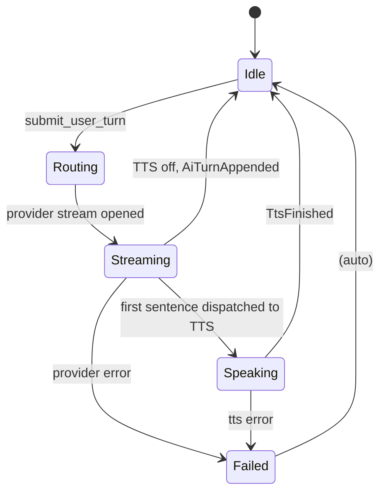

# Conversation Voice Slice — Specification

**Status:** Draft
**Type:** Specification
**Audience:** Both
**Date:** 2026-04-22

---

## 1. Overview

This spec defines the **first voice slice** of Conversation Mode: end-to-end speech-in / speech-out against an Anthropic LLM, using AssemblyAI for STT (already wired) and ElevenLabs `eleven_v3` for TTS (new).

It is a strict subset of [conversation-mode-spec.md](conversation-mode-spec.md). Items in that spec not listed here are deferred to a later slice.

Cross-references:
- Parent spec: [conversation-mode-spec.md](conversation-mode-spec.md)
- Architecture context: [architecture.md §Conversation orchestrator](architecture.md#L625)
- Provider registry: [proxy/src/providers.rs](../proxy/src/providers.rs)
- Secrets model: [secrets-storage-spec.md](secrets-storage-spec.md)
- TTS expression vocabulary (deferred but referenced): [conversation-mode-spec.md §6.4](conversation-mode-spec.md#L201)

---

## 2. Goals & Non-Goals

### 2.1 Goals (this slice)

1. User clicks **Start Turn**, speaks into the mic, and watches their own words appear in the conversation window in real time (interim + final transcripts from AssemblyAI, streaming as they're recognized — same UX as today's transcription view).
2. User clicks **End Turn**. The frontend waits for AssemblyAI to flush any in-flight final transcript, collapses the recognized words into one clean string, and POSTs it to the orchestrator.
3. The orchestrator dispatches the text to the active persona's LLM.
4. The LLM's streamed response is synthesized by ElevenLabs `eleven_v3` using a single configurable voice (Jarnathan, voice id `c6SfcYrb2t09NHXiT80T`).
5. Audio playback in the browser begins **after the first complete sentence** of the LLM response has been synthesized — playback is progressive (audio bytes flow into the audio element while the rest of the response is still synthesizing).
6. Per-turn TTS audio is cached on disk (`~/.parley/sessions/{id}/tts-cache/turn-NNN.mp3`) and re-playable via a Play button on every AI turn.
7. **Stop** halts current playback for the active turn (LLM continues to completion; full text recorded; audio frozen at synthesized-so-far).
8. **Pause** halts *playback* but TTS synthesis continues to completion in the background — the cache fills out fully so Play can later resume / replay the entire response.
9. After the AI's response finishes playing, mic capture **automatically restarts** for the next user turn — *unless* the user is in **type mode**.
10. The user can flip between **voice mode** (push-to-talk + auto-listen) and **type mode** (text input only) at any time. Type mode disables auto-listen.
11. ElevenLabs API key lives only in the proxy keystore (same model as Anthropic / AssemblyAI today). The literal key never crosses the wire.

### 2.2 Non-Goals (deferred to later slices)

| Deferred item | Why deferred |
|---|---|
| Barge-in via VAD | Spec §8 of parent; this slice ships push-to-talk only. |
| Multi-party speakers / diarization | Single-speaker use case in this slice. |
| Expression annotation layer (§6.4 of parent) | Adds an LLM-prompt and translation layer; orthogonal to plumbing. |
| Word-level TTS timings ingested into WordGraph | Useful for highlighting; not user-visible in this slice. |
| Failure meta-turns spoken via TTS | Errors render as banners (existing behavior). |
| Sentence-streaming (start playing first sentence's first chunk before the sentence ends) | First slice waits for the first **complete sentence** to be synthesized; finer-grained chunking is a follow-up. |
| Per-persona voice override | Single voice for v1 (Jarnathan). Per-persona voice support exists in the schema already; we just don't exercise it. |
| OpenAI provider | Out of scope for this slice. |
| Auto-listen disabled when TTS is off | TTS is always on in this slice. A toggle is a follow-up. |

### 2.3 Reaffirmed Decisions From Parent Spec

| Ref | Decision |
|---|---|
| [§5.2](conversation-mode-spec.md#L171) | Sentence-boundary chunking with single-token lookahead. |
| [§5.3](conversation-mode-spec.md#L181) | Pause = halt + preserve cursor; Stop = halt + freeze cache; Play = replay from cache. |
| [§13.4](conversation-mode-spec.md#L596) | Per-turn audio cache in session directory. |
| [D21](conversation-mode-spec.md#L674) | Press-to-start / press-to-end turn-taking. |
| [D23](conversation-mode-spec.md#L676) | `eleven_v3` is the sole TTS model. |

### 2.4 New Decisions Introduced By This Slice

| # | Decision | Rationale |
|---|---|---|
| VS-1 | TTS dispatch is **per-sentence**, not per-token. Buffer until a sentence-terminating punctuation + lookahead, then synthesize that whole sentence. | Lowest-complexity progressive playback that still yields acceptable first-audio latency (~1.5s for a typical first sentence). Finer chunking is a follow-up. |
| VS-2 | TTS audio is requested in **MP3 44.1kHz 128kbps** from ElevenLabs (`mp3_44100_128`). Cached on disk as MP3 (not Opus). | MP3 is natively supported by `MediaSource` in all WASM browser targets without a transcode step. 128 kbps avoids audible artifacts on sibilants while keeping cache sizes trivial. |
| VS-3 | Each sentence is a **separate ElevenLabs HTTP request** (not one streaming WebSocket session). Audio chunks from each request are concatenated and appended to the same `MediaSource` buffer. | Sentence requests parallelize trivially. Avoids the stateful WS protocol's reconnection / sequencing edge cases. Trade-off: ElevenLabs charges per character regardless, and per-request latency is bounded by network round-trip plus the first byte of audio. |
| VS-4 | Playback transport from proxy → browser is a **separate SSE stream** keyed by `turn_id`, not multiplexed into the existing `/conversation/turn` SSE. The turn SSE emits a `tts_started { turn_id }` event; the browser opens a sibling `GET /conversation/tts/{turn_id}` connection that streams audio chunks as base64-encoded `data:` payloads. | Keeps the existing turn SSE binary-free (it stays JSON-only). Lets the browser tear down the audio stream independently of the LLM stream. |
| VS-5 | The disk cache file format is **MP3** (matches what ElevenLabs returns). Replay is the same content the live stream produced. | No transcode complexity. Re-synthesis at a different bitrate is a separate concern. |
| VS-6 | The conversation has two modes: **voice mode** (push-to-talk + auto-listen-after-AI) and **type mode** (text input only). User toggles at any time. Default = voice mode when an ElevenLabs key is configured, type mode otherwise. | Lets the user fall back to typing without abandoning the conversation. |
| VS-7 | Pause/Stop **only target the currently-playing turn**. Playing a historical turn from cache cannot be paused mid-playback in this slice — it only supports Play and Stop. | Avoids per-turn state machines for historical playback; one global "active player" handle. |

---

## 3. Architecture

### 3.1 New Components

```mermaid
flowchart LR
    subgraph Browser
        UI[ConversationView]
        Cap[BrowserCapture<br/>existing]
        STT[AssemblyAI WS<br/>existing]
        Player[MediaSource Player<br/>NEW]
    end
    subgraph Proxy
        TurnSSE[/conversation/turn SSE/]
        Orch[ConversationOrchestrator]
        Chunker[SentenceChunker<br/>NEW]
        TTS[ElevenLabsTts<br/>NEW]
        TtsSSE[/conversation/tts/&#123;turn_id&#125; SSE<br/>NEW/]
        Cache[(tts-cache/<br/>turn-NNN.mp3)]
    end
    subgraph External
        AAI[AssemblyAI<br/>v3 streaming]
        Anth[Anthropic API]
        EL[ElevenLabs<br/>eleven_v3]
    end

    Cap --> STT
    STT --> AAI
    AAI -->|interim+final transcript| UI
    UI -->|POST /conversation/turn| TurnSSE
    TurnSSE --> Orch
    Orch -->|stream tokens| Anth
    Anth -->|tokens| Orch
    Orch -->|sentence text| Chunker
    Chunker -->|complete sentence| TTS
    TTS -->|HTTP synth req| EL
    EL -->|MP3 chunks| TTS
    TTS -->|append| Cache
    TTS -->|broadcast| TtsSSE
    UI -->|GET /conversation/tts/&#123;id&#125;| TtsSSE
    TtsSSE -->|base64 chunks| Player
```



### 3.2 New Module Layout

```
parley-core/
  src/
    tts/
      mod.rs              # TtsInput, TtsChunk, TtsCost, sentence types
      sentence.rs         # SentenceChunker (pure, no I/O — testable on WASM)
proxy/
  src/
    tts/
      mod.rs              # TtsProvider trait + TtsError
      elevenlabs.rs       # ElevenLabsTts impl (streaming MP3)
      cache.rs            # FsTtsCache: per-session per-turn MP3 store
    conversation_api.rs   # extended: /conversation/tts/{turn_id} SSE route
    orchestrator/
      mod.rs              # extended: chunker integration + tts dispatch
src/
  ui/
    conversation.rs       # extended: voice-input + audio playback
    media_player.rs       # NEW: MediaSource wrapper for progressive playback
```

### 3.3 Boundary Discipline

- `parley-core` gets a small `tts` module containing only **WASM-clean** types: `TtsInput`, `TtsChunk` (data only, no I/O), `SentenceChunker`. The chunker has no async, no `tokio`, no HTTP — it accepts strings and emits sentence boundaries. This lets both the proxy (where the chunker actually drives synthesis) and tests on any platform exercise it.
- `proxy::tts::TtsProvider` trait + impl live in the proxy because they pull HTTP + tokio. Same boundary as `LlmProvider` ([proxy/src/llm/mod.rs](../proxy/src/llm/mod.rs)).
- The orchestrator owns one `Arc<dyn TtsProvider>` (Optional — `None` means "TTS disabled, text-only response," same code path as today).

---

## 4. Data Model

### 4.1 New Types in `parley-core::tts`

```rust
/// One sentence (or final partial) ready to be synthesized.
#[derive(Debug, Clone, PartialEq)]
pub struct SentenceChunk {
    /// Zero-based index within the current turn. The orchestrator
    /// uses this to label downstream cache files / SSE events
    /// (e.g. `turn-007.sentence-002.mp3` if needed for debugging).
    pub index: u32,
    /// The sentence text. Already includes its terminating
    /// punctuation. Whitespace is trimmed.
    pub text: String,
    /// `true` when this is the last sentence the chunker will
    /// emit for the turn (drained at end-of-stream regardless of
    /// punctuation).
    pub final_for_turn: bool,
}

/// Stateful sentence-boundary detector.
pub struct SentenceChunker { /* impl detail */ }

impl SentenceChunker {
    pub fn new() -> Self;
    /// Feed a token / delta from the LLM stream. Returns zero or
    /// more `SentenceChunk`s that just completed.
    pub fn push(&mut self, delta: &str) -> Vec<SentenceChunk>;
    /// Drain any remaining buffered text as a final sentence.
    /// Always called exactly once at end-of-turn.
    pub fn finish(&mut self) -> Option<SentenceChunk>;
}
```

#### 4.1.1 SentenceChunker — Behavioral Contract

A "sentence boundary" is detected when:

1. The buffered text contains a sentence-terminating character: `.`, `!`, `?`.
2. **Lookahead:** at least one additional character has arrived after the terminator.
3. The character immediately after the terminator is **whitespace** (space, tab, newline) — OR the buffer ends and `finish()` is called.
4. The character following the whitespace is **not lowercase** (handles `Dr. Smith` — terminator followed by space followed by lowercase = not a sentence boundary; merge and continue).

When all four conditions are met, everything up to and including the terminator is emitted as a sentence. Trailing whitespace is consumed but not included in the chunk text. The `index` increments for each emitted chunk.

`finish()` flushes any remaining non-whitespace buffer as the final sentence regardless of punctuation, with `final_for_turn = true`. The last `push()`-emitted sentence in a turn is also marked `final_for_turn = true` if `finish()` would otherwise return `None` — this means the orchestrator can rely on exactly one sentence per turn carrying the final flag.

### 4.2 New Types in `proxy::tts`

```rust
#[derive(Debug, Clone)]
pub struct TtsRequest {
    /// Sentence text to synthesize. ASCII / UTF-8 safe.
    pub text: String,
    /// ElevenLabs voice id (e.g. "c6SfcYrb2t09NHXiT80T").
    pub voice_id: String,
    /// Provider model id. v1 is always "eleven_v3" but kept
    /// configurable per spec D23.
    pub model_id: String,
}

#[derive(Debug)]
pub enum TtsChunk {
    /// MP3 byte chunk — append to cache and forward to player.
    Audio(Vec<u8>),
    /// Synthesis finished cleanly; carries the character count
    /// actually sent to the provider (for cost accounting).
    Done { characters: u32 },
}

#[derive(Debug, thiserror::Error)]
pub enum TtsError {
    #[error("transport: {0}")] Transport(String),
    #[error("HTTP {status}: {body}")] Http { status: u16, body: String },
    #[error("auth: {0}")] Auth(String),
    #[error("malformed response: {0}")] BadResponse(String),
    #[error("tts disabled (no provider configured)")] Disabled,
}

#[async_trait]
pub trait TtsProvider: Send + Sync {
    fn id(&self) -> &str;
    /// Streaming synthesis. Yields audio bytes as they arrive,
    /// terminating with exactly one `Done` (or an error item).
    async fn synthesize_stream(
        &self,
        req: &TtsRequest,
    ) -> Result<BoxStream<'_, Result<TtsChunk, TtsError>>, TtsError>;
    /// USD cost estimate for the given character count.
    /// Implementations consult their own per-character rate.
    fn cost_for(&self, characters: u32) -> Cost;
}
```

### 4.3 Per-Turn Audio Cache

```
~/.parley/sessions/{session-id}/tts-cache/
  turn-001.mp3
  turn-003.mp3
  ...
```

Files are named by turn id zero-padded to three digits. The cache directory is created lazily on first write. Reads are streamed via standard file I/O; writes happen via `tokio::fs::OpenOptions::append(true)` so each TTS chunk is durable as it arrives.

`FsTtsCache` API (proxy):

```rust
pub struct FsTtsCache { root: PathBuf /* sessions root */ }
impl FsTtsCache {
    pub fn new(sessions_root: PathBuf) -> Self;
    /// Returns a writer that appends to `{root}/{session}/tts-cache/turn-{id:03}.mp3`.
    pub async fn writer(&self, session_id: &str, turn_id: &TurnId)
        -> Result<TtsCacheWriter, std::io::Error>;
    /// Streams the cached file as a `BoxStream<Bytes>` for replay.
    pub async fn reader(&self, session_id: &str, turn_id: &TurnId)
        -> Result<TtsCacheReader, std::io::Error>;
    /// Whether the cache exists for this turn.
    pub async fn exists(&self, session_id: &str, turn_id: &TurnId) -> bool;
}
```

### 4.4 Orchestrator Extensions

`OrchestratorContext` gains:

```rust
/// Optional TTS provider. `None` means "text-only mode" (existing
/// behavior preserved).
pub tts: Option<Arc<dyn TtsProvider>>,
/// Optional cache. Required iff `tts` is `Some`.
pub tts_cache: Option<Arc<FsTtsCache>>,
/// Voice id to use for all turns in this slice. Per-persona voice
/// override is a follow-up.
pub tts_voice_id: Option<String>,
```

`OrchestratorEvent` gains three new variants:

```rust
/// First sentence of the AI turn was dispatched to TTS. Carries
/// the turn id so the browser can open the audio sibling stream.
TtsStarted { turn_id: TurnId },
/// One synthesized sentence finished and was appended to the
/// cache. Useful for progress UI; not strictly required for
/// playback (the audio sibling stream carries the bytes).
TtsSentenceDone { turn_id: TurnId, sentence_index: u32, characters: u32 },
/// Whole turn's TTS finished. Final cost is rolled into
/// `AiTurnAppended.cost` already; this event signals "cache is now
/// complete, safe to close audio sibling stream."
TtsFinished { turn_id: TurnId, total_characters: u32 },
```

The chunker drives between LLM `Token { delta }` and TTS dispatch:

1. On each `Ok(ChatToken::TextDelta { text })`, the orchestrator forwards `text` to `SentenceChunker::push`. Any returned chunks are queued for synthesis.
2. The first queued chunk for a turn fires `TtsStarted` and starts a synthesis task.
3. Synthesis tasks run **serially per turn** (sentence N+1 starts after sentence N finishes appending to cache) so the cache file remains a valid concatenated MP3 stream.
4. On final `ChatToken::Done`, the orchestrator calls `chunker.finish()` and synthesizes any trailing sentence.
5. After the last sentence completes, `TtsFinished` is emitted and the cache file is closed.

**Failure handling within TTS:** A TTS error during synthesis emits an `OrchestratorEvent::Failed { message }` but does **not** roll back the LLM turn — the AI's text stays in the session and is rendered as text-only. The Play button on that turn shows "TTS unavailable — retry" (deferred to a follow-up; in this slice it just renders without a Play button).

### 4.5 Cost Accounting

`TurnProvenance.cost` is currently the LLM cost. We extend it:

```rust
pub struct TurnProvenance {
    pub persona_id: PersonaId,
    pub model_config_id: ModelConfigId,
    pub usage: TokenUsage,
    pub llm_cost: Cost,            // renamed from `cost` for clarity
    pub tts_characters: u32,       // 0 when TTS was off for this turn
    pub tts_cost: Cost,            // zero when TTS was off
}
```

No backwards-compat layer: existing on-disk sessions are not preserved across this change (per user direction). The frontend's running-total math sums `llm_cost.usd + tts_cost.usd`.

---

## 5. HTTP API Changes

### 5.1 New Route: `GET /conversation/tts/{turn_id}`

`text/event-stream` response. Events:

| `event:` | `data:` payload | When |
|---|---|---|
| `audio` | `{"type":"audio","b64":"..."}` | Every MP3 chunk as it arrives from ElevenLabs. Base64-encoded. |
| `done` | `{"type":"done"}` | Synthesis complete and cache finalized. |
| `error` | `{"type":"error","message":"..."}` | Synthesis failed; client should fall back to "text only" rendering. |

Response status:
- `200` — stream begins. If the turn is still being synthesized, the proxy attaches a live consumer to the in-progress broadcast. If the turn is already cached, the proxy reads the cache file and emits `audio` chunks at line speed followed by `done`.
- `404` — unknown turn id (no live broadcast and no cache file).

The proxy maintains a per-turn `tokio::sync::broadcast` channel during live synthesis. Late subscribers get the bytes from the cache file (already on disk) followed by any remaining live chunks. The handoff is internal to this route.

### 5.2 New Route: `POST /conversation/tts/{turn_id}/replay`

Returns the cached MP3 file with `Content-Type: audio/mpeg`, suitable for direct `<audio src="...">`. This is the **simpler replay path** for historical turns; the SSE route above is reserved for live synthesis. Status `404` if no cache file exists.

### 5.3 Existing Route Changes

`POST /conversation/turn` SSE adds the three new event variants from §4.4 (`tts_started`, `tts_sentence_done`, `tts_finished`). The browser ignores unknown variants today, so the change is forward-compatible.

`POST /conversation/init` accepts an optional `voice_id` field; if absent, the proxy uses `c6SfcYrb2t09NHXiT80T` (Jarnathan) as the default. The voice id is stored in the orchestrator's context for the lifetime of the session.

`/api/secrets` automatically picks up the new `elevenlabs` provider when the registry entry is added (see §6.1). No new routes required.

---

## 6. Provider Wiring

### 6.1 Provider Registry Addition

[proxy/src/providers.rs](../proxy/src/providers.rs) gains:

```rust
pub enum ProviderId {
    Anthropic,
    AssemblyAi,
    ElevenLabs,   // NEW (must be appended; index = discriminant)
}

// In REGISTRY (appended):
ProviderDescriptor {
    id: "elevenlabs",
    display_name: "ElevenLabs",
    category: ProviderCategory::Tts,
    env_var: "PARLEY_ELEVENLABS_API_KEY",
},
```

The Settings panel auto-renders an ElevenLabs API key row because it iterates the registry by category.

### 6.2 ElevenLabs HTTP Contract

The provider hits `POST https://api.elevenlabs.io/v1/text-to-speech/{voice_id}/stream`:

```http
POST /v1/text-to-speech/c6SfcYrb2t09NHXiT80T/stream?output_format=mp3_44100_64 HTTP/1.1
xi-api-key: <KEY>
Content-Type: application/json

{
  "text": "Hello world.",
  "model_id": "eleven_v3",
  "voice_settings": { "stability": 0.5, "similarity_boost": 0.75 }
}
```

Response is a streaming MP3 byte stream. The provider implementation reads `reqwest::Response::bytes_stream()` and forwards each chunk as `TtsChunk::Audio`, finishing with `TtsChunk::Done { characters }` where `characters` is the UTF-8 character count of the request `text`.

`voice_settings` defaults are hardcoded for v1; per-persona overrides are deferred.

Cost: ElevenLabs charges per character. v1 hardcodes the **Creator-tier rate** of `0.000015 USD / character` (≈ $15 per 100k chars). The exact rate is plan-dependent; this slice uses the published Creator rate as a starting point and surfaces the running total in the existing cost meter for sanity-checking against the ElevenLabs dashboard. Plan-specific rate overrides are a follow-up.

### 6.3 Provider Construction

`/conversation/init` and `/conversation/load`:

1. Resolve the Anthropic credential (existing).
2. **NEW:** Resolve the ElevenLabs credential (request body field `elevenlabs_credential`, default `"default"`). If `None`, the orchestrator runs in **text-only mode** (`tts: None` in context) and the frontend gets no TTS audio. If present, construct `ElevenLabsTts` and wire it.
3. The frontend defaults the ElevenLabs credential dropdown to `"default"`, same as Anthropic.

When no ElevenLabs key is configured at all, the conversation still works — it's just text-only — and the UI shows a small "TTS off" badge with a link to Settings.

---

## 7. Frontend (WASM)

### 7.1 Voice Input Wiring

The transcription view (`src/ui/app.rs`) already owns `BrowserCapture` + AssemblyAI streaming and renders the live transcript. We **extract** the capture+STT machinery into a reusable hook:

```rust
// src/ui/use_voice_input.rs
pub struct VoiceInputHandle {
    pub interim_text: ReadOnlySignal<String>,
    pub final_text: ReadOnlySignal<String>,
    pub state: ReadOnlySignal<VoiceState>,  // Idle, Listening, Finalizing, Error(String)
    pub start: Callback<()>,
    pub stop: Callback<()>,        // stops capture; finalizes the transcript
}
pub fn use_voice_input() -> VoiceInputHandle;
```

`ConversationView` consumes this hook. The push-to-talk flow:

1. User clicks **Start Turn** (or presses Space) → `start()` → AssemblyAI begins streaming, interim text shows in the pending-input area.
2. User clicks **Send Turn** → `stop()` → final transcript collapses into a single string.
3. Frontend POSTs `/conversation/turn` with that string.
4. SSE stream consumed (existing path) + the new `tts_started` event triggers opening the audio sibling stream (§7.2).
5. After `tts_finished` (or `ai_turn_appended` if TTS off), **auto-listen** kicks back in → `start()` is called automatically.

The user can override auto-listen by clicking **Stop Listening** before speaking again.

### 7.2 Progressive Audio Playback

```rust
// src/ui/media_player.rs
pub struct MediaSourcePlayer { /* MediaSource + SourceBuffer + HTMLAudioElement */ }
impl MediaSourcePlayer {
    pub fn new() -> Result<Self, JsValue>;
    /// Append an MP3 chunk. Safe to call from any task — internally
    /// queues chunks until `SourceBuffer.updateend` fires.
    pub fn append(&self, bytes: &[u8]) -> Result<(), JsValue>;
    /// Mark end-of-stream. Player will play to completion then idle.
    pub fn end(&self) -> Result<(), JsValue>;
    /// Halt playback without freeing the player.
    pub fn pause(&self);
    /// Resume from current cursor.
    pub fn play(&self);
    /// Halt and detach the audio element (cannot resume).
    pub fn stop(&self);
    /// Subscribe to playback-finished events.
    pub fn on_ended(&self, cb: Box<dyn Fn()>);
}
```

`MediaSource` API is provided by `web-sys`. The browser-supported MIME type for `eleven_v3` MP3 output is `audio/mpeg`.

The audio sibling stream (`GET /conversation/tts/{turn_id}` SSE) is consumed by a `wasm_bindgen_futures` task that decodes each base64 chunk and calls `player.append(...)`. On `done`, it calls `player.end()`.

### 7.3 Per-Turn Play / Stop / Pause Controls

- **Live turn (currently playing):** Pause / Play / Stop buttons in the AI turn bubble.
- **Historical turn (cached):** Play / Stop only. Pause is deferred (VS-7).
- **Replay mechanism:** Historical playback uses `<audio src="/conversation/tts/{turn_id}/replay">` — simpler than re-running through `MediaSource`, since latency doesn't matter for replay.

### 7.4 Voice / Type Mode and Auto-Listen Loop

A `mode` signal toggles between `Voice` and `Type`. The toggle is a button in the conversation header.

- **Voice mode:** the input area shows the live transcript with **Start Turn** / **End Turn** buttons. After a TTS playback finishes (audio `ended` event fires) and the orchestrator emits `TtsFinished` (or `AiTurnAppended` if TTS is off), the frontend auto-calls `voice.start()` to begin the next turn. If the user manually clicked **Start Turn** during playback, the auto-start is a no-op (idempotent).
- **Type mode:** the input area shows a text box and **Send** button. No mic activity. Auto-listen is suppressed.

Flipping from voice → type while listening immediately stops the capture and discards the in-flight transcript. Flipping from type → voice does nothing automatic — the user has to click **Start Turn** for the first capture.

---

## 8. State Machine Updates

The orchestrator state enum gains one new value:

```rust
pub enum OrchestratorState {
    Idle,
    Routing,
    Streaming,    // LLM tokens arriving
    Speaking,     // NEW: TTS playback in progress (LLM may still be streaming)
    Failed,
}
```

Transition diagram (this slice only):



Pause / Stop / Play act on the **playback layer** (the `MediaSourcePlayer` in the browser), not the orchestrator state. Stop emits no orchestrator event — the LLM continues, the AI turn still gets appended with provenance, and the cache still finalizes. Stop just disconnects the local audio.

---

## 9. Test Plan

| Component | Tests |
|---|---|
| `SentenceChunker` | (1) Single sentence ending in `.`. (2) Multiple sentences in one push. (3) Sentences split across pushes. (4) `Dr. Smith` does not split. (5) `?` and `!` terminators. (6) `finish()` flushes a non-terminated trailing sentence. (7) Empty pushes are no-ops. (8) Indices are sequential and start at 0. (9) The last emitted chunk for a turn is marked `final_for_turn`. |
| `ElevenLabsTts` | Mocked `reqwest` HTTP server (using `wiremock`). (1) Happy path — chunks arrive in order, `Done { characters }` correct. (2) HTTP 401 → `TtsError::Auth`. (3) HTTP 5xx → `TtsError::Http`. (4) Network drop mid-stream → error in stream item. |
| `FsTtsCache` | (1) Writer creates the directory lazily. (2) Round-trip: write chunks, read them back identical. (3) Concurrent writers to different turns don't collide. (4) `exists` correctly reports presence. |
| Orchestrator + TTS | Using a `MockTtsProvider` and a fake clock. (1) LLM emits two sentences → two TTS dispatches → `TtsStarted`, two `TtsSentenceDone`, one `TtsFinished`. (2) LLM emits one sentence then errors → `TtsFinished` still fires for the synthesized sentence; `Failed` event fires for LLM error. (3) TTS error mid-turn → `Failed` event; AI turn still appended with text. (4) `tts: None` in context → no TTS events emitted; existing flow preserved. |
| `/conversation/tts/{turn_id}` SSE | (1) Live synthesis: subscribe before first chunk; receive all chunks + `done`. (2) Replay: subscribe after `done`; receive cached bytes + `done`. (3) Unknown turn id → 404. |
| Provider registry | Existing tests (`registry_index_matches_variants`) cover the new `ElevenLabs` variant automatically. |

WASM browser-side code (capture extraction, MediaSource player, SSE consumer) is **not** covered by automated tests in this slice — the existing transcription view has no automated tests either, and adding browser-test infrastructure is out of scope. Manual verification:

1. Set ElevenLabs API key in Settings.
2. Start a conversation, click **Start Turn**, speak a sentence, click **Send Turn**.
3. Verify: AI text streams into the bubble; first sentence audio begins playing within ~2s of the LLM's first token; full response plays through.
4. Click **Pause** mid-playback → audio halts. Click **Play** → resumes from same cursor.
5. Click **Stop** → audio halts. Click Play on the turn after it completes → cached audio plays.
6. Verify auto-listen: after audio finishes, the mic light comes back on.
7. Verify cache: `~/.parley/sessions/{id}/tts-cache/turn-001.mp3` exists and is playable in any media player.
8. Reload the page, load the same session → Play buttons on historical AI turns work.

---

## 10. Migration / Compatibility

No migration. `TurnProvenance` is changed in place; existing on-disk sessions become unloadable (per user direction — no production data to preserve). On startup, the proxy logs a one-line warning if `~/.parley/sessions/` contains files; the user is expected to delete them.

- **No ElevenLabs key configured:** Conversation runs text-only and defaults to **type mode**. UI shows a "TTS off — configure ElevenLabs in Settings" badge near the mode toggle.
- **Anthropic-only / AssemblyAI-only key set:** No regression.

---

## 11. Open Questions

| # | Question | Resolution path |
|---|---|---|
| OQ-1 | Does ElevenLabs `eleven_v3` actually support the `/stream` endpoint with MP3 output today, or do they require WebSocket for streaming? | Verify against current ElevenLabs API docs during implementation; switch to WS if needed (changes §6.2 only). |
| OQ-2 | What's the actual ElevenLabs character rate for the user's plan? | Hardcode Creator-tier rate (`$0.000015/char`) for v1; surface in cost meter so divergence from the dashboard is visible; revisit with a `tts_rates` config later. |
| OQ-3 | Does AssemblyAI's `end_of_turn=true` event happen reliably enough that we could skip the explicit "End Turn" click in a v2 slice? | Empirical question; ignored in this slice. |

---

## 12. Out-of-Scope Reminders

This slice does **not** implement:

- Barge-in
- Multi-party / diarization
- Expression annotation tags
- WordGraph AI lane writes / per-word TTS timings
- OpenAI provider
- Per-persona voice override (single voice for v1)
- Pause for historical turns

These remain on the parent spec's roadmap.
