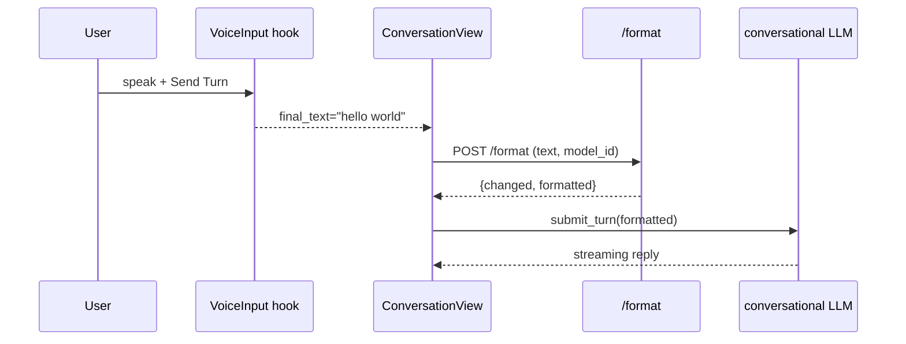

# Global Reformat Settings + Cross-Mode STT Cleanup — Specification

> Status: **Implemented**
> Author: Gavin + Droid
> Date: 2026-04-28
>
> Supersedes the cross-mode behavior described in
> [`formatting-config-spec.md`](./formatting-config-spec.md). The rest of
> that document (Anthropic prompt design, depth math, graceful-stop flow)
> still applies.

---

## Goal

1. Reformat (the `/format` LLM cleanup pass) runs in **both** Transcribe Mode
   and Conversation Mode.
2. All reformat settings move from the inline `▾ Reformat` dropdown into the
   global Settings drawer (so they apply to both modes).
3. The reformat-LLM picker lists **every** model from the registry
   (`GET /models`), not just the two hard-coded Anthropic IDs.
4. Conversation Mode's Persona + Model + Switch button stay in the
   Conversation view — only reformatting state is lifted to global.
5. Investigate and fix the bug that reformat "doesn't appear to be working"
   in either mode.

---

## 1. Current State

| Concern | Location | Status |
|---|---|---|
| `/format` proxy endpoint | `proxy/src/main.rs:300` `format_text()` | Hard-codes Anthropic key + Anthropic prefilled-`{` JSON-mode trick |
| Reformat invocations | `src/ui/app.rs` only — ticker, on_stop, on_reformat | Conversation never calls `/format` |
| Reformat settings (`format_model`, `format_depth`, `format_context_depth`, `auto_format_enabled`, `format_nth`, `format_on_stop`) | `src/ui/app.rs` local signals + the `▾` combo dropdown (~lines 2546–2660) | Lives in Transcribe view only |
| Model picker | Hard-coded `<option>` for `claude-haiku-4-5-20251001` and `claude-sonnet-4-6` | Not wired to `/models` |
| Conversation user voice flow | `use_voice_input.rs::final_text` → `submit_turn` (`conversation.rs:769`) | No `/format` pass |
| `AppSettings` struct | `src/ui/app_state.rs` | Missing all `format_*` fields |
| Reformat in Transcribe — why it looks dead | `app.rs:1237` `auto_format_enabled` gate is on the **AssemblyAI** turn-commit branch only | Likely missing on the Soniox + xAI ingest branches |

---

## 2. Backend: `/format` becomes provider-agnostic

`proxy/src/main.rs::format_text` is rewritten to dispatch through the
`LlmProvider` trait. New request shape:

```rust
struct FormatRequest {
    context: String,
    text: String,
    multi_speaker: bool,
    model_config_id: String, // was: model: String (raw model ID)
    credential: String,      // "default" unless multi-cred
}
```

Dispatch flow:

1. Look up `model_config_id` in `state.registries.models`.
2. Build the `LlmProvider` for that config (Anthropic / OpenAI / xAI / Google
   / local — using existing trait impls; we extend incrementally).
3. For **Anthropic** providers, keep the existing prefilled-`{` trick — it's
   tuned and working.
4. For **other** providers, switch to a JSON-mode `complete()` call that
   returns `{"changed": bool, "formatted": string}`.
5. Return `{ changed, formatted, input_tokens, output_tokens, model, provider }`.
6. If only the Anthropic `LlmProvider` is implemented today, non-Anthropic
   models fall back to a 501 with a clear error so the UI can disable them
   in the picker until support lands.

```mermaid
flowchart LR
    UI[/format UI call/] --> Endpoint[/format handler]
    Endpoint --> Lookup[registries.models lookup]
    Lookup --> Dispatch{provider tag}
    Dispatch -->|Anthropic| AnthropicPrefill
    Dispatch -->|Other| GenericJsonMode
    AnthropicPrefill --> Resp[changed/formatted/usage]
    GenericJsonMode --> Resp
```

---

## 3. Frontend: lift reformat signals into `AppSettings`

Add to `src/ui/app_state.rs`:

```rust
pub struct AppSettings {
    /* ...existing fields... */
    pub reformat_model_config_id: Signal<String>,
    pub reformat_credential: Signal<String>,
    pub auto_format_enabled: Signal<bool>,
    pub format_nth: Signal<u32>,
    pub format_depth: Signal<usize>,
    pub format_context_depth: Signal<usize>,
    pub format_on_stop: Signal<bool>,
    pub auto_format_in_conversation: Signal<bool>, // see §5
}
```

Cookies: keep the existing keys (`parley_format_nth`, `parley_format_depth`,
etc.); rename `parley_format_model` → `parley_reformat_model_config_id` with
a one-shot migration that maps the two old hardcoded Anthropic IDs to the
closest registry IDs. Add new cookie `parley_auto_format_in_conversation`
(default `true`).

Remove the matching local `use_signal` calls inside `App` and read them from
`use_context::<AppSettings>()`.

---

## 4. Settings drawer UI

Add a new section to `src/ui/settings_drawer.rs` (visible whenever
`anthropic_configured()` for now; the gate broadens once non-Anthropic
providers are wired):

```
── Reformatting ───────────────────────────────────
Reformat model:         [Haiku 4.5 (anthropic) ▾]   ← from /models
Credential:             [default ▾]                  ← if multiple anthropic creds
☑ Auto-format every  [ 3 ]  turns                    ← Transcribe Mode
   Reformat depth (chunks):              [ 2 ]
   Additional visibility depth (chunks): [ 1 ]
☑ Also format on stop (full pass, Sonnet 4.6)
☑ Auto-reformat each user voice turn (Conversation)  ← NEW
```

Hint text under the new toggle:
*"Cleans up STT punctuation and acronyms before sending each spoken turn to
the conversational LLM."*

The `▾` combo arrow + `format-menu` block in `src/ui/app.rs` is **deleted**;
the `¶ Reformat` button stays as a single-action button.

---

## 5. Conversation Mode auto-reformat

In `src/ui/conversation.rs` voice → submit bridge (~line 769), wrap the
`final_text` capture with a `/format` round-trip when
`auto_format_in_conversation && anthropic_configured`:

```rust
if matches!(previous, VoiceState::Finalizing) && matches!(current, VoiceState::Idle) {
    let raw = voice.final_text.peek().trim().to_string();
    if !raw.is_empty() {
        let cleaned = if app_settings.auto_format_in_conversation.peek().clone() {
            reformat_single_turn(&raw, &app_settings.reformat_model_config_id.peek()).await
                .unwrap_or(raw)
        } else { raw };
        input.set(cleaned);
        submit_turn(/* ... */);
    }
}
```

`reformat_single_turn(text, model_id)` is a small WASM helper that hits
`/format` with `depth=0, context_depth=0, multi_speaker=false`, returning the
`formatted` field if `changed`, else the original text. On any HTTP error it
logs to console and returns the original text — never blocks the user from
sending.

UI feedback: while the round-trip is in flight, swap the Send button label
to "Cleaning up…" and disable it (~250–500 ms expected for a single turn at
Haiku speeds).



---

## 6. Conversation Reformat button

Add a `¶ Reformat` button to the Conversation toolbar (next to Send / Mode
toggle). It runs `/format` with `depth=0, context_depth=0,
multi_speaker=false` over the **most recent user message** in `messages`.
Disabled when streaming, when no user messages exist, or when no reformat
model is selected. Whole-log reformat is out of scope.

---

## 7. Bug fix: why reformat looks dead in Transcribe today

Hypothesis (must be confirmed in implementation):

- The `auto_format_enabled` + `tcc.set(...)` block at `app.rs:1237` lives
  only inside the **AssemblyAI** turn-commit branch. The Soniox ingest path
  does not call it, so when the user picks Soniox auto-format never fires.
  Same for the xAI proxy session.
- Action: extract a `bump_format_counter(...)` helper and call it from the
  AssemblyAI, Soniox, and xAI completion sites once they commit a turn to
  the transcript.

Also verify that:

- `parley_format_model` cookie doesn't have a stale value that no longer
  matches a real Anthropic model id (causing `/format` to 4xx silently).
- The `parley_auto_format` cookie default. The current code uses
  `.map(|s| s != "false").unwrap_or(true)` so default is `true`; OK.

### 7.1 As-built formatter split fix

`/format` now treats paragraphing as a semantic formatting responsibility,
not only a speaker-tag cleanup pass. The formatter prompt explicitly requires
splits when a speaker moves to a new subject of discussion, changes reasoning
track, or uses transition phrases such as "switching topics", "moving on", or
"another thing".

The proxy also applies a conservative structural fallback when the model
returns `{"changed": false}` or emits a formatted result that still missed an
obvious split. The fallback only inserts blank lines where it can preserve the
canonical letter/digit sequence:

- before inline bracketed speaker/timestamp markers that appear after spoken text, while keeping leading `[05:23] [Gavin]`-style prefixes together;
- before explicit topic-shift cues with enough text on both sides to be a real paragraph boundary.

For long single-paragraph transcripts, `/format` now adds a request-specific
instruction that forbids `{"changed": false}` and requires inferred semantic
paragraph boundaries. If the model still returns no change, the proxy applies
a readability fallback to any individual paragraph that is still too long:
sentence groups for punctuated text, or word-count chunks for unpunctuated
text. That fallback is intentionally a last resort; semantic subject changes
remain primarily LLM-driven, while the deterministic path guarantees that an
obvious wall of text is not returned unchanged just because another part of
the paste already had a blank line.

The endpoint normalizes `changed` after all fallback passes. This matters
because Anthropic can return `{"changed": false, "formatted": "..."}`; if the
proxy inserts paragraph breaks into that formatted field, it must return
`changed: true` so the browser applies the text instead of logging "no changes
needed".

Malformed model output is also fail-closed into deterministic paragraphing.
If Anthropic spends tokens but returns invalid JSON, omits the `formatted`
field, or emits a formatted string that fails the canonical letter-sequence
guard, the proxy applies the structural/readability fallback before returning
`changed: false`.

Regression coverage lives in `proxy/src/main.rs` around
`apply_safe_structural_fallback`, `insert_readability_breaks`, and the
`/format` endpoint tests that mock Anthropic returning `changed:false` or
returning a formatted string without the required paragraph split.

---

## 8. Cookie / migration table

| Cookie key | New default | Notes |
|---|---|---|
| `parley_reformat_model_config_id` | first model from `/models` whose provider is Anthropic | Migrated from `parley_format_model` |
| `parley_reformat_credential` | `"default"` | New |
| `parley_auto_format` | `true` | Unchanged |
| `parley_format_nth` | `3` | Unchanged |
| `parley_format_depth` | `2` | Unchanged |
| `parley_format_context_depth` | `1` | Unchanged |
| `parley_format_on_stop` | `true` | Unchanged |
| `parley_auto_format_in_conversation` | `true` | New |

---

## 9. Files touched

| File | Change |
|---|---|
| `proxy/src/main.rs` | `FormatRequest` shape; provider dispatch; new `model_config_id` field |
| `proxy/src/llm/mod.rs` | (no change today; future non-Anthropic impls slot in here) |
| `src/ui/app_state.rs` | New `format_*` signals on `AppSettings`; cookie loads + persistence effects |
| `src/ui/settings_drawer.rs` | New "Reformatting" section with model dropdown, depth inputs, toggles |
| `src/ui/app.rs` | Remove local `format_*` signals + `▾` combo dropdown; bump-format-counter helper called from all three STT ingest paths; pass `model_config_id` to `/format` |
| `src/ui/conversation.rs` | Voice → submit bridge runs `/format` first; new `¶ Reformat` toolbar button |
| `docs/global-reformat-spec.md` | **This spec doc** |
| `docs/formatting-config-spec.md` | Status banner pointing to this doc for cross-mode behavior |

---

## 10. Testing

1. `cargo test -p parley-proxy` — `/format` request decoding, provider
   dispatch, Anthropic happy-path JSON parse.
2. `cargo check -p parley` (WASM crate) — compile after signal moves.
3. Manual:
   - **Transcribe**: select Soniox, speak a few turns, confirm Haiku
     auto-format fires (console log line `[parley] Haiku applied
     formatting`).
   - **Transcribe**: ¶ Reformat full-pass with Sonnet still works.
   - **Conversation**: enable Voice mode, speak a sloppy sentence, confirm
     `input` is cleaned before submit; turn off the new toggle, confirm raw
     text is sent.
   - **Conversation**: ¶ Reformat button rewrites the last user bubble in
     place.
4. `cargo fmt && cargo clippy -- -D warnings`.

---

## 11. Out of scope

- Implementing OpenAI / Google / xAI `LlmProvider` impls — kept as 501 stubs
  from `/format`'s perspective.
- Whole-conversation-log reformat (only last user turn).
- Moving Persona / Model / Switch out of the Conversation view (explicitly
  kept where they are).
- Diarized multi-speaker reformat in Conversation (single-user only for
  now).
