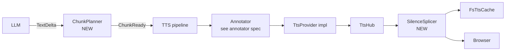

# Paragraph-Bounded TTS Chunking

**Status:** Draft
**Type:** Specification
**Audience:** Both
**Date:** 2026-04-23

## 1. Problem

Today the proxy orchestrator dispatches one TTS synthesis request *per sentence* via [`SentenceChunker`](../parley-core/src/tts/sentence.rs). This minimizes time-to-first-audio but produces three problems:

1. **Choppy prosody.** Each sentence is synthesized in isolation. The voice cannot read ahead, modulate intonation across clauses, or pace the cadence of a paragraph.
2. **Per-request overhead.** Each synthesis dispatch carries fixed HTTP setup cost; many small dispatches waste round-trips.
3. **Cross-chunk seam audibility.** Even with a perfect synthesizer, sentence-to-sentence transitions are jarring because the listener's ear expects intra-paragraph continuity.

We need chunking that:

- Treats the **paragraph** as the natural prosodic unit.
- Falls back gracefully when paragraphs are slow to arrive or pathologically large.
- Inserts inter-paragraph silence so the listener's brain perceives chunk seams as natural breaths.
- Stays **provider-agnostic**: the same chunking logic works for ElevenLabs v3, ElevenLabs Multilingual v2, future xAI grok-speech, OpenAI TTS, Cartesia, etc. Provider-specific cross-chunk continuity features (ElevenLabs request stitching, Flash WebSocket stream-input) live inside provider adapters and are invisible to the orchestrator.

## 2. Goals & Non-Goals

### Goals

- **G1.** Replace per-sentence dispatch with paragraph-bounded chunking using time-based controls.
- **G2.** Time-to-first-audio comparable to today's behavior. The first chunk is at most 2 sentences and falls back to 1 if the second is slow.
- **G3.** Inter-chunk silence is spliced into the audio stream so the cache and replay paths are transparently correct.
- **G4.** A `TtsProvider` trait with optional `SynthesisContext` hints lets adapters use provider-specific continuity features (e.g., ElevenLabs `previous_request_ids`) without leaking provider details into the orchestrator.
- **G5.** All chunking parameters live in `ModelConfig` with sensible defaults, configurable per TTS model.
- **G6.** Lists are grouped with their containing paragraph as one chunk, subject to the same caps.

### Non-Goals

- **NG1.** Cross-chunk prosody for v3 personas. v3 has no provider-side continuity feature; we rely on paragraph chunking + silence + (eventually) the [annotator pass](expressive-annotation-spec.md) to mask seams.
- **NG2.** Browser→proxy playback feedback channel. Earlier drafts proposed this for backpressure. Single-flight synthesis (one chunk in flight at a time per turn) provides natural backpressure without it. Future optimization, not v1.
- **NG3.** Predictive estimation of LLM emission rate or synthesis time. All controls are flat configurable timers; no estimators.
- **NG4.** Per-persona chunking overrides. v1 lives in `ModelConfig`. Persona-level override is documented as future work; the [persona CRUD spec](persona-crud-spec.md) may add a hook later.
- **NG5.** ElevenLabs Flash WebSocket `stream-input` adapter. Future provider adapter; the trait shape supports it but v1 ships HTTP-per-chunk only.
- **NG6.** Inter-list-item micro-pacing. Belongs to the [annotator spec](expressive-annotation-spec.md), not the chunker. Chunker treats a [paragraph + list] block as one chunk; annotator inserts whatever pacing markers the target provider understands.

## 3. Architecture

### 3.1 Component Changes



`SentenceChunker` is preserved as a pure utility — it still answers *"where do sentences end?"* `ChunkPlanner` is a new component that wraps `SentenceChunker` plus paragraph detection plus the timer machinery defined in §3.3. It owns the decision of *when to release a chunk*.

`SilenceSplicer` is a new component that owns inserting MP3 silence between chunks before they hit the cache or the browser.

### 3.2 Provider Trait

`parley-core::tts` gains a provider-agnostic trait. Existing ElevenLabs synthesis becomes one implementation.

```rust
/// A TTS provider. Implementations are async and return a stream of
/// audio frames.
#[async_trait]
pub trait TtsProvider: Send + Sync {
    /// Synthesize one chunk of text. Returns a stream of audio bytes
    /// in the configured output format.
    async fn synthesize(
        &self,
        text: &str,
        voice: &str,
        ctx: SynthesisContext,
    ) -> Result<Pin<Box<dyn Stream<Item = Result<Bytes, TtsError>> + Send>>, TtsError>;

    /// Declares the provider's output format so the SilenceSplicer can
    /// generate matching silence frames at startup.
    fn output_format(&self) -> AudioFormat;

    /// Whether this provider supports expressive annotation tags
    /// (used by the annotator pass to decide whether to enable).
    fn supports_expressive_tags(&self) -> bool;
}

/// Hints for cross-chunk continuity. Providers that don't support
/// these features ignore them.
#[derive(Debug, Clone, Default)]
pub struct SynthesisContext {
    /// The text of the immediately prior chunk, if any. ElevenLabs
    /// v2 stitching uses this to set `previous_request_ids`. Other
    /// providers may use it directly as `previous_text`.
    pub previous_text: Option<String>,
    /// A hint at the next chunk's text if it's already buffered.
    /// Rarely available in the LLM-streaming case; provided for
    /// completeness.
    pub next_text_hint: Option<String>,
    /// Zero-based index of this chunk within the turn.
    pub chunk_index: u32,
    /// True when this is the last chunk for the turn.
    pub final_for_turn: bool,
    /// Provider-specific opaque continuation token. v2 stitching
    /// stores the previous request id here; other providers may
    /// store session ids or websocket handles.
    pub provider_state: Option<ProviderContinuationState>,
}
```

`ProviderContinuationState` is an enum with one variant per provider that needs it (initially just `ElevenLabsRequestId(String)`). Providers that don't need continuation state never construct or read it.

The orchestrator builds `SynthesisContext` from the planner's output and the prior chunk's response metadata. It does not know what the provider will do with the hints.

### 3.3 ChunkPlanner — Release Rules

State per turn:

- `pending: String` — accumulated text since the last released chunk.
- `pending_sentence_count: u32` — sentences in `pending` (from `SentenceChunker`).
- `chunks_released: u32` — total chunks dispatched this turn.
- `wait_started_at: Option<Instant>` — when the current wait period began (set when `pending` becomes non-empty after release).
- `last_token_at: Instant` — when the LLM most recently emitted a token.

A chunk is released when **any** of:

#### R1. First-chunk fast path

`chunks_released == 0` AND `pending_sentence_count >= first_chunk_max_sentences`. Cut at the latest sentence boundary, dispatch.

If `chunks_released == 0` AND `pending_sentence_count == 1` AND wait time since first sentence completed exceeds `first_chunk_max_wait_ms`: cut at the single sentence, dispatch. (The "second sentence didn't arrive in time" fallback.)

#### R2. Paragraph break

`pending` contains a paragraph break (`\n\n`). Special case: if the next non-blank line after the break starts with a list marker (`-`, `*`, or `\d+\.`), continue accumulating. The chunk ends at the *next* paragraph break after the list ends, OR at hard cap, whichever comes first.

When the paragraph break (or end of [paragraph + list] block) is detected: cut there, dispatch.

#### R3. Paragraph wait timer expires

`now - wait_started_at >= paragraph_wait_ms` AND `pending_sentence_count >= 1`. Cut at the latest sentence boundary, dispatch.

If `pending_sentence_count == 0` at timer expiry (no complete sentence in buffer yet): wait an additional `sentence_grace_ms`. If still no sentence boundary at the end of the grace period, cut at the latest whitespace.

#### R4. Hard char cap

`pending.len() >= hard_cap_chars`. Cut at the latest sentence boundary; if none exists in the buffer, cut at the latest whitespace; if no whitespace exists either (degenerate), cut at exactly `hard_cap_chars`.

#### R5. Idle timeout

`now - last_token_at >= idle_timeout_ms` AND `pending_sentence_count >= 1`. The LLM appears to have stalled mid-paragraph. Cut at the latest sentence boundary, dispatch.

#### R6. Stream end

LLM finished. Flush `pending` as the final chunk, marked `final_for_turn = true`. Cuts mid-sentence if necessary.

### 3.4 Configuration

All controls live in `ModelConfig` under a new `[tts_chunking]` section. Defaults selected to balance prosody, latency, and worst-case dead air; see §5 for rationale.

```toml
[tts_chunking]
first_chunk_max_sentences = 2
first_chunk_max_wait_ms = 800
paragraph_wait_ms = 3000
sentence_grace_ms = 1000
hard_cap_chars = 1500
idle_timeout_ms = 1500
paragraph_silence_ms = 500
first_chunk_silence_ms = 100
```

| Parameter | Default | Job |
|---|---|---|
| `first_chunk_max_sentences` | 2 | Prefer 2-sentence first chunk for buffer runway |
| `first_chunk_max_wait_ms` | 800 | Fall back to 1-sentence first chunk if 2nd is slow |
| `paragraph_wait_ms` | 3000 | How long to wait for a paragraph break before falling back to sentence chunking |
| `sentence_grace_ms` | 1000 | Extra wait after `paragraph_wait_ms` if no sentence boundary exists yet |
| `hard_cap_chars` | 1500 | Synthesis-size safety net; ~⅓ page |
| `idle_timeout_ms` | 1500 | LLM-stalled flush trigger |
| `paragraph_silence_ms` | 500 | Silence spliced before each non-first chunk |
| `first_chunk_silence_ms` | 100 | Silence spliced before the first chunk |

A persona-level override in `Persona` is **future work**; tracked in the [persona CRUD spec](persona-crud-spec.md) §7. v1 ships with `ModelConfig`-only configuration.

### 3.5 SilenceSplicer

At proxy startup, for each `AudioFormat` declared by a configured `TtsProvider`, generate two MP3 silence buffers: one of `first_chunk_silence_ms` duration, one of `paragraph_silence_ms` duration. Cache them in memory (`HashMap<(AudioFormat, u32), Bytes>`). At 128kbps, 500ms of silence is ~8KB. The total memory cost is trivial.

Generation method: produce raw silence PCM samples at the format's sample rate, encode with a minimal LAME-compatible MP3 encoder (via the `mp3lame-encoder` crate or equivalent). The splicer lives in the proxy only; the browser consumes already-spliced bytes and never generates silence itself.

When the orchestrator releases chunk N to TTS:

1. Splice the appropriate silence (first-chunk or paragraph-silence) **before** the chunk's audio bytes.
2. Stream the spliced bytes to both the cache and the browser.

The cache stores the spliced stream, so replay is byte-identical to live playback.

**Bitrate compatibility:** MP3 frames are self-describing. The decoder tolerates frame-level bitrate variation. Generating silence at the same bitrate as TTS output (typically 128kbps) avoids any compatibility risk.

### 3.6 Single-Flight Synthesis (Backpressure)

The orchestrator maintains **at most one in-flight synthesis request per turn**. After releasing chunk N, the planner continues accumulating tokens into `pending`, but does not release chunk N+1 until chunk N's synthesis has completed.

Rationale:
- Provides natural backpressure without a feedback channel from the browser.
- Synthesis time roughly matches audio playback time for paragraph-sized chunks (both ~1.5–3s for v3), so the listener never hears silence except for the configured paragraph silence.
- Simple to reason about and test.

The cost: if synthesis is unusually slow (network blip, provider slowdown), a paragraph break in the buffer waits for chunk N to finish before chunk N+1 dispatches. Acceptable for v1; a future optimization can pipeline synthesis when buffer is healthy.

### 3.7 Provider Behavior Summary

| Provider | Continuity hint usage | Audio tags | Notes |
|---|---|---|---|
| ElevenLabs v3 (default) | None — v3 doesn't support stitching | Yes (via annotator) | Relies entirely on chunking + silence |
| ElevenLabs Multilingual v2 | `previous_text` → `previous_request_ids` | No | Cross-chunk prosody handled by provider |
| ElevenLabs Flash v2.5 | None at HTTP layer; future WebSocket adapter | No | Lowest latency; future optimization |
| xAI grok-speech (planned) | TBD per provider docs | Yes (per user) | Per-provider adapter when implemented |

### 3.8 Failure Modes

| Failure | Behavior |
|---|---|
| Provider error mid-turn | Surfaced as `OrchestratorEvent::TtsError`; further chunks for the turn are not dispatched. The text continues streaming as `OrchestratorEvent::Token` (text-only fallback). |
| Provider error on first chunk | Same as above; user sees text but no audio. Logged. |
| LLM idle past `idle_timeout_ms` with empty buffer | No-op; nothing to flush. |
| LLM emits paragraph break but planner has just released a chunk | The paragraph break starts the *next* chunk's wait period. Common case; no special handling. |
| Hard cap fires inside a list block | Cut at latest list-item boundary if any, otherwise at sentence boundary, otherwise whitespace. |

## 4. Data Model

In `parley-core::tts`:

```rust
/// One released chunk ready for synthesis dispatch.
#[derive(Debug, Clone, PartialEq)]
pub struct ReleasedChunk {
    pub index: u32,
    pub text: String,
    pub final_for_turn: bool,
}

#[derive(Debug, Clone, Copy)]
pub struct ChunkPolicy {
    pub first_chunk_max_sentences: u32,
    pub first_chunk_max_wait_ms: u64,
    pub paragraph_wait_ms: u64,
    pub sentence_grace_ms: u64,
    pub hard_cap_chars: usize,
    pub idle_timeout_ms: u64,
    pub paragraph_silence_ms: u32,
    pub first_chunk_silence_ms: u32,
}

impl Default for ChunkPolicy {
    fn default() -> Self {
        Self {
            first_chunk_max_sentences: 2,
            first_chunk_max_wait_ms: 800,
            paragraph_wait_ms: 3000,
            sentence_grace_ms: 1000,
            hard_cap_chars: 1500,
            idle_timeout_ms: 1500,
            paragraph_silence_ms: 500,
            first_chunk_silence_ms: 100,
        }
    }
}

/// State machine that turns LLM text deltas into released chunks.
pub struct ChunkPlanner { /* ... */ }

impl ChunkPlanner {
    pub fn new(policy: ChunkPolicy, clock: Clock) -> Self;

    /// Push token text. Returns chunks released *now* (synchronously
    /// against the planner's clock).
    pub fn push(&mut self, text: &str) -> Vec<ReleasedChunk>;

    /// Tick the planner with the current time. Used to fire timer-based
    /// rules when no token has arrived. Returns chunks released by the
    /// tick.
    pub fn tick(&mut self) -> Vec<ReleasedChunk>;

    /// LLM stream ended. Flush any pending text.
    pub fn finish(self) -> Option<ReleasedChunk>;

    /// Indicate that the previously-released chunk's synthesis has
    /// completed (for single-flight backpressure).
    pub fn synthesis_completed(&mut self, chunk_index: u32);
}
```

`Clock` is a small abstraction (`fn now(&self) -> Instant`) so tests can drive the timers deterministically with a fake clock.

### 4.1 Wire & Cache

No new wire formats. The audio sibling SSE stream ([`/conversation/tts/{turn_id}`](../proxy/src/conversation_api.rs)) continues to emit `audio` frames; the bytes inside those frames now include the spliced silence prefixes. The cache stores the same bytes. Replay is unchanged.

A future optimization (deferred) may add `chunk_boundary` SSE frames for browser-side analytics or word-timing alignment.

## 5. Rationale for Defaults

Picked from a working model of the synthesis-and-playback pipeline; numbers are starting defaults to be tuned by listening, not commitments.

- **`first_chunk_max_sentences = 2`** vs. 1: a 2-sentence first chunk is roughly 6 seconds of audio. Subtracting ~1.5s of synthesis time for chunk 2, that leaves ~4.5s of buffer headroom — enough that the 3-second `paragraph_wait_ms` is comfortably under the buffer. With a 1-sentence first chunk (~3s audio), headroom collapses to ~1.5s and paragraph wait must shrink. The 2-sentence default trades a small TTFA bump (~1s) for a meaningful runway gain.
- **`first_chunk_max_wait_ms = 800`**: protects TTFA when the second sentence is slow. If the second sentence hasn't arrived 800ms after the first completes, dispatch the 1-sentence first chunk and accept the smaller runway.
- **`paragraph_wait_ms = 3000`**: long enough that an LLM emitting at typical rates frequently delivers a paragraph break within the window. Cost asymmetry favors waiting longer (cutting too soon produces a prosodically wrong silence inside what should have been one paragraph; waiting too long just adds slight pacing drag).
- **`sentence_grace_ms = 1000`**: covers the rare case where the timer fires mid-sentence. Gives the LLM a beat to finish before we cut at whitespace.
- **`hard_cap_chars = 1500`**: roughly ⅓ of a typeset page. Bounds worst-case synthesis duration to a few seconds even on a paragraph that refuses to end.
- **`idle_timeout_ms = 1500`**: covers "LLM stalled mid-paragraph." Long enough not to fire on normal token-stream gaps; short enough that the listener doesn't notice the pause.
- **`paragraph_silence_ms = 500`**: matches the natural pause a human takes between paragraphs. Long enough to mask synthesizer chunk discontinuity; short enough not to feel like a stall.
- **`first_chunk_silence_ms = 100`**: enough that the first audio doesn't sound truncated at its leading edge, but not so much that it adds noticeable TTFA. Acts like the natural breath before someone starts speaking.

## 6. Test Plan

| Component | Tests |
|---|---|
| `ChunkPlanner` (pure, with fake `Clock`) | (1) Push 1 sentence, advance clock past `first_chunk_max_wait_ms` → 1-sentence first chunk released. (2) Push 2 sentences quickly → 2-sentence first chunk released. (3) Push 1 paragraph (3 sentences then `\n\n`) → released as one chunk at the paragraph break. (4) Push 5 sentences without paragraph break, advance clock past `paragraph_wait_ms` → released as 5-sentence chunk at latest sentence boundary. (5) Push text with no sentence terminators, advance clock past `paragraph_wait_ms + sentence_grace_ms` → released at latest whitespace. (6) Push 1500+ chars without sentence terminator → hard cap fires immediately, cut at last whitespace. (7) Push 1 sentence, advance clock past `idle_timeout_ms` without further pushes → idle flush fires. (8) Push paragraph followed by list (`-` lines) → `[paragraph + list]` block emitted as one chunk. (9) `finish()` flushes a non-terminated trailing sentence with `final_for_turn=true`. (10) Single-flight: chunk 2 not released until `synthesis_completed(0)` even when buffer is full of further content. (11) Indices monotonic from 0. |
| `SilenceSplicer` | (1) Generated 500ms silence at 128kbps decodes to 500ms ± 25ms via `symphonia` or equivalent. (2) Splicing silence + TTS bytes produces a stream that decodes as continuous audio with the expected silence duration at start. (3) Splice for first chunk uses 100ms; subsequent chunks use 500ms. (4) Cache stores spliced bytes; replay returns identical bytes. |
| Provider trait | (1) v3 adapter ignores `previous_text`. (2) v2 adapter (when implemented) sets `previous_request_ids` from `provider_state`. (3) `output_format()` reports correct sample rate and bitrate. (4) `supports_expressive_tags()` returns true for v3 and grok-speech, false for v2 and Flash. |
| Orchestrator integration | Using a `MockTtsProvider` and a fake clock. (1) LLM emits 5 sentences across 8s with one `\n\n` after sentence 3 → 2 chunks dispatched: [1-2 sentences as first chunk], [paragraph through sentence 3], rest flushed at stream end. (2) LLM emits 1 long sentence (no terminator) for 4s → first-chunk fallback fires at 800ms with what's available; if nothing ends in a sentence, hard-cap or grace handles it. (3) `tts: None` in context → planner not constructed; behavior identical to text-only path. |

## 7. Migration & Compatibility

- `SentenceChunker` continues to exist as a pure utility used by `ChunkPlanner`. No change.
- Existing session files: unchanged. Chunking is a runtime concern.
- Existing TTS cache files: pre-existing caches without spliced silence will play back without inter-chunk gaps (that is the historical behavior). New caches include silence. No migration needed; the difference is audible but functionally correct.
- `/conversation/tts/{turn_id}` SSE wire format: unchanged.
- ElevenLabs adapter refactor: existing code in [`proxy/src/orchestrator/mod.rs`](../proxy/src/orchestrator/mod.rs) that calls ElevenLabs directly moves behind `TtsProvider`. The adapter is the same code, plus reading `SynthesisContext` to emit hints — but for v3 (the default) those hints are ignored.

## 8. Open Questions

1. **MP3 silence encoder availability.** Confirm a suitable MP3 encoder is available on the proxy's target platforms. Resolve during implementation step 1.
2. **List boundary detection.** §3.3 R2 detects lists by line-prefix regex. Markdown allows nested lists, lazy continuation, and other complications. v1 uses the simplest possible detector (single-level lists with `-`, `*`, or `\d+\.` prefix). Document edge cases as found.
3. **Persona-level override field name.** Deferred until persona CRUD lands. Likely `persona.tts.chunking = "model_default" | { ...overrides }` or similar.

## 9. Out-of-Scope Reminders

- Browser→proxy playback feedback channel (NG2).
- Estimator for synthesis time or LLM emission rate (NG3).
- Per-persona chunking overrides (NG4).
- Flash WebSocket `stream-input` adapter (NG5).
- Inter-list-item micro-pacing — handled in [annotator spec](expressive-annotation-spec.md) (NG6).
- Pipelined synthesis (more than one in-flight chunk per turn). Future optimization.
