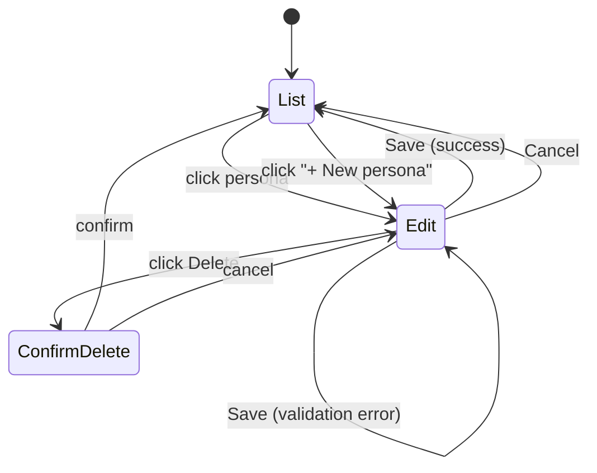

# Persona CRUD UI

**Status:** Draft
**Type:** Specification
**Audience:** Both
**Date:** 2026-04-22

## 1. Problem

Personas exist as TOML files in `~/.parley/personas/`. Today the only way to create, edit, or delete one is to hand-edit a file, restart the proxy, and reload the page. This is brutal friction for what is conceptually the most user-facing customization in the product — picking a persona is the first thing a user does in the Conversation view, and a user who wants a different persona has nowhere to go.

This spec adds in-app CRUD: a persona management drawer in the Conversation view, plus the proxy routes to back it.

## 2. Goals & Non-Goals

### Goals

- **G1.** Users can create a new persona from the UI without touching the filesystem.
- **G2.** Users can rename, edit (system prompt, description, tier voice/model), and delete existing personas.
- **G3.** Changes are persisted to `~/.parley/personas/<id>.toml` immediately.
- **G4.** The persona list in the picker reflects edits without a page reload.
- **G5.** Edits to a persona currently active in a session take effect on the *next* user turn — never mid-turn.
- **G6.** Deleting a persona currently active in a session does not crash the session; the session displays a clear "persona deleted" state and requires the user to pick a different persona before sending the next turn.

### Non-Goals

- **NG1.** Editing system prompt files in `~/.parley/prompts/`. Personas with `system_prompt = { file = "..." }` reference these files; v1 keeps file-referenced prompts read-only from the UI. Inline (`SystemPrompt::Inline`) prompts are editable. A future spec can add prompt-file editing.
- **NG2.** Per-tier `fast` configuration. v1 only manages `tiers.heavy` (the only tier the orchestrator dispatches to today, per [persona.rs](../parley-core/src/persona.rs)).
- **NG3.** Importing/exporting personas, sharing presets, persona templates. Plain CRUD only.
- **NG4.** Validation of system prompt content (length, safety, etc.). The proxy validates structure (parses as TOML, references resolvable model/voice ids); the UI does not lint the prose.
- **NG5.** Multi-user / authentication. Single-user local app stays single-user.
- **NG6.** Concurrent-edit handling between two browser tabs. Last-write-wins; the second tab's stale edit silently overwrites the first. Acceptable for a single-user local app.

## 3. Design

### 3.1 Proxy API

Additive; existing `GET /personas` ([architecture.md `/personas`](architecture.md#L649)) is unchanged.

| Route | Method | Body | Returns |
|---|---|---|---|
| `/personas` | GET | — | Existing summary list. |
| `/personas/{id}` | GET | — | Full `Persona` (the schema in [parley-core/src/persona.rs](../parley-core/src/persona.rs#L147)). 404 if unknown. |
| `/personas` | POST | Full `Persona` JSON | 201 with the persisted `Persona`. 409 if `id` already exists. 422 on validation failure (unknown model, malformed prompt-file ref). |
| `/personas/{id}` | PUT | Full `Persona` JSON | 200 with persisted `Persona`. The `id` in the URL must match the body's `id` (400 otherwise). 404 if `id` does not exist. 422 on validation failure. |
| `/personas/{id}` | DELETE | — | 204 on success. 404 if `id` unknown. The proxy does not check whether any active session is using the persona — that's the UI's job (see §3.4). |

PUT (full replace) was chosen over PATCH (partial update) to keep the proxy stateless: every write is a full document with no merge logic.

#### Persistence

Each write produces an atomic file replacement:

1. Serialize `Persona` to TOML using `toml::to_string_pretty`.
2. Write to `~/.parley/personas/<id>.toml.tmp`.
3. `fs::rename` to `<id>.toml` (atomic on the same filesystem on all supported OSes).
4. Reload the in-memory `PersonaRegistry` (the proxy already has reload logic — confirm and reuse).

Delete is `fs::remove_file` followed by registry reload.

The id ↔ filename invariant: `id` in the file body always equals the file stem. The POST/PUT handlers enforce this. Renaming a persona is therefore POST-new + DELETE-old (handled by the UI as a two-step transaction; see §3.3).

#### Validation

Validation lives in the existing `parley-core` registry validator (it already enforces persona → model references for startup loading). Reuse it on every write. If a write would leave the registry invalid (unknown model id, missing prompt file), reject with 422 and a structured error body:

```jsonc
{
  "error": "validation_failed",
  "details": [
    { "field": "tiers.heavy.model_config", "message": "unknown model id 'claude-opus-9'" }
  ]
}
```

### 3.2 Frontend UI

The picker dropdown gains a "Manage personas…" entry that opens a new drawer (sibling to the existing Settings drawer). Three views inside the drawer:



#### List View

Table of personas with columns: Name, Description, Heavy Model, Heavy Voice. Each row has Edit and Delete actions. A "+ New persona" button at the top.

#### Edit View

Form fields:

- **Id** — text input. Required. Lowercase ASCII, digits, hyphens (regex `^[a-z][a-z0-9-]*$`). Disabled when editing an existing persona (renames go through "duplicate then delete" — see §3.3).
- **Name** — text input. Required.
- **Description** — text input. Optional.
- **System prompt** — textarea (10 rows, monospace, vertical resize). Required. If the persona on disk uses `SystemPrompt::File`, this field is *read-only* and shows the resolved file content with a note: "This prompt lives in `~/.parley/prompts/<file>`. Edit the file directly."
- **Heavy model** — dropdown populated from `GET /models`. Required.
- **Heavy voice** — text input with a "provider:voice_id" hint. Required (matches schema).
- **Heavy TTS model** — text input, default `eleven_v3`. Required.
- **Default speak responses** — checkbox. Default true.
- **Use expression annotations** — checkbox. Default true.
- *(Context settings — `compact_at_token_pct`, `preserve_recent_turns` — collapsed under "Advanced", numeric inputs.)*

Save sends POST or PUT depending on whether this is a new persona. On 422, error details are surfaced inline next to the offending field. On 409 (POST with duplicate id), the id field shows "an id already exists with this name."

#### Delete

Modal confirm. If the persona is currently active in *this session*, the modal includes an extra warning: "This persona is active in your current session. Deleting it will require you to pick a different persona before your next turn."

### 3.3 Renames

Renaming is implemented in the UI as **duplicate + delete** because the id is also the filename. Flow:

1. User clicks "Rename" on the Edit view (separate button next to Save).
2. Modal asks for the new id.
3. UI POSTs the persona body with the new id. On success, UI DELETEs the old id.
4. On failure between POST and DELETE, the UI surfaces "duplicate created but old persona could not be deleted; please remove `<old-id>` manually" — strictly worst case.

If the renamed persona is active in the current session, the session's stored persona id is rewritten in-place to the new id (no proxy round-trip; the next turn submission uses the new id).

### 3.4 Active-Session Conflict Handling

When the picker reloads the persona list (after any CRUD action) and the session's currently selected persona id is no longer in the list:

- The picker enters a "persona deleted" state: shows the missing id with a strikethrough and an alert badge.
- The Send Turn button is disabled with tooltip "Pick a persona first."
- Selecting a new persona clears the alert. The next turn uses the newly chosen persona, with a `PersonaActivation` history record (this is existing behavior in the orchestrator; per [architecture.md persona switching](architecture.md#L632)).

When the picker reloads and the active persona *still exists* but its content changed (e.g., prompt was edited), no special UI state — the next turn just picks up the edited persona naturally because system prompt resolution happens at turn-dispatch time, not at session-init time. Verify this assumption against the orchestrator code during implementation; if init-time caching exists, file an addendum.

### 3.5 Mid-Turn Safety

The orchestrator's `submit_user_turn` resolves persona → model → provider *before* mutating the session ([architecture.md turn flow](architecture.md#L630)). Resolution reads the live `PersonaRegistry`. So if the user deletes a persona while a turn is streaming, that turn completes normally (it already resolved), and the *next* `submit_user_turn` call will fail at resolution with a clean error.

The UI must not allow CRUD operations to interrupt an in-flight turn — disable the "Manage personas…" entry while `SendStatus::Streaming` is active. (Alternative: allow but block the Save button — rejected; simpler to disable the whole drawer entry.)

### 3.6 Frontend File Layout

New files:

- `src/ui/personas.rs` — the drawer component, list/edit/delete views, and the form state.

Existing files modified:

- `src/ui/conversation.rs` — picker dropdown gains "Manage personas…" entry; picker reload after drawer close.
- (Possibly) `src/ui/app.rs` — drawer mounting if the conversation view doesn't own its own drawer slot.

The drawer is a child of the Conversation view, not a global app-shell drawer. The Transcribe view does not use personas and does not need this UI.

## 4. Data Model

No changes to `parley-core::persona::Persona`. The wire format for POST/PUT is the same JSON shape Serde already produces from `Persona`.

The proxy gains:

```rust
// proxy/src/personas_api.rs (NEW)
async fn get_persona(...) -> Result<Json<Persona>, ApiError>;
async fn create_persona(...) -> Result<(StatusCode, Json<Persona>), ApiError>;
async fn replace_persona(...) -> Result<Json<Persona>, ApiError>;
async fn delete_persona(...) -> Result<StatusCode, ApiError>;
```

`ApiError` follows the existing pattern in `proxy/src/conversation_api.rs` (status code + structured error body).

## 5. Test Plan

| Component | Tests |
|---|---|
| Persona persistence | (1) POST a valid persona → file appears at `~/.parley/personas/<id>.toml`, in-memory registry contains it, GET returns it. (2) POST duplicate id → 409. (3) POST with unknown model → 422 with structured error. (4) PUT updates content → file rewritten atomically (no partial-write window observable). (5) PUT with mismatched URL/body id → 400. (6) DELETE removes file and registry entry. (7) DELETE unknown id → 404. (8) Atomic rename verified by interrupting between tmp-write and rename in a unit test (mock filesystem). |
| Validation | (1) Unknown `tiers.heavy.model_config` → 422. (2) System prompt file ref to nonexistent file → 422. (3) `id` failing regex → 400. |
| UI flow | (1) Open drawer, click "+ New persona", fill form, save → list shows new entry. (2) Edit existing inline-prompt persona, save → form changes persisted, picker reflects new name. (3) File-prompt persona shows read-only prompt textarea with note. (4) Delete persona not in use → confirm modal, accept, list updates. (5) Delete persona that *is* the active session persona → confirm shows extra warning; on accept, picker enters "persona deleted" state and Send is disabled. (6) Pick a different persona after deletion → Send re-enables. (7) Rename flow: POST new + DELETE old; verify session state updates if the renamed persona was active. (8) Mid-turn: drawer entry is disabled while streaming. |
| Active-session edit | (1) Edit active persona's system prompt → next turn uses the new prompt (verified by submitting a turn and inspecting the system prompt the orchestrator dispatched). |

Proxy-side tests live in `proxy/src/personas_api.rs`'s `#[cfg(test)] mod tests`, mirroring the pattern in `secrets_api.rs`. UI-side tests are manual for v1 (matches current convention for Dioxus components).

## 6. Migration & Compatibility

- Existing persona files are unchanged. Reads work, edits via UI rewrite them in `toml::to_string_pretty` form (whitespace may differ from hand-written but content is equivalent).
- File-referenced system prompts (`SystemPrompt::File`) are preserved on edit — the UI does not silently inline them. Only the *non-prompt* fields are editable for these personas.
- The `GET /personas` summary endpoint is unchanged.

## 7. Open Questions

1. **Validation of voice id format.** The schema says voice is free-form `"provider:voice_id"`. Should the UI parse and offer a dropdown of known voices per provider? Lean no for v1 — voice catalogs are provider-specific and large; free text input is acceptable. Add provider-aware pickers in a follow-up.
2. **Audit log.** Should persona edits/deletes be logged somewhere user-visible? Lean no — this is a single-user local app; the filesystem `mtime` is sufficient. Revisit if multi-user ever lands.
3. **Default persona protection.** Should the bundled default personas (`assistant`, `conversationalist`) be deletable? Lean yes — they're in `~/.parley/personas/`, owned by the user. If they want them back, a future "reset to bundled defaults" feature can copy them in. Out of scope for this spec.

## 8. Out-of-Scope Reminders

- System prompt file editing (NG1).
- `tiers.fast` editing (NG2).
- Import/export, sharing, templates (NG3).
- Prompt content linting (NG4).
- Multi-user, auth (NG5).
- Concurrent-tab edit reconciliation (NG6).
