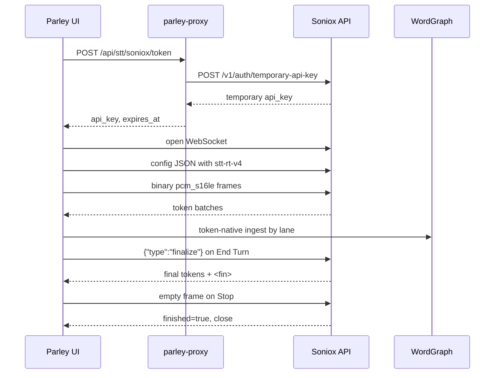

# Soniox STT Integration - Specification

**Status:** Draft
**Type:** Specification
**Audience:** Both
**Date:** 2026-04-26

---

## 1. Overview

This spec defines how Parley integrates Soniox `stt-rt-v4` as a selectable real-time speech-to-text provider for both Capture Mode and Conversation Mode.

Soniox is not a turn-shaped provider like the current AssemblyAI integration. It streams token batches where tokens may be words, subwords, spaces, punctuation, endpoint markers, or finalization markers. Tokens can be provisional or final, can carry confidence and timestamps, and can include speaker labels when diarization is enabled. That shape is closer to Parley's annotated stream model, but it requires a token-native STT event layer and a small word-graph prerequisite before the provider is wired into the UI.

Canonical dependencies:

- Core data model: [architecture.md](architecture.md)
- Word graph model: [word-graph-spec.md](word-graph-spec.md)
- Existing AssemblyAI reference: [assemblyai-turn-data.md](assemblyai-turn-data.md)
- Current multi-source speaker mode: [multi-speaker-spec.md](multi-speaker-spec.md)
- Conversation Mode voice input: [conversation-voice-slice-spec.md](conversation-voice-slice-spec.md)
- Credential storage: [secrets-storage-spec.md](secrets-storage-spec.md)

---

## 2. Goals

1. Soniox `stt-rt-v4` is selectable in Capture Mode.
2. Soniox `stt-rt-v4` is selectable in Conversation Mode voice input.
3. Soniox uses one microphone stream and creates Parley lanes from Soniox diarization speaker labels.
4. AssemblyAI remains available as the existing simpler STT provider.
5. Soniox credentials live only in the proxy keystore, following [secrets-storage-spec.md](secrets-storage-spec.md).
6. The browser receives a temporary Soniox API key from a provider-specific proxy endpoint, then opens the Soniox WebSocket directly.
7. End Turn uses Soniox manual finalization so the WebSocket session can remain open across turns.
8. Stop uses Soniox's graceful stream end behavior and closes the WebSocket only when the user stops the session.
9. Soniox token responses feed a token-native STT normalizer before any string rendering or graph writes happen.
10. The minimal word-graph prerequisite lands before the Soniox provider is considered complete.

---

## 3. Non-Goals

| Non-goal | Rationale |
| --- | --- |
| Full word-graph implementation | Soniox needs token-native ingest and lane mapping, not the entire editing/projection/undo system from [word-graph-spec.md](word-graph-spec.md). |
| Soniox async transcription | This spec is real-time only. Async can be evaluated later as a batch refinement provider. |
| Translation | Soniox supports translation, but Parley is integrating transcription first. |
| Language-tag storage | Soniox may emit per-token `language`; v1 parses and drops it. Multilingual annotations are deferred. |
| Soniox context mapping from Parley profiles/vocabulary | The config type leaves room for context, but v1 does not map Parley vocabulary/profile data into Soniox `context`. |
| Replacing AssemblyAI | AssemblyAI remains useful for single-speaker dictation and as an already-working provider. |
| Perfect overlap separation | Soniox diarization is useful, but real-time diarization has known attribution errors under low latency. |
| Profile/model configuration overhaul | Provider selection can use focused settings first; richer profile-driven selection is separate work. |

---

## 4. Decisions

| ID | Decision | Rationale | Tradeoff |
| --- | --- | --- | --- |
| S-01 | Soniox is selectable in both Capture Mode and Conversation Mode. | The provider boundary should be shared across both surfaces. | Both surfaces must stop hard-coding AssemblyAI. |
| S-02 | Soniox creates lanes from one mic stream using `enable_speaker_diarization`. | This exercises Parley's lane model without requiring two physical audio sources. | Real-time diarization can temporarily mislabel speakers. |
| S-03 | Language tags are parsed and dropped in v1. | The parser should tolerate Soniox's payload shape without expanding the graph before there is a use case. | Multilingual transcript features require a later graph/schema extension. |
| S-04 | Soniox supports user-provided context text as a provider-specific setting. | Direct context entry is a focused way to bias domain terms, names, phrasing, and punctuation without designing the full Parley vocabulary/profile mapping first. | Users must maintain the text manually until richer profile-derived context exists. |
| S-05 | Token endpoints are provider-specific. | `/api/stt/soniox/token` is explicit and leaves `/token` as legacy AssemblyAI behavior until it is retired. | Some token-fetch helper code will be shared internally instead of exposed as one generic route. |
| S-06 | End Turn sends `{"type":"finalize"}`. | Finalization preserves session context and avoids reconnect latency. | The client must handle `<fin>` markers. |
| S-07 | Stop sends an empty WebSocket frame and waits for `finished: true`. | This is Soniox's graceful end-of-stream protocol. | Stop is a session end, not a reusable pause. |
| S-08 | Build the minimal token-native graph/event slice before Soniox UI wiring. | Flattening Soniox into `TurnEvent` would discard the main reason to use Soniox. | Adds prerequisite work before first end-to-end demo. |

---

## 5. External Soniox Contract

### 5.1 WebSocket Endpoint

Default US endpoint:

```text
wss://stt-rt.soniox.com/transcribe-websocket
```

Regional endpoint support should be config-ready but not required in v1:

| Region | WebSocket host |
| --- | --- |
| United States | `stt-rt.soniox.com` |
| European Union | `stt-rt.eu.soniox.com` |
| Japan | `stt-rt.jp.soniox.com` |

### 5.2 Initial Configuration Message

The first WebSocket message is JSON. For Parley v1:

```json
{
  "api_key": "<SONIOX_TEMPORARY_API_KEY>",
  "model": "stt-rt-v4",
  "audio_format": "pcm_s16le",
  "sample_rate": 16000,
  "num_channels": 1,
  "enable_speaker_diarization": true,
  "enable_endpoint_detection": true,
  "max_endpoint_delay_ms": 1500,
  "context": {
    "text": "Optional user-provided domain/topic/names/vocabulary context."
  }
}
```

`max_endpoint_delay_ms` is controlled by a Soniox-specific latency setting, not by the generic STT provider selector. Presets:

| Preset | `max_endpoint_delay_ms` | End Turn settle delay |
| --- | ---: | ---: |
| Fast | 500 | 0 ms |
| Balanced | 1500 | 250 ms |
| Careful | 3000 | 750 ms |

The setting applies only to Soniox because other STT providers may not expose equivalent endpointing controls.

Soniox context is also a Soniox-specific setting. When non-empty, Parley sends it as `context.text` in the initial WebSocket configuration for both Capture Mode and Conversation Mode voice input. Context biases recognition toward the supplied domain, topic, names, vocabulary, or example phrasing. It can help punctuation when the text makes the expected prose style or phrase boundaries clearer, but it is not future lookahead: once Soniox emits final tokens, Parley should treat them as final unless a later Parley-side formatting/refinement pass explicitly rewrites transcript text.

Config fields reserved for later:

| Field | v1 behavior | Future use |
| --- | --- | --- |
| `enable_language_identification` | Omit by default; parser tolerates `language` if present. | Multilingual annotations and language-aware rendering. |
| `language_hints` | Omit unless a local setting already exists. | Bias recognition toward expected languages. |
| `language_hints_strict` | Omit. | Restrict recognition to selected languages. |
| `context.general` / `context.terms` | Omit in v1. | Map Parley vocabulary/profile/domain hints into richer Soniox context fields. |
| `client_reference_id` | Optional session id if easy. | Usage/log correlation. |

### 5.3 Audio Streaming

Parley's current browser capture already produces mono 16 kHz `f32` samples. The Soniox session converts those samples to raw `pcm_s16le` bytes and sends them as binary WebSocket frames.

The client must send audio at real-time or near-real-time cadence. Prolonged bursts or long gaps without keepalive may cause the provider to disconnect.

### 5.4 Server Response

Successful responses are JSON:

```json
{
  "tokens": [
    {
      "text": "Hello",
      "start_ms": 600,
      "end_ms": 760,
      "confidence": 0.97,
      "is_final": true,
      "speaker": "1",
      "language": "en"
    }
  ],
  "final_audio_proc_ms": 760,
  "total_audio_proc_ms": 880
}
```

Token fields:

| Field | Required | v1 handling |
| --- | ---: | --- |
| `text` | Yes | Parsed. Empty strings ignored. |
| `start_ms` | No | Used when present. Missing timing falls back to audio progress fields or adjacent token timing. |
| `end_ms` | No | Used when present. Missing timing falls back to audio progress fields or adjacent token timing. |
| `confidence` | Yes | Preserved on graph word/punctuation nodes. |
| `is_final` | Yes | Drives final/provisional buffer handling. |
| `speaker` | No | Mapped to a Parley lane. Missing value maps to lane 0. |
| `language` | No | Parsed and dropped in v1. |
| `translation_status` | No | Ignored unless translation is enabled in a future spec. |
| `source_language` | No | Ignored unless translation is enabled in a future spec. |

### 5.5 Control Messages

| Client message | When | Expected server marker |
| --- | --- | --- |
| `{"type":"finalize"}` | End Turn while keeping the session open | Final tokens plus `<fin>` |
| `{"type":"keepalive"}` | No audio is being sent but the session should stay open | No transcript marker required |
| Empty binary or text frame | Stop/full session teardown | One or more responses, then `finished: true` and socket close |

Special marker tokens:

| Marker | Source | Meaning | Graph behavior |
| --- | --- | --- | --- |
| `<end>` | Endpoint detection | Provider believes an utterance ended. | Do not create a node; emit endpoint event. |
| `<fin>` | Manual finalization | Provider finished finalizing all pending audio. | Do not create a node; emit finalize-complete event. |

### 5.6 Error Responses

If an error occurs, Soniox sends JSON with `error_code` and `error_message`, then closes the WebSocket.

```json
{
  "error_code": 400,
  "error_message": "Invalid model specified."
}
```

The integration must log the code/message locally without secret material and surface a user-facing provider error.

---

## 6. Credential And Token Flow

### 6.1 Provider Registry

Add Soniox to the provider registry described by [secrets-storage-spec.md](secrets-storage-spec.md#41-provider-categories-and-registry).

| Field | Value |
| --- | --- |
| Provider id | `soniox` |
| Display name | `Soniox` |
| Category | `stt` |
| Env var | `PARLEY_SONIOX_API_KEY` |

### 6.2 Temporary Key Endpoint

Add a provider-specific proxy route:

```text
POST /api/stt/soniox/token
```

Behavior:

1. Resolve `ProviderId::Soniox` credential `default` through the proxy secrets manager.
2. If missing, return `412 Precondition Failed` with the standard `provider_not_configured` body from [secrets-storage-spec.md](secrets-storage-spec.md#55-existing-endpoints--payload-changes).
3. Call Soniox auth REST endpoint with the real API key:

```text
POST https://api.soniox.com/v1/auth/temporary-api-key
Authorization: Bearer <SONIOX_API_KEY>
Content-Type: application/json
```

Request body:

```json
{
  "usage_type": "transcribe_websocket",
  "expires_in_seconds": 480
}
```

Response to browser:

```json
{
  "api_key": "temp:...",
  "expires_at": "2026-04-26T12:34:56Z"
}
```

Notes:

- `expires_in_seconds` may be any value from 1 to 3600. Use 480 initially to match the existing AssemblyAI token lifetime.
- The browser never receives the long-lived Soniox key.
- The route should retry transient upstream failures using the same policy style as the existing AssemblyAI token route.

---

## 7. Minimal Word-Graph And Event Prerequisite

This section defines the graph/event work that must land before the Soniox provider is wired into Capture Mode or Conversation Mode.

### 7.1 Why Existing `ingest_turn` Is Not Enough

The current graph slice is turn-oriented because it was built around AssemblyAI's `Turn` messages. Soniox streams token batches where:

- final tokens are sent once and never repeated;
- non-final tokens may be replaced wholesale by the next response;
- token text may be a subword, word, leading-space word, standalone whitespace, or punctuation;
- one response can contain speaker labels from multiple speakers;
- `<end>` and `<fin>` are control markers, not transcript words.

Adapting Soniox into AssemblyAI `TurnEvent` would either duplicate finalized tokens, lose provisional-token semantics, or collapse speaker labels too early.

### 7.2 Provider-Neutral STT Event Contract

Introduce a token-native event shape before provider-specific UI wiring. Exact module placement is an implementation decision, but it must be WASM-compatible because the browser STT sessions consume it.

```rust
pub struct SttToken {
    pub text: String,
    pub start_ms: Option<f64>,
    pub end_ms: Option<f64>,
    pub confidence: f32,
    pub is_final: bool,
    pub speaker_label: Option<String>,
}

pub enum SttMarker {
    Endpoint,
    FinalizeComplete,
    Finished,
}

pub enum SttStreamEvent {
    Tokens {
        tokens: Vec<SttToken>,
        final_audio_proc_ms: Option<f64>,
        total_audio_proc_ms: Option<f64>,
    },
    Marker(SttMarker),
    Error {
        code: Option<u16>,
        message: String,
    },
    Closed {
        code: u16,
        reason: String,
    },
}
```

Implementation rules:

- AssemblyAI may continue using `TurnEvent` internally during migration, but Soniox must not be forced through that shape.
- Soniox raw `language` is intentionally absent from `SttToken`; the parser reads and drops it.
- Provider-specific raw JSON must not leak into UI components.

### 7.3 Soniox Token Normalizer

Add a stateful normalizer between raw Soniox events and graph/rendering consumers.

Responsibilities:

1. Split raw response tokens into transcript tokens and marker tokens.
2. Ignore empty text tokens.
3. Convert `<end>` into `SttMarker::Endpoint`.
4. Convert `<fin>` into `SttMarker::FinalizeComplete`.
5. Maintain a per-lane finalized buffer.
6. Maintain a per-lane provisional buffer that is replaced on each non-final update.
7. Assemble subword/space/punctuation tokens into graph-ready words and punctuation.
8. Map Soniox speaker labels to stable Parley lane indexes.
9. Emit display text suitable for interim UI without requiring the UI to understand token assembly.

### 7.4 Speaker Label To Lane Mapping

Soniox speaker labels are strings such as `"1"`, `"2"`, and so on. Parley lanes are `u8` indexes as described in [word-graph-spec.md](word-graph-spec.md#14-node-struct).

Mapping contract:

| Provider label | Lane behavior |
| --- | --- |
| Missing label | Lane 0 |
| First new label | Next available lane index |
| Repeated label | Existing lane index |
| More than 15 labels | Surface provider/diarization error; Soniox documents up to 15 speakers. |

The mapping is per STT session and must be stable for the lifetime of that session.

### 7.5 Token To Word Assembly

Soniox tokens are not guaranteed to be whole words. The normalizer must assemble graph-ready words.

Rules:

1. Whitespace-only tokens delimit words and do not create graph nodes.
2. Leading whitespace in a token delimits the previous word, then the remaining text starts/continues the next word.
3. Subword tokens without intervening whitespace are concatenated into the current word.
4. Punctuation-only tokens become punctuation nodes.
5. Trailing punctuation attached to a word is split into punctuation nodes, matching [word-graph-spec.md](word-graph-spec.md#33-sttword--input-from-stt-provider).
6. A word assembled from multiple tokens uses the first token's `start_ms`, the last token's `end_ms`, and a conservative confidence value.
7. Conservative confidence is the minimum confidence across the assembled tokens unless implementation evidence supports a better aggregation.

### 7.6 Graph Ingest Requirement

The graph needs a token-native ingest path in addition to the current turn ingest path.

The implementation may choose one of two approaches:

| Approach | Description | Preferred? |
| --- | --- | --- |
| Add token-native ingest | Add a new method that accepts finalized/provisional words per lane. | Yes. |
| Build temporary turn-shaped batches inside the normalizer | Convert Soniox tokens into existing `ingest_turn` calls. | Acceptable only if it does not duplicate finalized tokens or lose lane boundaries. |

Required behavior:

- Finalized Soniox words are appended once to the lane spine.
- Provisional Soniox words are visible in the graph with `FLAG_TURN_LOCKED`.
- The next provisional update replaces only the lane's current provisional nodes.
- Finalization clears `FLAG_TURN_LOCKED` for the affected lane's provisional nodes.
- A single Soniox response containing tokens for multiple speakers updates each speaker lane independently.
- Marker tokens do not create graph nodes.

### 7.7 Out Of Scope For The Graph Prerequisite

Do not block Soniox on these [word-graph-spec.md](word-graph-spec.md) features:

| Deferred feature | Why not required for Soniox v1 |
| --- | --- |
| `Alt` edges | Soniox v1 integration does not expose alternative hypotheses. |
| `Correction` edges | User editing/history can remain deferred. |
| `Temporal` edge analysis | Interleaving can initially sort projected blocks by timestamps without storing derived edges. |
| Full `ProjectionOpts` | A focused transcript projection for current UI is enough. |
| Undo/non-destructive editing | Not needed to validate provider ingest. |
| Filler detection | Useful later, unrelated to provider integration. |
| Language annotation nodes | Multilingual support is deferred. |

### 7.8 Word Graph Spec Update

Before implementation starts, update [word-graph-spec.md](word-graph-spec.md) to include:

- the token-native ingest contract;
- lane mapping from provider diarization labels;
- provisional-token replacement semantics;
- marker-token exclusion from graph nodes;
- Soniox as the motivating token-stream provider.

---

## 8. Browser STT Session Architecture

### 8.1 Modules

Expected module additions:

```text
src/stt/
  mod.rs
  assemblyai.rs
  soniox.rs
  events.rs          # provider-neutral event shapes, if kept in frontend crate
```

`soniox.rs` owns:

- temporary key fetch from `/api/stt/soniox/token`;
- WebSocket connection to Soniox;
- initial config send;
- `f32` to `pcm_s16le` conversion;
- binary audio send;
- `finalize()` control message;
- `keepalive()` control message;
- graceful stop via empty frame;
- raw response parsing;
- conversion to provider-neutral events.

### 8.2 Session Lifecycle



### 8.3 Keepalive

If Parley pauses audio sending but keeps the WebSocket open, it must send `{"type":"keepalive"}` at least once every 20 seconds. A 5-10 second interval is acceptable.

If browser capture continuously sends audio frames, explicit keepalive is not required.

---

## 9. Provider Selection

### 9.1 Capture Mode

Capture Mode gains an STT provider selector with at least:

| Option | Behavior |
| --- | --- |
| AssemblyAI | Current behavior. Single-speaker or dual-session physical-source mode remains AssemblyAI-shaped. |
| Soniox | One mic stream, diarization enabled, lanes created from Soniox speaker labels. |

Provider selection must be visible before recording starts. Changing providers during an active recording is out of scope for v1.

### 9.2 Conversation Mode

Conversation Mode voice input uses the same provider selection concept.

For Soniox:

- Start Turn opens mic capture and Soniox streaming if not already active.
- Interim transcript comes from the Soniox normalizer's provisional display text.
- End Turn sends `finalize` and waits for `<fin>` before submitting the user's turn to the orchestrator.
- If multiple human speaker lanes exist in one finalized segment, Conversation Mode must decide how to submit them. V1 can submit the combined human transcript with speaker labels inlined, matching existing multi-speaker text conventions from [multi-speaker-spec.md](multi-speaker-spec.md).

### 9.3 Persistence

Provider selection persistence is intentionally small in v1. Use whichever local settings mechanism is already active for the relevant UI surface. Rich profile-driven STT provider selection is deferred.

The Soniox latency preset is persisted independently from provider selection. It is a provider-specific setting and must not be treated as a generic STT-provider capability.

---

## 10. Transcript Rendering

Soniox graph ingest is the source of truth. String rendering is a projection from normalized token/graph state.

V1 rendering rules:

1. Single-speaker output may render without speaker labels unless the user enables labels.
2. Soniox multi-speaker output renders speaker labels at speaker transitions.
3. Speaker labels use the existing bracket convention, e.g. `[Speaker 1]`.
4. User-specified speaker names can replace generic labels when the UI provides a mapping.
5. Endpoint and finalization markers do not render.
6. Provisional text is visually distinct from finalized text where the current UI supports it.

---

## 11. Failure Handling

| Failure | Required behavior |
| --- | --- |
| Soniox credential missing | Proxy returns `412 provider_not_configured`; UI prompts Settings. |
| Temporary key request fails | UI shows token fetch error and does not open mic. |
| WebSocket connect fails | UI shows connection error and releases mic. |
| Config rejected | Parse Soniox error JSON, show provider error, close session. |
| Mid-stream 503 | Surface recoverable provider error. Automatic reconnect can be a follow-up unless required by manual testing. |
| Rate limit 429 | Show rate-limit error; do not retry in a tight loop. |
| More speakers than lane capacity | Stop diarization ingest for new labels and surface a clear error. |
| Finalize timeout | Show finalization error; allow user to stop session. |
| Stop timeout | Close local WebSocket and release mic even if `finished` does not arrive. |

---

## 12. Test Plan

### 12.1 Unit Tests

Provider registry and secrets:

- `ProviderId::Soniox` round-trips through string/JSON.
- Soniox appears under category `stt`.
- Env var is `PARLEY_SONIOX_API_KEY`.
- Missing Soniox credential produces standard provider-not-configured status.

Proxy token route:

- `POST /api/stt/soniox/token` resolves `soniox/default`.
- Missing credential returns `412` with `{error:"provider_not_configured", provider:"soniox", credential:"default"}`.
- Successful upstream response returns only temporary key fields.
- Upstream 401/402/429/500 map to non-secret error bodies.

Soniox parser:

- Parses tokens, audio progress fields, `finished`, and error responses.
- Parses and drops `language` without failing.
- Converts `<end>` into endpoint marker.
- Converts `<fin>` into finalize-complete marker.
- Ignores empty token text.
- Missing speaker maps to lane 0.

Normalizer:

- Final tokens append once and are not duplicated by later responses.
- Non-final tokens replace prior provisional tokens.
- Subword tokens assemble into one graph word.
- Leading-space tokens create word boundaries.
- Punctuation-only tokens create punctuation nodes.
- Speaker label mapping is stable across responses.
- One response with multiple speaker labels updates multiple lanes.

Word graph prerequisite:

- Finalized words append to correct lane spine.
- Provisional words are `FLAG_TURN_LOCKED`.
- Provisional replacement does not orphan finalized nodes.
- Finalize clears turn-locked flags for affected lanes.
- Marker tokens never create nodes.

### 12.2 Integration Tests

- Mock Soniox WebSocket sequence drives parser and normalizer end to end.
- Capture Mode with Soniox provider creates a graph with at least two lanes from speaker labels.
- Conversation Mode End Turn sends `finalize`, waits for `<fin>`, then submits text.
- Stop sends empty frame, handles `finished: true`, and releases capture.

### 12.3 Manual Verification

- Configure Soniox key in Settings.
- Select Soniox in Capture Mode.
- Record one speaker and verify transcript text, confidence, and timestamps appear in graph-backed state.
- Record two people on one mic and verify separate lanes/speaker labels are created.
- Select Soniox in Conversation Mode.
- Start Turn, speak, End Turn, and verify the user turn submits only after finalization.
- Stop during a session and verify mic release and WebSocket teardown.
- Leave the session idle with no audio sending and verify keepalive prevents premature close.

---

## 13. Implementation Phases

| Phase | Scope | Done when |
| --- | --- | --- |
| 1 | Word-graph/event prerequisite | Token-native event shape, normalizer, lane mapping, and graph ingest tests pass. |
| 2 | Provider registry and token route | Soniox credential status and `/api/stt/soniox/token` work through proxy tests. |
| 3 | Browser Soniox session | WebSocket config/audio/control/error handling works against mocked events. |
| 4 | Capture Mode wiring | User can select Soniox and get diarized graph-backed transcript from one mic stream. |
| 5 | Conversation Mode wiring | User can select Soniox voice input, finalize turns, and submit finalized text. |
| 6 | Hardening | Keepalive, finalization timeout, stop timeout, and user-facing errors are verified. |

---

## 14. Open Questions

No blocking product questions remain from the research discussion.

Implementation choices still to settle during Phase 1:

1. Exact module placement for provider-neutral STT events.
2. Whether Soniox token-native ingest lives directly on `WordGraph` or in an adapter that calls existing graph methods.
3. Whether v1 enables `enable_language_identification` to validate parse-and-drop behavior, or only tolerates the field when present.
4. Exact local persistence mechanism for STT provider selection before profile-driven provider configuration exists.

---

## 15. Acceptance Criteria

- Soniox appears as an STT provider in secrets/status data and UI configuration.
- Soniox API keys are stored and resolved through the proxy secrets model only.
- The browser fetches a Soniox temporary key from `/api/stt/soniox/token`.
- The browser opens a Soniox WebSocket, sends config first, then binary `pcm_s16le` frames.
- Capture Mode can use Soniox from one mic stream.
- Conversation Mode can use Soniox from one mic stream.
- Soniox diarization labels create stable Parley lanes.
- Soniox final/non-final token behavior does not duplicate finalized words.
- End Turn sends `finalize` and waits for `<fin>`.
- Soniox latency presets configure Soniox endpoint delay and End Turn settle delay without affecting AssemblyAI.
- Stop sends an empty frame and releases the mic.
- `<end>` and `<fin>` never appear in transcript text or graph nodes.
- `language` fields are parsed without failure and dropped.
- Soniox sends user-provided context text when configured and omits context when the setting is blank.
- All unit and integration tests in [§12](#12-test-plan) pass.
