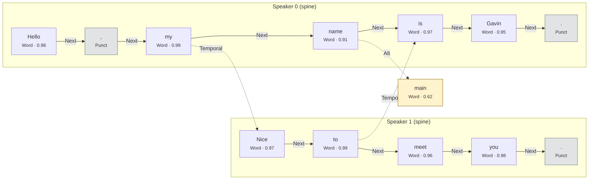
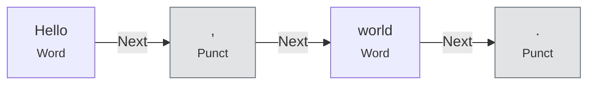
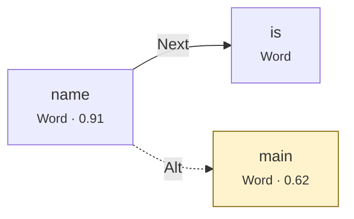
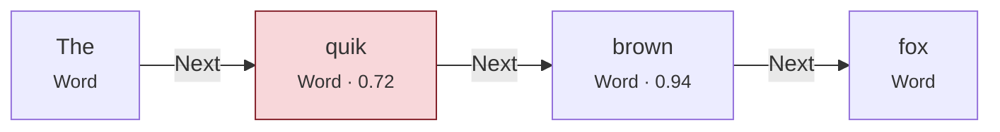
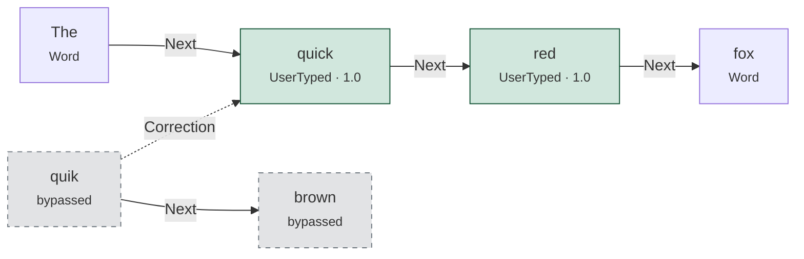
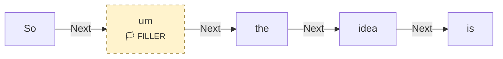
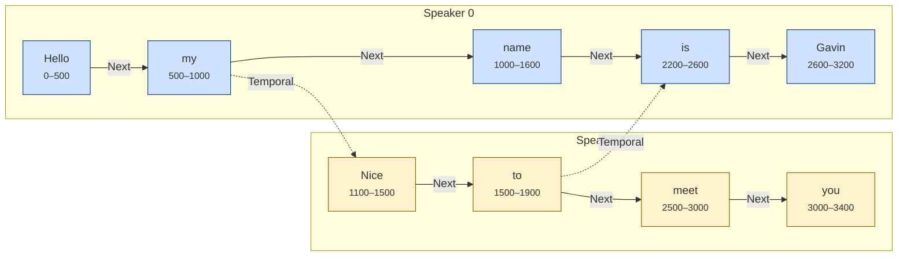

# Word Graph Data Model — Specification

> Status: **Design**
> Author: Gavin + Copilot
> Date: 2026-03-25 (Draft) → 2026-03-25 (Design)

---

## Overview

The word graph is the runtime data model that backs the transcript. It replaces the current flat `String` transcript signal and `LiveWord` vector with a graph-native structure that preserves per-word confidence, timing, origin, filler classification, and edit history — all without data loss.

The design is motivated by three goals:

1. **Graph-native from the start.** Parley will integrate into a graph-native system. The runtime data model should be a graph of nodes and edges, not a string that gets parsed and re-serialized.
2. **Non-destructive editing.** Every operation — STT ingest, LLM formatting, user corrections, filler removal — is additive. Original data is always reachable. Nothing is thrown away.
3. **Display is a projection.** The user never sees the graph directly. They see a projection — a walk of the graph with filters applied. Verbatim mode, clean mode, interleaved multi-speaker, single-speaker, confidence-highlighted — all are just different projection configurations over the same graph.

---

### Conceptual overview



Each box is a **node**. Solid arrows are **Next** edges (the primary spine). Dotted arrows are **Alt** (alternative transcription) and **Temporal** (cross-speaker timing) edges. Punctuation nodes sit inline on the spine. The Alt branch does not rejoin.

The temporal edges cross in **both** directions (speaker 0→1 and speaker 1→0), creating a DAG with diverge/coalesce structure: "name" and "Nice, to" are **parallel** (spoken simultaneously), then paths converge at "is". After "is", "Gavin" and "meet, you" are parallel again (no temporal edge — they overlap in time). See §7.2 for a detailed walkthrough.

---

## 1. Nodes

### 1.1 NodeKind (enum — mutually exclusive)

A node is exactly one kind. This is an enum because these are mutually exclusive — a node cannot be a Word and Punctuation simultaneously.

```rust
#[derive(Clone, Copy, Debug, PartialEq, Eq)]
enum NodeKind {
    Word,         // a spoken or typed word
    Punctuation,  // inline punctuation: . , — ? ! ; : " '
    Silence,      // a timed gap in speech (text is empty, duration in start_ms/end_ms)
    Break,        // explicit line or paragraph break ("\n" or "\n\n")
}
```

**Word** — the primary node type. One per detected word from STT, or per typed word from the user, or per word inserted by the LLM formatting pass.

**Punctuation** — a separate node in the Next chain, not attached to the preceding word. This allows punctuation to have independent confidence (when available), to be independently styled, and to be independently removed or modified.



In projection, punctuation is rendered without a preceding space: `Hello, world.`

**Silence** — represents a timed gap between words. `text` is empty. Duration is encoded in `start_ms` / `end_ms`. Used for pause detection, pacing analysis, and paragraph-break heuristics.

**Break** — an explicit structural break in the text. `text` is `"\n"` (line break) or `"\n\n"` (paragraph break). Has an `origin` like any other node — `Stt` for turn boundaries, `LlmFormatted` for breaks inserted by the formatting pass, `UserTyped` for manual Enter presses.

### 1.2 NodeOrigin (enum — mutually exclusive)

Where this node came from. A node has exactly one origin.

```rust
#[derive(Clone, Copy, Debug, PartialEq, Eq)]
enum NodeOrigin {
    Stt,           // produced by the STT provider
    LlmFormatted,  // inserted or modified by the LLM formatting pass
    AiGenerated,   // produced by an LLM as a conversational response (Conversation Mode)
    UserTyped,     // typed by the user
}
```

`LlmFormatted` and `AiGenerated` are distinct: `LlmFormatted` describes nodes that originated as STT (or another origin) and were post-processed by an LLM formatter; `AiGenerated` describes nodes that were *originally produced by an LLM* as a turn in a conversation, with no underlying audio source. AI agent lanes in Conversation Mode are populated with `AiGenerated` nodes (see [conversation-mode-spec.md §1.5](conversation-mode-spec.md#15-dependencies--word-graph-slice-must-land-first)).

### 1.3 NodeFlags (bitfield — combinable)

Cross-cutting boolean properties that can apply to any node regardless of kind. These are independent of each other and independently combinable. A `u16` provides 16 bits; we define only what we need now and leave room for future use.

```rust
type NodeFlags = u16;

const FLAG_FILLER: NodeFlags      = 1 << 0;  // word is a filler (um, uh, er, ah, etc.)
const FLAG_TURN_LOCKED: NodeFlags = 1 << 1;  // node belongs to an in-progress turn (not yet editable)
```

When all bits are zero, the node has no special flags — this is the default, zero-cost case.

`FLAG_TURN_LOCKED` marks nodes that are still part of an active STT turn. While set, the UI renders the node normally (inline in the transcript) but prevents user editing. When the turn commits (`end_of_turn: true`), the flag is cleared on all nodes belonging to that turn, making them editable. This eliminates the need for a separate "live zone" — all words live in the graph from the moment they arrive.

Future flag candidates (not defined until needed): proper noun, technical term, bold, italic, underline, strikethrough.

### 1.4 Node struct

```rust
type NodeId = u32;

#[derive(Clone, Debug)]
struct Node {
    id: NodeId,
    kind: NodeKind,
    text: String,
    confidence: f32,    // 0.0–1.0, from STT or synthetic
    start_ms: f64,      // timestamp relative to session start
    end_ms: f64,
    speaker: u8,        // lane index (0, 1, ...)
    origin: NodeOrigin,
    flags: NodeFlags,
}
```

**Convenience methods:**

```rust
impl Node {
    fn is_filler(&self) -> bool       { self.flags & FLAG_FILLER != 0 }
    fn set_filler(&mut self)          { self.flags |= FLAG_FILLER; }
    fn clear_filler(&mut self)        { self.flags &= !FLAG_FILLER; }

    fn is_turn_locked(&self) -> bool  { self.flags & FLAG_TURN_LOCKED != 0 }
    fn set_turn_locked(&mut self)     { self.flags |= FLAG_TURN_LOCKED; }
    fn clear_turn_locked(&mut self)   { self.flags &= !FLAG_TURN_LOCKED; }
}
```

---

## 2. Edges

### 2.1 EdgeKind (enum — mutually exclusive)

All edges live in a single collection. An edge has exactly one kind.

```rust
#[derive(Clone, Copy, Debug, PartialEq, Eq)]
enum EdgeKind {
    Next,        // primary sequence within a speaker lane (words, punctuation, breaks)
    Alt,         // alternative transcription (branch — lower-confidence option)
    Correction,  // user or LLM edit: old node → replacement node
    Temporal,    // cross-speaker timing link (derived — rebuildable)
}
```

**Next** — the primary spine. Walk `Next` edges from a lane root to traverse the full transcript for that speaker. Words, punctuation, silence, and breaks are all linked by `Next` edges in sequence.

**Alt** — an alternative transcription for a word. Branches off the spine; does not rejoin. Used when the STT provides multiple hypotheses, or when the LLM suggests but doesn't commit a change.



**Correction** — links an old node to its replacement. When the user edits a word or the LLM reformats a passage, the old nodes are bypassed on the spine (their incoming/outgoing `Next` edges are rewired), but they remain in the arena. A `Correction` edge from the first old node to the first replacement node preserves the relationship for undo and provenance.

**Temporal** — a derived edge linking words across speaker lanes by timing. These are artifacts of an analysis pass: computed from word timestamps to establish the interleaving order for multi-speaker projection. They can be deleted and recomputed at any time (e.g., after edits change the timing structure in a region).

### 2.2 Derived vs. intrinsic distinction

This distinction is semantic, not structural. All edges share the same struct and collection. The distinction is expressed by an `EdgeKind` method:

```rust
impl EdgeKind {
    fn is_derived(self) -> bool {
        matches!(self, EdgeKind::Temporal)
    }
}
```

Derived edges can be bulk-cleared and recomputed. Intrinsic edges (`Next`, `Alt`, `Correction`) are part of the core structure and are only modified by explicit graph operations (ingest, edit, undo).

### 2.3 Edge struct

```rust
#[derive(Clone, Debug)]
struct Edge {
    from: NodeId,
    to: NodeId,
    kind: EdgeKind,
}
```

---

## 3. WordGraph

### 3.1 Storage: arena + adjacency

```rust
struct WordGraph {
    nodes: Vec<Node>,       // arena — NodeId is an index into this vec
    edges: Vec<Edge>,       // all edges (intrinsic + derived)
    roots: Vec<NodeId>,     // one per speaker lane; roots[0] = speaker 0's first node
    next_id: NodeId,        // monotonically increasing node ID counter
    free: Vec<NodeId>,      // free list for reusing slots of unreachable nodes (compaction)
}
```

Arena-based: `NodeId` is an index into `nodes`. No `Rc`, no pointer cycles, no borrow checker issues. Cache-friendly iteration. Trivially serializable.

**Adjacency index:** For O(1) edge lookup by source node, the graph maintains a secondary index:

```rust
use std::collections::HashMap;

/// Maps NodeId → indices into the `edges` vec for outgoing edges from that node.
outgoing: HashMap<NodeId, Vec<usize>>,
/// Maps NodeId → indices into the `edges` vec for incoming edges to that node.
incoming: HashMap<NodeId, Vec<usize>>,
```

The flat `Vec<Edge>` remains the source of truth. The `HashMap` indices are maintained on insert/remove and enable `edges_from()` and `edges_to()` to run in O(degree) rather than O(|E|).

### 3.2 Core operations

```rust
impl WordGraph {
    // ── Construction ──
    fn new() -> Self;

    // ── Ingest ──
    /// Add or update nodes from an STT turn event.
    /// Partial turns (end_of_turn=false): updates existing turn-locked nodes in place.
    /// Final turns (end_of_turn=true): finalizes nodes, clears FLAG_TURN_LOCKED.
    fn ingest_turn(&mut self, speaker: u8, words: &[SttWord], end_of_turn: bool);

    // ── Query ──
    /// Walk the primary spine for a speaker, return node IDs in order.
    fn walk_spine(&self, speaker: u8) -> Vec<NodeId>;

    /// Get outgoing edges of a specific kind from a node.
    fn edges_from(&self, node: NodeId, kind: EdgeKind) -> Vec<&Edge>;

    /// Get incoming edges of a specific kind to a node.
    fn edges_to(&self, node: NodeId, kind: EdgeKind) -> Vec<&Edge>;

    /// Get all nodes below a confidence threshold.
    fn low_confidence_nodes(&self, threshold: f32) -> Vec<NodeId>;

    // ── Projection ──
    /// Walk the graph and produce a flat text string, applying filters.
    fn project(&self, opts: &ProjectionOpts) -> String;

    /// Interleaved multi-speaker projection using Temporal edges.
    fn project_interleaved(&self, opts: &ProjectionOpts) -> Vec<ProjectedBlock>;

    // ── Editing ──
    /// Replace a span of nodes with new text. Old nodes are bypassed,
    /// not deleted. Correction edge links old → new. Returns IDs of new nodes.
    fn replace_span(&mut self, start: NodeId, end: NodeId, new_text: &str, origin: NodeOrigin) -> Vec<NodeId>;

    /// Delete a span (bypass on spine, no replacement). Correction edge
    /// from predecessor to successor marks the deletion point.
    fn delete_span(&mut self, start: NodeId, end: NodeId);

    /// Insert new text after a node. Returns IDs of new nodes.
    fn insert_after(&mut self, after: NodeId, text: &str, origin: NodeOrigin) -> Vec<NodeId>;

    // ── Analysis ──
    /// Clear all Temporal edges and recompute from word timestamps.
    fn analyze_temporal(&mut self);

    /// Recompute Temporal edges only within a time window.
    fn reanalyze_range(&mut self, start_ms: f64, end_ms: f64);

    // ── Filler detection ──
    /// Scan all Word nodes against a filler word list and set FLAG_FILLER.
    fn detect_fillers(&mut self, filler_words: &[&str]);

    // ── LLM exchange ──
    /// Serialize a span of nodes into an array of LlmExchangeEntry for LLM input.
    fn to_llm_exchange(&self, start: NodeId, end: NodeId) -> Vec<LlmExchangeEntry>;

    /// Apply LLM output back to the graph. Maps returned entries by node_id.
    fn apply_llm_exchange(&mut self, entries: &[LlmExchangeEntry]);
}
```

### 3.3 SttWord — input from STT provider

```rust
struct SttWord {
    text: String,
    start_ms: f64,
    end_ms: f64,
    confidence: f32,
    word_is_final: bool,
}
```

This maps directly to the AssemblyAI v3 `words` array in a Turn event. Each Turn message includes a `words` array with the following JSON structure per word:

```json
{
  "start": 2160,       // start time in ms (integer)
  "end": 2560,         // end time in ms (integer)
  "text": "Hi,",       // word text (may include trailing punctuation)
  "confidence": 0.868, // 0.0–1.0 recognition confidence
  "word_is_final": true // true = finalized, false = may still change
}
```

The full Turn event contains these top-level fields (11 properties):

| Field | Type | Description |
|---|---|---|
| `type` | `"Turn"` | Message type discriminator |
| `turn_order` | `u32` | Incrementing turn counter (0, 1, 2, …) |
| `turn_is_formatted` | `bool` | Always `true` for u3-rt-pro |
| `end_of_turn` | `bool` | `true` = turn complete; `false` = partial |
| `end_of_turn_confidence` | `f64` | Model's confidence the turn has ended (0.0–1.0) |
| `transcript` | `String` | Running transcript for the current turn |
| `utterance` | `String` | Finalized utterance text (empty unless utterance boundary) |
| `words` | `Vec<SttWord>` | Word-level data: text, timing, confidence, finality |
| `speaker_label` | `String?` | Speaker label (only when `speaker_labels=true`) |
| `language_code` | `String?` | Detected language (only when `language_detection=true`) |
| `language_confidence` | `f64?` | Language detection confidence |

**Key observations from the v3 API:**
- Timestamps are integers (milliseconds), not floats. We store as `f64` internally for future sub-ms precision.
- `word_is_final: false` means the word may still change in subsequent Turn messages. Non-final words should update existing graph nodes in-place rather than appending new ones.
- Punctuation is **attached to the word text** by the model (e.g., `"Hi,"`, `"Sonny."`, `"agent."`). The `ingest_turn` method splits trailing punctuation into separate `Punctuation` nodes.
- Partial words appear during transcription (e.g., `"Son"` → `"Sonny"` → `"Sonny."`). The graph tracks which nodes belong to the current turn via `FLAG_TURN_LOCKED` and updates them as new Turn messages arrive.

The `ingest_turn` method converts `SttWord` entries into `Node` entries with `origin: Stt`, detects fillers, splits trailing punctuation into separate nodes, and wires `Next` edges.

### 3.4 Token-stream STT ingest

Soniox `stt-rt-v4` streams token batches rather than AssemblyAI-style turn objects. The graph does not ingest provider WebSocket JSON directly. Provider messages normalize into a provider-neutral event layer in `parley-core::stt`, then into `SttGraphUpdate` values that apply to the graph.

```rust
struct SttToken {
    text: String,
    start_ms: Option<f64>,
    end_ms: Option<f64>,
    confidence: f32,
    is_final: bool,
    speaker_label: Option<String>,
}

enum SttMarker {
    Endpoint,          // Soniox <end>
    FinalizeComplete,  // Soniox <fin>
    Finished,
}

struct SttGraphUpdate {
    lane: u8,
    finalized: Vec<SttWord>,
    provisional: Vec<SttWord>,
}
```

`TokenStreamNormalizer` owns provider-label-to-lane mapping and finalized-token deduplication. It emits:

- `finalized` as append-only deltas. These are immediately safe to commit to the graph.
- `provisional` as the current non-final tail for that lane. Applying a newer provisional tail replaces the previous turn-locked nodes for that lane rather than appending duplicates.
- `markers` separately from graph updates. Marker tokens are control events, not transcript words, and must never become graph nodes.

Lane mapping is stable for the life of a normalizer. Missing provider speaker labels map to lane `0`; new labels allocate lanes in first-seen order up to the current implementation cap (`15`). Soniox language tags are intentionally dropped in this slice; multilingual projection can add language metadata later without changing the graph node shape.

`SttGraphUpdate::apply_to_graph` currently reuses `WordGraph::ingest_turn(lane, words, end_of_turn)`:

1. Apply `finalized` with `end_of_turn = true`.
2. Apply `provisional` with `end_of_turn = false`.
3. Ignore `SttMarker` values for graph mutation.

This keeps the minimal graph implementation small while allowing token-native providers to land now. A later graph-native ingest API can replace the adapter without changing provider parsers or UI event handling.

### 3.5 ProjectionOpts — filters for display

```rust
struct ProjectionOpts {
    include_fillers: bool,         // false = skip nodes with FLAG_FILLER
    include_silence: bool,         // false = skip Silence nodes
    speaker_filter: Option<u8>,    // Some(n) = only speaker n; None = all speakers
    include_speaker_labels: bool,
    include_timestamps: bool,
    confidence_threshold: f32,     // for downstream highlighting (not filtering)
}
```

The projection walk:
1. Start at `roots[speaker]` (or each root if `speaker_filter` is None).
2. Follow `Next` edges along the spine.
3. Skip nodes based on filters (fillers, silence).
4. Emit text, inserting spaces between words, no space before punctuation.
5. For interleaved mode, follow `Temporal` edges to switch speaker lanes at the right moments.

---

## 4. Non-Destructive Editing

### 4.1 Additive model

When the user selects a span of words and types a replacement:

1. The selected nodes' `Next` chain is **bypassed** — the predecessor's `Next` edge is rewired to point past the selection, and the successor is reached by the newly inserted nodes.
2. New nodes are created with `origin: UserTyped`.
3. A `Correction` edge links the first bypassed node to the first new node.
4. The bypassed nodes **remain in the arena** — they are no longer reachable from the active spine, but they are still present.

**Before edit:**



User selects "quik brown" and types "quick red":

**After edit:**



The bypassed nodes (dashed borders) remain in the arena. The `Correction` edge allows undo and provenance tracking.

### 4.2 Undo (deferred)

Undo is not in scope for v0.5. The `Correction` edge infrastructure supports undo structurally (walk edges backward, restore bypassed nodes), but the UI integration and edit grouping logic will be designed later. The graph's additive model ensures nothing is lost — undo can be added without data model changes.

### 4.3 LLM formatting as an edit

When the LLM formatting pass rewrites a passage, it follows the same additive model:

1. Old nodes are bypassed (not deleted).
2. New nodes are created with `origin: LlmFormatted`.
3. `Correction` edges link old to new.

This means "revert to STT original" for any passage is: walk `Correction` edges backward, restore the bypassed nodes to the spine.

### 4.4 Filler handling

Fillers are **not edited out** of the graph. They remain as normal nodes with `FLAG_FILLER` set. "Remove fillers" is a projection-time filter: `if node.is_filler() && !opts.include_fillers { skip }`. Toggling verbatim mode re-projects the same graph with `include_fillers: true`.

**Graph (always the same):**



**Projection (clean mode, `include_fillers: false`):** `So the idea is`

**Projection (verbatim mode, `include_fillers: true`):** `So um the idea is`

Same graph, different projection.

---

## 5. Filler Detection

### 5.1 Filler word list

A static default list of filler words that are almost never intentional content:

```rust
const DEFAULT_FILLERS: &[&str] = &[
    "um", "uh", "hmm", "mm", "er", "ah", "eh", "uh-huh", "mm-hmm",
];
```

### 5.2 Detection at ingest

When `ingest_turn` processes STT words, each word's lowercased `text` is checked against the filler list. If it matches, `FLAG_FILLER` is set on the node.

### 5.3 User-configurable fillers

The filler list is a setting (stored as a cookie, comma-separated). Users can add words. The detection runs at ingest time, so changing the list only affects new words. A `redetect_fillers` operation can re-scan existing nodes if the user changes the list mid-session.

---

## 5A. Punctuation Splitting

### 5A.1 Splitting rules

AssemblyAI v3 attaches punctuation to word text (e.g., `"Hi,"`, `"Sonny."`, `"agent."`). During `ingest_turn`, trailing punctuation is split from each word into a separate `Punctuation` node.

**Built-in punctuation characters** (split from word trailing edge):

```rust
const DEFAULT_PUNCTUATION: &[char] = &['.', ',', ';', ':', '!', '?', '\u{2014}', '"', '\''];
// \u{2014} is em-dash
```

**Splitting regex:**

```rust
/// Match one or more trailing punctuation characters at the end of a word.
let punct_re = Regex::new(r"([.,;:!?\u{2014}\"']+)$").unwrap();
```

**Algorithm:**

For each `SttWord` during ingest:
1. Check if `word.text` ends with one or more characters from the punctuation set.
2. If yes: strip the trailing punctuation, create a `Word` node with the remaining text, then create a `Punctuation` node with the stripped characters. Wire them with a `Next` edge.
3. If no trailing punctuation: create a `Word` node with the full text.

**Edge cases:**
- **Contractions** (`"don't"`, `"it's"`): The apostrophe is mid-word. The regex only matches *trailing* punctuation, so contractions are kept as a single `Word` node. ✅
- **Abbreviations** (`"Mr."`, `"U.S.A."`): The trailing period is split off. `"Mr"` + `"."`. This may incorrectly split some abbreviations but is acceptable — the word text is still correct, and the punctuation node is adjacent.
- **Multiple trailing** (`"really?!"`): All trailing punctuation becomes one `Punctuation` node: `"really"` + `"?!"`.
- **Pure punctuation** (`"---"`): If the entire text is punctuation, it becomes a `Punctuation` node with no preceding `Word` node.

### 5A.2 Custom punctuation

Like filler words, the punctuation set is user-configurable:

| Setting | Type | Default | Cookie |
|---|---|---|---|
| Custom punctuation | text (comma-separated) | *(empty)* | `parley_custom_punctuation` |

Custom punctuation characters are merged with `DEFAULT_PUNCTUATION` at ingest time.

---

## 5B. Silence and Break Nodes

### 5B.1 Silence detection

When `ingest_turn` processes consecutive words, it checks the gap between `word[i].end_ms` and `word[i+1].start_ms`. If the gap exceeds the silence threshold, a `Silence` node is inserted between them on the spine.

```rust
const DEFAULT_SILENCE_THRESHOLD_MS: f64 = 5000.0; // 5 seconds
```

The `Silence` node has:
- `kind: Silence`
- `text: ""` (empty)
- `start_ms` / `end_ms` set to the gap boundaries
- `confidence: 1.0` (silence is certain)
- Same `speaker` as the surrounding words

### 5B.2 Break insertion

Breaks are structural separators. They are created in these situations:

1. **Turn boundaries:** When a new turn arrives (`turn_order` increments), a `Break` node (`text: "\n"`) is inserted between the last node of the previous turn and the first node of the new turn.
2. **LLM formatting:** The LLM may insert paragraph breaks (`text: "\n\n"`) via the exchange format (see §11).
3. **User action:** The user presses Enter in the transcript to insert a manual break.

No automatic silence-to-break promotion. If a gap exceeds the silence threshold, only a `Silence` node is created. The LLM formatting pass can choose to promote silences to paragraph breaks based on content analysis.

### 5B.3 Configurable thresholds

| Setting | Type | Default | Cookie |
|---|---|---|---|
| Silence threshold (ms) | number | 5000 | `parley_silence_threshold` |

---

## 6. Confidence

### 6.1 Per-node confidence

Every node has a `confidence: f32` field (0.0–1.0).

- **STT-origin nodes**: confidence comes directly from the STT provider's word-level data.
- **LLM-origin nodes**: synthetic confidence (e.g., 1.0 for words the LLM chose, or a value derived from the LLM's stated uncertainty if available).
- **User-typed nodes**: confidence = 1.0 (the user knows what they meant).
- **Punctuation nodes**: confidence from STT if available, otherwise synthetic (e.g., 0.95 for LLM-inserted punctuation).

### 6.2 Confidence threshold

A user setting (default: 0.85). Used at projection/render time to determine which nodes get visual highlighting. The graph doesn't filter low-confidence nodes out — it flags them for the UI layer.

### 6.3 LowConfidence as a query, not an entity

The architecture doc described `LowConfidence` as a separate annotation type. In the word graph, "low confidence" is simply `node.confidence < threshold` — a predicate, not stored data. No separate entity needed.

---

## 7. Multi-Speaker: Forest → DAG

### 7.1 Per-speaker trees

Each speaker lane is a tree rooted at `roots[speaker_index]`. The tree is mostly a spine (linked list via `Next` edges) with occasional `Alt` branches.

### 7.2 Temporal edges make it a DAG

When temporal analysis runs, it adds `Temporal` edges between words on different speaker lanes that overlap in time. This converts the forest into a DAG (directed acyclic graph) — no cycles (time flows forward), but nodes have cross-lane connections.

Consider this scenario where speaker 1 starts responding while speaker 0 is still talking, and both finish at roughly the same time:

```
Timeline (ms):  0    500  1000 1500 2000 2500 3000 3500 4000
Speaker 0:      Hello my   name ···· is   Gavin
Speaker 1:                Nice to   ···· meet you
```

The temporal edges encode the ordering constraints the timestamps reveal:



Blue = speaker 0, amber = speaker 1.

This DAG has a **diverge → coalesce → diverge** structure:

#### Phase 1 — Divergence at "my"

"my" has two outgoing paths: `my → name` (spine) and `my → Nice` (temporal). After this point, speaker 0 ("name") and speaker 1 ("Nice, to") are **running in parallel** — they were spoken simultaneously and the DAG has no ordering between them.

#### Phase 2 — Coalescence at "is"

"is" has two incoming paths: `name → is` (spine) and `to → is` (temporal). Both paths converge. This means "is" doesn't happen until both "name" and "to" are done. This is the structural signal that the overlap region has ended and the speakers are momentarily synchronized.

#### Phase 3 — Divergence again

After the coalescence, "Gavin" continues on speaker 0's spine and "meet → you" continues on speaker 1's spine. There are no temporal edges between these tails — because they genuinely overlap in time (2500–3400ms). The DAG correctly leaves them **unconstrained**, meaning they are parallel.

> **Key principle: absence of temporal edges = parallelism.** If there is no directed path between two nodes in the DAG, they are concurrent. This is not a gap in the data — it is an accurate statement that the speakers were talking at the same time.

#### 7.2.1 The diverge/coalesce pattern

This three-phase pattern recurs throughout any multi-speaker conversation:

1. **Sequential** — one speaker is talking, the other is silent. A single path through the DAG.
2. **Divergence** — the second speaker starts while the first is still talking. A temporal edge marks the transition point; after it, both spines advance in parallel.
3. **Coalescence** — the overlap ends. A temporal edge from the speaker who finishes first to the next word of the other speaker merges the paths. The DAG returns to a single path.

Repeated diverge/coalesce cycles make the DAG look like a braid. Each overlap region is a parallel section between a pair of temporal edges pointing in opposite directions.

#### 7.2.2 Temporal edge density

`analyze_temporal` places edges **at transition points** — the moments where ordering changes between speakers. It does NOT place an edge between every pair of overlapping words (that would be O(n²) and mostly redundant). The rules:

- **Divergence edge** (0→1): placed when speaker 1's first word in an overlap region starts after a word on speaker 0's spine. One edge, at the onset.
- **Coalescence edge** (1→0 or 0→1): placed when one speaker's last word in an overlap region ends before the other speaker's next word. One edge, at the offset.
- **Within a parallel region**: no temporal edges. The two spines are intentionally unconstrained — they are concurrent.

This sparse placement is sufficient to reconstruct the full ordering via topological sort. Dense timestamps are still available on every node for fine-grained alignment in the UI.

### 7.3 Temporal edges are derived

Temporal edges are analysis artifacts. They are computed from word timestamps and can be:
- **Cleared entirely**: `edges.retain(|e| e.kind != EdgeKind::Temporal)`
- **Recomputed for a range**: clear temporals in a time window, then re-derive from timestamps in that window
- **Recomputed globally**: clear all, re-derive from all word timestamps

This means editing a word's timing (or inserting/deleting words) doesn't corrupt the temporal structure — you just reanalyze the affected region. The interleaved projection is always rebuildable.

### 7.4 Overlap rendering strategies

When the projection walk hits a parallel region (a diverge/coalesce pair), it must decide how to render the overlap. This is context-dependent — the UI can do things plain text cannot.

```rust
enum OverlapRendering {
    /// Side-by-side columns aligned by time (for UI / HTML).
    ParallelLanes,
    /// Earliest speaker gets a complete block; other speaker follows
    /// with an [overlap] marker (for plain-text export / clipboard).
    SequentialWithMarker,
    /// Word-by-word interleave by start_ms (rarely readable).
    WordInterleave,
}
```

`project_interleaved` returns structured data, not a flat string:

```rust
enum ProjectedBlock {
    /// Normal single-speaker segment (no overlap).
    Sequential { speaker: u8, text: String },
    /// Two (or more) speakers talking simultaneously.
    Parallel { blocks: Vec<(u8, String)> },
}
```

**UI rendering (ParallelLanes):** A `Sequential` block is a normal paragraph with a speaker label. A `Parallel` block is rendered as side-by-side columns — the user can visually see that both speakers were talking at the same time. Timestamps on each word allow fine-grained vertical alignment within the columns if desired.

For the example in §7.2, the UI would render something like:

```
Speaker 0: Hello, my—
     ┌─────────────────────────┐
     │ Speaker 0: name         │  Speaker 1: Nice to
     └─────────────────────────┘
Speaker 0: is—
     ┌─────────────────────────┐
     │ Speaker 0: Gavin        │  Speaker 1: meet you
     └─────────────────────────┘
```

**Plain-text serialization (SequentialWithMarker):** Parallel blocks are linearized. The speaker whose first word has the earliest `start_ms` goes first as a complete block. The other speaker's block follows, prefixed with `[speaking simultaneously]`:

```
Speaker 0: Hello, my name
Speaker 1: [speaking simultaneously] Nice to
Speaker 0: is Gavin
Speaker 1: [speaking simultaneously] meet you
```

**Word interleave (WordInterleave):** Strict `start_ms` ordering across all speakers, word by word. Produces output like `Hello my name Nice to is meet Gavin you`. Almost never readable; exists as an option for completeness or for downstream tools that want raw temporal order.

Without temporal edges, the fallback is to walk each speaker's spine independently and merge by timestamp — equivalent to `SequentialWithMarker` but using raw timestamps instead of graph structure.

---

## 8. Relation to Architecture.md Entities

How word graph concepts map to the architecture's entity model:

| Architecture entity | Word graph realization | Notes |
|---|---|---|
| **Word** annotation | `Node { kind: Word }` | Identical. The node IS the word annotation. |
| **Phrase** annotation | Contiguous run of nodes between Break nodes | Emergent — a span query, not a stored entity. |
| **Silence** annotation | `Node { kind: Silence }` | Identical. |
| **LowConfidence** annotation | `node.confidence < threshold` | Subsumed by per-node confidence. Not a separate entity. |
| **PostProcessed** annotation | Nodes with `origin: LlmFormatted` + Correction edges to originals | Structural, not a separate annotation layer. |
| **UserCorrection** annotation | `Correction` edge + bypassed nodes with `origin: Stt` or `LlmFormatted` | Structural. Old and new are both in the graph. |
| **Lane** | `speaker` field on nodes + `roots` vec | Implicit in graph structure, not a wrapping entity. |
| **`responds_to`** edge | Future `EdgeKind::RespondsTo` variant | Would be a derived edge kind from an LLM semantic analysis pass. |
| **SpeakerIdentity** | Side table: `speaker_id → SpeakerInfo { name, confidence, method }` | Not in the word graph — session-level metadata. |
| **SpatialPosition** | Not modeled yet | Future: either per-node property or derived annotation. |
| **ConversationGroup** | Not modeled yet | Future: derived from spatial + semantic analysis. |

---

## 9. Settings

New settings in the settings drawer, under a **"Transcript Quality"** section (visible when an STT key is set):

| Setting | Type | Default | Cookie |
|---|---|---|---|
| Strip filler words | checkbox | on | `parley_strip_fillers` |
| Custom filler words | text (comma-separated) | *(empty)* | `parley_custom_fillers` |
| Custom punctuation | text (comma-separated) | *(empty)* | `parley_custom_punctuation` |
| Highlight low-confidence words | checkbox | on | `parley_highlight_confidence` |
| Confidence threshold | number (0.0–1.0) | 0.85 | `parley_confidence_threshold` |
| Silence threshold (ms) | number | 5000 | `parley_silence_threshold` |
| Verbatim mode | checkbox | off | `parley_verbatim` |

**Verbatim mode** is a master override: when on, it forces `include_fillers: true` in the projection and disables auto-formatting. The other settings are grayed out. The confidence highlighting can remain active in verbatim mode (it's informational, not a cleanup action).

---

## 10. Partials in the Graph

### 10.1 Design: no separate live zone

In previous versions, partial (in-progress) turns lived in a separate `LiveWord` vector and rendered in a distinct "Live — sorting…" zone between the transcript and the current-turn boxes. This created a three-tier data model (transcript string, live word vector, current turn string) and forced the user to visually chase text between three locations.

In v0.5, **all words live in the graph from the moment they arrive**. There is no live zone. The transcript display is a single, unified projection of the graph.

### 10.2 How it works

1. **Partial Turn arrives** (`end_of_turn: false`): `ingest_turn` creates/updates nodes in the graph with `FLAG_TURN_LOCKED` set. These nodes appear in the transcript projection but are rendered with a visual indicator (e.g., slightly dimmed or with a subtle background) and are not user-editable.

2. **Subsequent partials arrive** (same `turn_order`): `ingest_turn` detects that turn-locked nodes for this speaker already exist and updates them in-place — text changes (e.g., `"Son"` → `"Sonny"`), timing updates, confidence updates. The `word_is_final` field from the API helps: final words are stable; non-final words may change.

3. **Turn commits** (`end_of_turn: true`): `ingest_turn` processes the final word array, updates all nodes to their final state, and clears `FLAG_TURN_LOCKED` on all nodes belonging to this turn. The nodes are now fully part of the permanent spine and are user-editable.

### 10.3 What this replaces

The following are removed in v0.5:
- `LiveWord` struct
- `live_turns_shared: Signal<Option<Rc<RefCell<Vec<LiveWord>>>>>`
- `render_live_zone()` function
- `split_turn_to_words()` helper
- `turn_start_time1_shared` / `turn_start_time2_shared` signals
- `live_turns_version` signal
- The "Live — sorting…" UI zone
- The graduation system (partition_point, 15s safety valve)

The `partial: Signal<String>` and `partial2: Signal<String>` signals are also removed. The current turn's text is simply the turn-locked region of the graph, visible in the unified projection.

### 10.4 Multi-speaker ordering

With partials in the graph, multi-speaker ordering happens naturally via temporal edges. When speaker 1's turn arrives while speaker 0 is still talking, both sets of turn-locked nodes exist on their respective spines. The `analyze_temporal` pass creates cross-lane edges as words arrive, establishing the interleaving order. No separate graduation or chronological insertion logic is needed.

---

## 11. LLM Exchange Format

### 11.1 The problem

The LLM formatting pass receives text and returns text. But the graph stores structured nodes with IDs, confidence, timing, and origin metadata. We need a bidirectional mapping between the graph and the LLM's input/output.

### 11.2 Exchange struct

```rust
#[derive(Clone, Debug, Serialize, Deserialize)]
struct LlmExchangeEntry {
    node_id: NodeId,          // graph node this entry maps to
    text: String,             // word/punctuation/break text
    kind: NodeKind,           // Word, Punctuation, Break, Silence
    speaker: u8,              // speaker lane
}
```

### 11.3 Serialization to LLM

`to_llm_exchange` walks the projection (respecting the editing window — last N chunks) and produces an array of `LlmExchangeEntry`. This array is serialized as JSON and sent to the LLM alongside the formatting prompt.

The LLM sees input like:

```json
[
  { "node_id": 0, "text": "So", "kind": "Word", "speaker": 0 },
  { "node_id": 1, "text": "um", "kind": "Word", "speaker": 0 },
  { "node_id": 3, "text": "the", "kind": "Word", "speaker": 0 },
  { "node_id": 5, "text": "idea", "kind": "Word", "speaker": 0 },
  { "node_id": 7, "text": "is", "kind": "Word", "speaker": 0 }
]
```

The LLM returns a modified array. It can:
- **Modify text**: change `"idea"` to `"concept"` (keeps same `node_id`)
- **Delete entries**: remove `"um"` (entry absent from output)
- **Insert new entries**: add a new entry with `node_id: null` (or -1) for nodes that don't exist yet (e.g., punctuation, paragraph breaks)
- **Reorder entries**: change sequence (though this is rare)

### 11.4 Applying LLM output

`apply_llm_exchange` receives the LLM's output array and applies changes to the graph:

1. **Matched entries** (same `node_id`): if `text` changed, perform a `replace_span` for that node with `origin: LlmFormatted`.
2. **Deleted entries** (present in input, absent in output): `delete_span` the corresponding nodes.
3. **New entries** (`node_id` is null/absent): `insert_after` at the appropriate position with `origin: LlmFormatted`.
4. All operations follow the non-destructive additive model — old nodes are bypassed, not removed.

### 11.5 Prompt considerations

The LLM prompt must instruct the model to:
- Preserve `node_id` values for words it doesn't change
- Return the full array (not just diffs)
- Use `null` for `node_id` when inserting new nodes
- Not invent or hallucinate `node_id` values

This is more structured than the current flat-text approach but gives us precise graph alignment without a diff algorithm.

---

## 12. UI Rendering

### 12.1 Rendered div (not textarea)

The transcript display is a rendered `<div>` (not a `<textarea>`). This enables:
- **Per-word confidence highlighting**: low-confidence words get a visual indicator (e.g., amber underline, background highlight)
- **Turn-locked visual state**: turn-locked words render normally but with a subtle indicator (e.g., slightly reduced opacity) and are non-interactive
- **Click-to-edit**: clicking a word selects it for editing
- **Speaker-colored text**: words from different speakers can have different colors in multi-speaker mode
- **Inline filler indicators**: fillers can be styled differently when `include_fillers: true`

Each word is rendered as a `<span>` with data attributes for `node_id`, `speaker`, and relevant flags. This makes the mapping between DOM elements and graph nodes direct.

### 12.2 Performance

For large transcripts (thousands of words), rendering every word as a separate span can be expensive. Mitigations:
- **Chunked rendering**: only render words in the visible viewport plus a small buffer
- **Signal-driven updates**: only re-render the span(s) that changed when a Turn event arrives, not the entire transcript
- **CSS-only styling**: confidence thresholds, filler status, and turn-lock state are applied via CSS classes, not inline styles

### 12.3 Editable regions

Words that are not turn-locked are editable. When the user clicks a word or selects a range:
1. The selection maps to `NodeId` values via `data-node-id` attributes
2. User types replacement text
3. `replace_span` is called on the graph with `origin: UserTyped`
4. The UI re-renders the affected region

---

## 13. Serialization & Export

The word graph is an in-memory runtime structure. It is **not** persisted to disk in graph form. Export projections are:

| Format | Method | Description |
|---|---|---|
| **Clipboard (plain text)** | `project()` | Flat text projection with current filter settings. Copies to clipboard. |
| **Text file (.txt)** | `project()` | Same as clipboard, written to file. |
| **Markdown file (.md)** | `project()` + YAML frontmatter | Projection with speaker labels, timestamps, and session metadata in frontmatter. |

No graph serialization format (e.g., JSON graph, DOT, adjacency list) is needed for v0.5. The graph exists only in memory for the duration of a recording session. If the page refreshes, the graph is lost (same as the current flat-string transcript). Persistence across sessions is a future consideration.

---

## 14. Implementation Sequence

1. **Define `Node`, `Edge`, `WordGraph`, `LlmExchangeEntry` structs** — pure data, no UI dependency. New module: `src/graph/mod.rs`.
2. **Parse word-level data from AssemblyAI Turn events** — extend `on_transcript` callback to receive word-level data (the `words` array from Turn events) alongside the flat transcript string.
3. **`ingest_turn` with FLAG_TURN_LOCKED** — populate the graph from STT words. Handle partial vs. final turns. Detect fillers. Split punctuation. Insert silence/break nodes.
4. **`project()`** — flat text serialization for display and LLM input. Replaces the `Signal<String>` transcript.
5. **Wire into UI as rendered div** — graph becomes the backing store. Replace textarea with rendered `<div>` of word spans. Turn-locked words render inline but non-editable.
6. **Remove live zone** — delete `LiveWord`, `render_live_zone`, graduation system, `partial`/`partial2` signals. All text lives in the graph.
7. **Filler detection + settings** — strip-filler toggle, custom word list, custom punctuation.
8. **Confidence highlighting** — per-word styling in the rendered div based on confidence threshold.
9. **LLM exchange format** — `to_llm_exchange` / `apply_llm_exchange` for structured LLM formatting pass.
10. **Temporal analysis + interleaved projection** — multi-speaker ordering via temporal edges.
11. **Non-destructive editing** — user corrections create Correction edges, bypassed nodes preserved.
